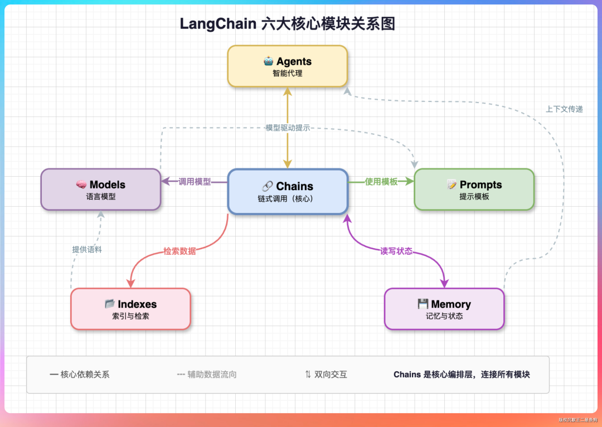
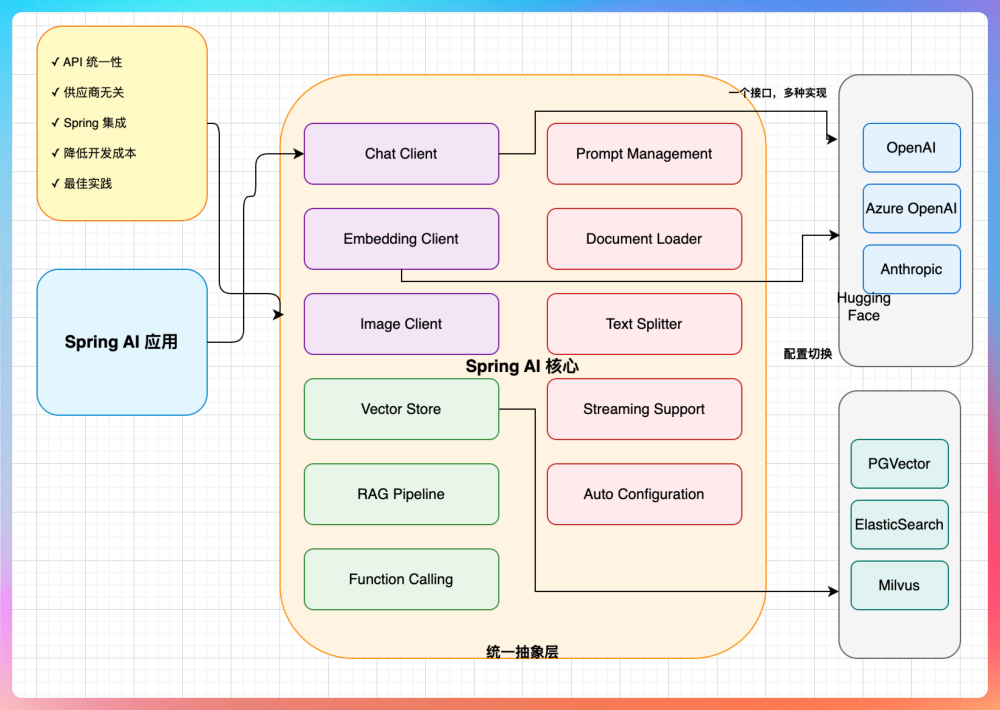

# 框架模块映射：各家如何划分核心抽象

> 每个主流 Agent/LLM 框架都有自己的"模块地图"。看懂它们的模块划分，就看懂了各家的设计哲学和边界。
>
> 本文横向对照 LangChain / Spring AI / MAF / Semantic Kernel / Dawning 五大体系的核心模块，分析谁是**中心枢纽**、谁是**可插拔边缘**、谁是**隐含耦合**。

---

## 1. 为什么模块划分如此重要

框架的"模块边界"决定了三件事：

1. **扩展点在哪里**：用户能替换哪些部件而不破坏系统
2. **心智模型**：开发者学这个框架时需要先理解哪些概念
3. **生态绑定度**：是否必须用全家桶，还是可以只用其中一块

→ **同一类能力（如"LLM 调用"）被不同框架放在不同位置，反映了各家对"Agent 的本质是什么"的理解差异。**

---

## 2. 五大体系模块地图

### 2.1 LangChain：六大模块 + Chains 为枢纽

| 模块 | 职责 | 是否枢纽 |
|------|------|---------|
| **Chains** | 编排多步调用（LCEL 表达式） | ✅ **中心** |
| **Models** | LLM / Chat / Embedding 调用 | 基础能力 |
| **Prompts** | Prompt 模板与组合 | 基础能力 |
| **Indexes** | Loader / Splitter / VectorStore / Retriever | 数据层 |
| **Memory** | 会话历史 / 实体记忆 | 状态层 |
| **Agents** | ReAct / 工具调用循环 | 依赖 Chains 的高层能力 |

**设计哲学**：一切皆链（Everything is a Chain）。Agent 只是更复杂的 Chain。
**2025 年演进**：老的模块划分已被 LCEL + LangGraph 取代——LangGraph 接管 Agent 编排，LangChain 缩减为"基础组件库"。

---

### 2.2 Spring AI：十二核心组件 + ChatClient 为入口

| 组件 | 职责 |
|------|------|
| **Chat Client** | ✅ **中心入口** — 统一 LLM 调用 |
| **Prompt Management** | Prompt 模板 |
| **Embedding Client** | 文本 → 向量 |
| **Vector Store** | 向量存储（9+ 实现） |
| **Document Loader** | 多格式文档加载 |
| **Text Splitter** | 文档分块 |
| **Image Client** | 图像生成 |
| **Streaming Support** | 流式响应 |
| **RAG Pipeline** | 检索增强生成 |
| **Function Calling** | 函数调用 |
| **Auto Configuration** | Spring Boot 自动装配 |

**设计哲学**：供应商无关 + 一个接口多种实现。**不做 Agent 编排**，定位在"LLM Framework"而非"Agent Framework"。
**关键特征**：所有组件都是接口 + Spring Boot Starter 的标准组合，降低 Spring 用户学习成本到最低。

---

### 2.3 Microsoft Agent Framework (MAF)：三层架构

| 层 | 核心类型 | 职责 |
|----|---------|------|
| **Agent Layer** | `IAgent` / `ChatCompletionAgent` / `AIAgent` | Agent 实体定义 |
| **Workflow Layer** | `Workflow` / `Executor` / `Edge` | ✅ **中心** — 图编排 |
| **Runtime Layer** | `AgentRuntime` / Durable / A2A | 分布式运行时 |

**设计哲学**：图编排 + 持久化 Agent + 原生 A2A。
**关键特征**：Workflow 是一等公民，Agent 被看作"特殊的 Executor"——这和 LangGraph 的思路一致，但多了 Durable 和 A2A 的企业级落地。

---

### 2.4 Semantic Kernel：Kernel + Plugin 架构

| 模块 | 职责 |
|------|------|
| **Kernel** | ✅ **中心枢纽** — 单例容器，协调所有组件 |
| **AI Services** | LLM / Embedding Provider |
| **Plugins** | 工具集合（函数装饰器 + Prompt 函数） |
| **Memory** | 向量记忆 |
| **Planners** | 任务分解（老概念，已淡化） |
| **Agents** | `ChatCompletionAgent` / `OpenAIAssistantAgent`（较晚加入） |
| **Processes** | 有状态工作流（较新） |

**设计哲学**：Kernel 是唯一入口 + Plugin 可热插拔。
**关键问题**：Kernel 作为全局单例与现代 DI 优先设计冲突。Agent 层是后期补充的，底层仍然围绕 Kernel。
**演进方向**：Microsoft 内部已将 Semantic Kernel 的 Agent 能力迁移到 MAF，SK 未来定位更接近"LLM 能力库"。

---

### 2.5 Dawning Agent OS：八层微内核

| Layer | 中心抽象 | 职责 |
|-------|---------|------|
| Layer 0 | `ILLMProvider` | 驱动层 |
| Layer 1 | `IAgentLoop` / `IToolRegistry` | 系统调用 |
| Layer 2 | `IWorkingMemory` / `ILongTermMemory` | 存储 |
| Layer 3 | `IOrchestrator` | 多 Agent 编排 |
| Layer 4 | `ISkillRouter` | 技能路由 |
| Layer 5 | `ISkillEvolution` | 技能演化 ✨ |
| Layer 6 | `IMessageBus` + A2A | IPC |
| Layer 7 | `IPolicyEngine` / `IAuditTrail` | 治理 |

**设计哲学**：微内核 + 分层 OS + DI 优先。没有"单一中心枢纽"——每层有自己的抽象，通过 DI 组装。
**独有特征**：Layer 5（技能演化）+ Layer 7（治理）是其他框架都没有的。

---

## 3. 谁是"中心枢纽"？

| 框架 | 中心枢纽 | 枢纽类型 | 耦合风险 |
|------|---------|---------|---------|
| LangChain | `Chain` / LCEL | 编排器 | 中 |
| Spring AI | `ChatClient` | 入口外观 | 低 |
| MAF | `Workflow` | 图引擎 | 中 |
| Semantic Kernel | `Kernel` | 单例容器 | **高**（全局状态） |
| LangGraph | `StateGraph` | 图编译器 | 中 |
| CrewAI | `Crew` | 集合容器 | 中 |
| OpenAI Agents SDK | `Runner` | 执行器 | 低 |
| Dawning | **无单一枢纽**（DI 容器） | 分布式组合 | **低**（纯接口） |

**洞察**：**"有中心枢纽"通常意味着更平缓的上手曲线，但也带来耦合**。Dawning 选择"无枢纽"是为了保证 .NET 生态的 DI 原教旨主义——一切皆可替换，一切皆构造函数注入。

---

## 4. 同一能力，不同位置

### 4.1 LLM 调用

| 框架 | 模块位置 | 抽象名 |
|------|---------|-------|
| LangChain | Models | `BaseChatModel` |
| Spring AI | 中心 | `ChatClient` |
| MAF | Agent Layer | `IChatClient`（MEAI） |
| SK | AI Services | `IChatCompletionService` |
| Dawning | Layer 0 | `ILLMProvider` |

→ **通用结论**：5 家都有 LLM 抽象，接口形态高度一致，说明这是行业共识。

### 4.2 工具/函数

| 框架 | 模块位置 | 抽象名 |
|------|---------|-------|
| LangChain | Tools（Agent 子模块） | `BaseTool` |
| Spring AI | Function Calling | `@Function` |
| MAF | 内置 | `AIFunction` |
| SK | **Plugins**（一等公民） | `KernelFunction` |
| Dawning | Layer 1 | `ITool` + MCP |

→ **差异点**：SK 和 Dawning 把工具作为**一等公民**（一个独立 Layer），其他框架把工具视为 Agent 的附属。

### 4.3 编排

| 框架 | 模块位置 | 抽象 |
|------|---------|------|
| LangChain | Chains / LangGraph | `Chain` / `StateGraph` |
| Spring AI | ❌ 无 | — |
| MAF | **Workflow 层（核心）** | `Workflow` |
| SK | Agents / Processes（后加） | `AgentGroupChat` |
| Dawning | Layer 3 | `IOrchestrator` + 4 种原语 |

→ **差异点**：Spring AI 显式不做 Agent 编排，留给用户；其他四家都内建，但实现模型差异很大。

### 4.4 记忆

| 框架 | 模块位置 | 抽象 |
|------|---------|-------|
| LangChain | Memory | `BaseMemory` |
| Spring AI | Vector Store + Chat Memory | 两个独立模块 |
| MAF | 内置 + 外部（Mem0 / Letta） | — |
| SK | Memory | `IMemoryStore` |
| Dawning | **Layer 2（双层 + 四级 Scope）** | `IWorkingMemory` + `ILongTermMemory` + Scope |

→ **差异点**：Dawning 是唯一把 **Scope 隔离**作为一等公民的。

### 4.5 A2A / MCP 协议

| 框架 | 支持 |
|------|------|
| LangChain | MCP 社区适配器；A2A 无 |
| Spring AI | MCP 实验性；A2A 无 |
| MAF | ✅ 原生两者 |
| SK | ⚠️ 部分（MCP 较新） |
| Google ADK | ✅ 原生两者 |
| Dawning | ✅ 原生两者（Layer 1 + Layer 6） |

→ **2026 年的生态分水岭**：是否原生支持两个协议已成为"企业级 Agent 运行时"的门槛。

---

## 5. 模块划分反映的设计哲学

### 5.1 LangChain — "组件乐高"

> 一切皆可组合，给你最多的积木让你自己拼。

**优点**：灵活、生态丰富
**代价**：心智负担高、组合正确性靠约定

### 5.2 Spring AI — "企业基座"

> 不管你用什么 LLM，Spring Boot 应用的接入方式只有一种。

**优点**：Spring 用户零学习成本
**代价**：不做 Agent 编排，复杂场景需另找框架

### 5.3 MAF — "工作流 + Agent"

> Agent 是特殊的 Executor，工作流才是一等公民。

**优点**：可持久化、可观测、企业落地友好
**代价**：所有场景都要"画图"，简单场景样板代码多

### 5.4 Semantic Kernel — "Kernel 中心"

> Kernel 是所有 AI 能力的入口，Plugin 是所有工具的载体。

**优点**：概念少，上手快
**代价**：Kernel 单例与现代 DI 冲突，Agent 层发展晚

### 5.5 Dawning — "分层 OS"

> 没有中心，每层一个抽象，DI 容器负责组装。

**优点**：零耦合、全可替换、接近 .NET 生态惯例
**代价**：层数多（8 层），需要理解 OS 隐喻

---

## 6. 对 Dawning 的启示

| 启示 | 来源 | Dawning 如何吸收 |
|------|------|----------------|
| **不要把 LLM 调用和 Agent 绑死** | Spring AI | `ILLMProvider` 独立为 Layer 0，Agent 只是其上层 |
| **把工具作为一等公民** | SK Plugins | `IToolRegistry` 是 Layer 1 核心 |
| **工作流可持久化 + 检查点** | MAF + LangGraph | Layer 6 `ICheckpointStore` |
| **原生 A2A + MCP** | MAF + Google ADK | Layer 1 + Layer 6 一等公民 |
| **不要有"Kernel 单例"** | SK 反面教材 | 全 DI，无全局状态 |
| **供应商无关的抽象层** | Spring AI | 16 个接口 × N 后端 |
| **不要做"模块耦合"** | LangChain/LangGraph 耦合 | Abstractions / Core 严格分离 |

---

## 7. 小结：模块划分的演进方向

**2023**：LangChain 式"组件乐高"——灵活但复杂
**2024**：Spring AI / MAF 式"统一入口 + Starter"——降低心智成本
**2025**：LangGraph / MAF Workflows 式"图编排"——可持久化、可审计
**2026**（Dawning 方向）：**"OS 式分层 + 协议标准化 + 技能演化"**——从"能用"进化到"企业可运维"

> 模块划分不是"审美问题"，而是决定一个框架生命周期的**架构决策**。
> Dawning 的八层微内核模型，是在观察了所有主流框架的边界后，给出的 .NET 生态答案。

---

## 8. 延伸阅读

- [[comparisons/agent-framework-landscape.zh-CN]] — 18+ 框架全景
- [[comparisons/agent-os-vs-frameworks]] — 为什么不是第 19 个框架
- [[concepts/dawning-capability-matrix.zh-CN]] — Dawning 16 接口详解
- [[concepts/protocols-a2a-mcp.zh-CN]] — A2A 和 MCP 协议深度
