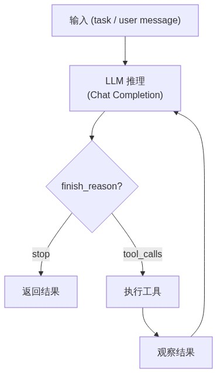
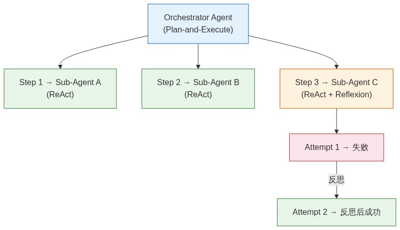

# Agent Loop：内核执行模式

> Agent 的核心在于循环执行：接收任务 → LLM 推理 → 执行动作 → 观察结果 → 决定下一步。
> 本文梳理主流 Agent 执行模式及其对 Dawning Agent OS 内核设计的影响。
>
> OS 类比：Agent Loop = 系统调用层。见 [[concepts/agent-os-architecture.zh-CN]]。

---

## 1. 基础循环

所有 Agent 框架的执行核心都是同一个循环：



关键变量：
- **何时终止** — `finish_reason="stop"` / 达到 `MaxSteps` / 达到 `MaxCost`
- **如何选择工具** — LLM 自主选择（`tool_choice="auto"`）vs 框架强制
- **是否反思** — 执行后是否评估中间结果的质量

---

## 2. 三种主流模式

### 2.1 ReAct（Reasoning + Acting）

> Yao et al., 2022. [ReAct: Synergizing Reasoning and Acting in Language Models](https://arxiv.org/abs/2210.03629)

LLM 在每一步交替进行推理和行动，并观察结果。

**原始实现 vs 现代实现**：原论文通过 prompt 让 LLM 输出 `Thought: / Action: / Observation:` 格式文本，再用正则解析提取工具调用——这种文本解析方式已被淘汰。现代框架通过 Function Calling API 实现同一模式：LLM 返回结构化的 `tool_calls` JSON，无需文本解析。

```
原始 ReAct (2022, 已淘汰):
  LLM 输出 → "Thought: ... Action: search(xxx)" → 正则解析 → 执行工具

现代 Function Calling (当前标准):
  LLM 返回 → { tool_calls: [{name: "search", args: {...}}] } → 直接反序列化 → 执行工具
```

**推理→行动→观察→循环**这一架构模式本身没有改变，改变的是实现机制。OpenAI Agents SDK、MS Agent Framework 的 `ChatCompletionAgent` 本质上都是 ReAct 循环的 Function Calling 实现。

| 特性 | 说明 |
|------|------|
| 推理方式 | 逐步推理，每步由 LLM 决定调用哪个工具（`tool_calls`）或直接回答（`stop`） |
| 规划深度 | 无显式规划，贪心决策 |
| 适用场景 | 工具调用、信息检索、问答 |
| 实现机制 | Function Calling API（非文本解析） |
| 代表框架 | OpenAI Agents SDK、MS Agent Framework |

**优点**：实现简单，Function Calling API 原生支持，无需文本解析。
**局限**：无全局规划，复杂任务容易在局部打转。

### 2.2 Plan-and-Execute

> Wang et al., 2023. [Plan-and-Solve Prompting](https://arxiv.org/abs/2305.04091)

先制定完整计划，再逐步执行。执行过程中可修订计划：

```
Plan:
  1. 查询北京天气
  2. 查询上海天气
  3. 对比两城天气并生成报告

Execute Step 1: get_weather(city="北京") → 晴，25°C
Execute Step 2: get_weather(city="上海") → 多云，22°C
Execute Step 3: generate_report(...)    → "北京比上海高3°C..."
```

| 特性 | 说明 |
|------|------|
| 推理方式 | 先规划全局步骤，再逐步执行 |
| 规划深度 | 显式多步规划 |
| 适用场景 | 复杂任务、多步骤工作流、项目管理 |
| 代表框架 | LangGraph Plan-and-Execute、CrewAI |

**优点**：全局视野，避免局部打转。
**局限**：初始计划可能错误，需要代价较高的计划修订。

### 2.3 Reflexion

> Shinn et al., 2023. [Reflexion: Language Agents with Verbal Reinforcement Learning](https://arxiv.org/abs/2303.11366)

在 ReAct 基础上增加自我反思：执行完一轮后评估结果质量，若不满意则总结教训并重试：

```
Attempt 1:
  Action: search("Python sort")
  Observation: 通用排序教程
  Reflection: 搜索太宽泛，应该搜索具体算法

Attempt 2:
  Action: search("Python timsort implementation")
  Observation: TimSort 详细实现
  → 成功
```

| 特性 | 说明 |
|------|------|
| 推理方式 | 执行 → 反思 → 改进 → 重试 |
| 规划深度 | 无显式规划，通过反思隐式改进策略 |
| 适用场景 | 代码生成、推理任务、需要迭代优化的场景 |
| 代表框架 | Reflexion Agent、AutoGen |

**优点**：自我纠错，持续改进。
**局限**：每次反思消耗额外 token，可能放大成本。

---

## 3. 对比

| 维度 | ReAct | Plan-and-Execute | Reflexion |
|------|-------|-------------------|-----------|
| 规划 | 无（贪心） | 显式全局规划 | 无（反思驱动） |
| 纠错 | 依赖 LLM 隐式调整 | 计划修订 | 显式反思 + 重试 |
| token 效率 | 高 | 中（规划开销） | 低（反思开销） |
| 实现复杂度 | 低 | 中 | 中 |
| 最佳场景 | 简单工具调用 | 多步骤复杂任务 | 需要迭代优化 |

---

## 4. 混合模式

实际生产系统往往混合使用：



- **顶层**用 Plan-and-Execute 拆解任务
- **子任务**用 ReAct 执行具体工具调用
- **关键步骤**加 Reflexion 保证质量

---

## 5. 框架实现对比

| 框架 | 默认模式 | 自定义 Loop |
|------|---------|------------|
| OpenAI Agents SDK | ReAct（Function Calling 驱动） | `max_turns` 限制，`Handoff` 支持多 Agent |
| MS Agent Framework | ReAct（`ChatCompletionAgent` + Function Calling） | `AgentGroupChat` 多 Agent 协作 |
| LangGraph | 图驱动（自定义状态机） | 完全可编程：节点 + 边 + 条件路由 |
| CrewAI | Plan-and-Execute（`Process.sequential` / `Process.hierarchical`） | 内建串行/层级执行模式 |
| AutoGen | 多 Agent 对话（已被 MS Agent Framework 取代） | Agent 间消息传递驱动循环 |

---

## 6. Dawning 设计方向

### 默认模式：ReAct

与 OpenAI Agents SDK 一致，基于 function calling 的 ReAct 循环是最小可用模式：

```csharp
// 伪代码：核心 Agent Loop
while (!done && step < maxSteps)
{
    var response = await llm.ChatAsync(messages, tools, ct);
    
    if (response.FinishReason == "stop")
    {
        done = true;
    }
    else if (response.FinishReason == "tool_calls")
    {
        var results = await ExecuteToolsAsync(response.ToolCalls, ct);
        messages.AddRange(results);
    }
    
    step++;
}
```

### 扩展点

| 扩展 | 用途 |
|------|------|
| `IAgentLoop` | 替换默认循环逻辑 |
| `MaxSteps` / `MaxCost` | 循环终止条件 |
| `Handoff` | Agent 间任务移交 |
| `IReflectionStrategy` | 可选反思策略 |
| Subagent 隔离 | Plan-and-Execute 中子任务使用独立上下文 |

---

## 延伸阅读

- [LLM 技术原理](llm-fundamentals.md) — Token、API、Function Calling 等基础
- [上下文管理](context-management.md) — 循环中的上下文窗口管理
- [LLM Wiki 模式](llm-wiki-pattern.zh-CN.md) — 长期知识积累

---

*最后更新：2026-04-11*
