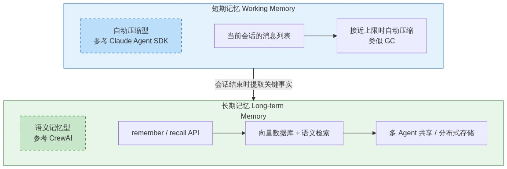
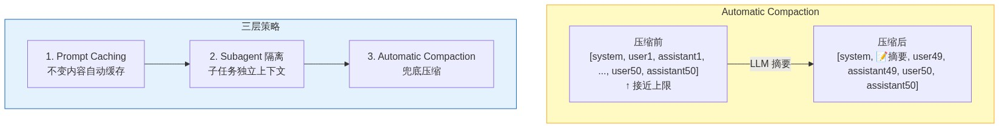

# 上下文管理：五种流派与 Dawning 设计决策

> Agent 场景下上下文窗口管理的竞品分析和 Dawning Agent Framework 的双层记忆架构设计。
> LLM 基础概念见 [LLM 技术原理](llm-fundamentals.md)。

---

## 1. 为什么 Agent 需要上下文管理

普通 Chat：一来一回，消息量小。Agent：每步产生多条消息（推理 + 工具调用 + 工具结果 + 回复），10 步运行轻松产生 30+ 条消息，加上工具返回的大段文本（文件内容、查询结果），token 消耗急剧增长。

简单丢弃最早消息的方案存在三个问题：

1. **关键上下文丢失** — 用户在第 2 步提出的约束条件被丢弃
2. **工具调用链断裂** — `tool_call` 与 `tool result` 必须成对出现，丢失其一会导致 LLM 报错
3. **不可预测性** — 开发者无法确定哪些消息被丢弃

---

## 2. 五种设计流派

核心问题：**谁负责在 LLM 调用前裁剪消息？何时触发？**

### 2.1 钩子型 — OpenAI Agents SDK

OpenAI Agents SDK **不自动截断**，提供机制让开发者选择策略：

| 策略 | 管理方 | 原理 |
|------|--------|------|
| `result.to_input_list()` | 客户端手动 | 手动拼接上轮输出 + 新输入 |
| `Session`（SQLite/Redis） | 客户端自动 | SDK 自动存取历史，`limit` 参数控制数量 |
| `conversation_id` | 服务端 | 服务端维护完整历史 |
| `previous_response_id` | 服务端 | 链式引用上一个 response |

加上 `truncation` 参数（`"auto"` 服务端智能截断）和 `call_model_input_filter` 钩子。

```python
def drop_old_messages(data: CallModelData) -> ModelInputData:
    trimmed = data.model_data.input[-5:]
    return ModelInputData(input=trimmed, instructions=data.model_data.instructions)
```

**设计哲学**：框架不擅自决定，提供机制让开发者实现自己的策略。

### 2.2 接口型 — Microsoft Agent Framework

继承自 Semantic Kernel 的 `IChatHistoryReducer` 接口 + 两个内建实现：

```csharp
public interface IChatHistoryReducer
{
    Task<IEnumerable<ChatMessageContent>?> ReduceAsync(
        IReadOnlyList<ChatMessageContent> chatHistory,
        CancellationToken cancellationToken = default);
}
```

| 实现 | 策略 |
|------|------|
| `ChatHistoryTruncationReducer` | 截断并丢弃旧消息（保留 system） |
| `ChatHistorySummarizationReducer` | 截断 + LLM 摘要压缩 |

**设计哲学**：接口 + 常用实现开箱即用，支持自定义 Reducer。

> **注**：Microsoft Agent Framework（2026-04-02 发布 v1.0.0）是 Semantic Kernel + AutoGen 的继任者。

### 2.3 管道型 — LangChain

`trim_messages()` 作为 Chain 管道中的处理节点：

```python
from langchain_core.messages import trim_messages

trimmed = trim_messages(
    messages,
    max_tokens=1000,
    strategy="last",
    token_counter=model,
    include_system=True,
    start_on="human",
)
```

**设计哲学**：声明式工具函数，组合进管道使用。与 Chain 管道耦合。

### 2.4 语义型 — CrewAI

不维护消息列表，用向量数据库 + 语义检索：

```python
memory = Memory()
memory.remember("我们决定用 PostgreSQL 作为用户数据库。")
matches = memory.recall("我们选了什么数据库？")
```

复合评分公式：

$$composite = w_{semantic} \times similarity + w_{recency} \times decay + w_{importance} \times importance$$

其中 $decay = 0.5^{age\_days / half\_life\_days}$。

核心特点：
- 存原子事实（LLM 从长文本提取），不存原始消息
- 层级化 scope（`/project/alpha`、`/agent/researcher`）
- 自动去重、合并、隐私隔离

**设计哲学**：对话历史不重要，关键信息的检索才重要。

### 2.5 自动压缩型 — Claude Agent SDK

接近上下文窗口上限时自动触发 LLM 摘要压缩。开发者零配置即可工作，可选通过 `CLAUDE.md` 自然语言指令或 `PreCompact` 钩子调参。

**设计哲学**：类似 C#/Java 的 GC — 开发者不需要手动释放内存，但可以通过调参影响行为。

---

## 3. 对比总结

| 流派 | 代表 | 触发方式 | 优点 | 缺点 |
|------|------|---------|------|------|
| 钩子型 | OpenAI Agents SDK | 开发者手动 | 最灵活，不会意外丢数据 | 需自行实现截断逻辑 |
| 接口型 | MS Agent Framework | 配置后自动 | 开箱即用 + 可扩展 | 需理解 Reducer 概念 |
| 管道型 | LangChain | 管道组装后自动 | 声明式，组合灵活 | 与 Chain 管道耦合 |
| 语义型 | CrewAI | 透明 | 长期记忆，自动检索 | 需要向量数据库基础设施 |
| 自动压缩型 | Claude Agent SDK | 全自动 | 零配置 | 压缩质量依赖 LLM，有额外 token 成本 |

### 演进类比：上下文管理 ≈ 内存管理

| 阶段 | 内存管理 | 上下文管理 |
|------|---------|-----------|
| 手动 | C/C++ `malloc/free` | OpenAI Agents SDK |
| 半自动 | C++ `unique_ptr` | MS Agent Framework |
| 全自动 | C#/Java GC | Claude Agent SDK |

趋势：**从开发者手动管理走向框架自动管理**。

---

## 4. Dawning 设计决策：双层记忆架构



### 4.1 短期记忆：Automatic Compaction

对话历史接近上下文窗口上限时，框架自动用 LLM 压缩旧消息为摘要。



### 4.2 长期记忆：Semantic Memory

跨会话知识库，基于向量数据库 + 语义检索：

- Agent 执行完任务后，框架自动提取关键事实存入向量数据库
- Agent 执行前，自动检索相关记忆注入 prompt
- 多 Agent 通过共享记忆交换知识
- 分布式场景使用远程存储（Redis / PostgreSQL+pgvector）

#### 向量数据库的已知局限

| 问题 | 描述 | Dawning 应对 |
|------|------|-------------|
| 语义相似 ≠ 相关 | "用 PostgreSQL" 和 "用 MySQL" 对 "选了什么数据库" 都高分，无法区分最终决策与被否决方案 | 复合评分（语义 + 时效 + 重要性），而非纯语义匹配 |
| 无法表达否定和更新 | 存了 "用 PostgreSQL" 后改主意存 "改用 MongoDB"，两条并存，可能返回过时信息 | 矛盾检测 + 版本化（→ [LLM Wiki Lint 机制](llm-wiki-pattern.zh-CN.md)） |
| 原子事实提取质量依赖 LLM | LLM 可能丢信息、曲解语义、产生幻觉事实 | 可配置提取 prompt + 人工审核钩子 |
| 检索精度与成本矛盾 | 召回太多浪费 token 且干扰判断，召回太少漏掉关键信息 | `MemoryOptions` 可配置召回数、相似度阈值、去重策略 |
| 基础设施复杂度 | 向量数据库（Qdrant / Milvus / pgvector）是额外运维负担 | `ILongTermMemory` 接口抽象，简单场景可用内存/文件实现 |

这也是采用双层架构而非纯向量数据库的原因——短期记忆用自动压缩（确定性强、无检索歧义），长期记忆才引入语义检索，且通过复合评分和可配置策略缓解上述问题。

### 4.3 摘要策略

| 策略 | 做法 | 理由 |
|------|------|------|
| 语言 | 跟随对话语言（自动检测），可通过 `CompactionOptions.Language` 覆盖 | 避免中英混杂 |
| 格式 | 要点列表，不用长段落 | 结构化比语言选择节省更多 token |
| 标识符 | 保留原始标识符（类名、方法名、路径） | 技术术语不翻译 |

默认压缩指令模板：

```
Summarize the conversation history. Use the following format:
- Key decisions: [bullet list]
- Modified files: [file paths]
- Pending tasks: [bullet list]
- Keep original identifiers (class names, method names, paths) as-is.
Use the same language as the conversation.
```

### 4.4 扩展点

| 扩展 | 用途 |
|------|------|
| `IContextCompactor` | 替换默认 LLM 摘要策略 |
| `ILongTermMemory` | 替换默认向量数据库后端 |
| `call_model_input_filter` 钩子 | LLM 调用前最后拦截点 |
| `CompactionOptions` | 配置保留策略 |
| `PreCompact` 钩子 | 压缩前存档完整记录 |
| `MemoryOptions` | 配置复合评分权重、去重阈值、存储后端 |

---

## 延伸阅读

- [LLM 技术原理](llm-fundamentals.md) — Token、API、采样等基础概念
- [Agent Loop](agent-loop.md) — ReAct / Plan-and-Execute / Reflexion 执行模式
- [LLM Wiki 模式](llm-wiki-pattern.zh-CN.md) — 编译式知识管理与记忆面设计

---

*最后更新：2026-04-11*
