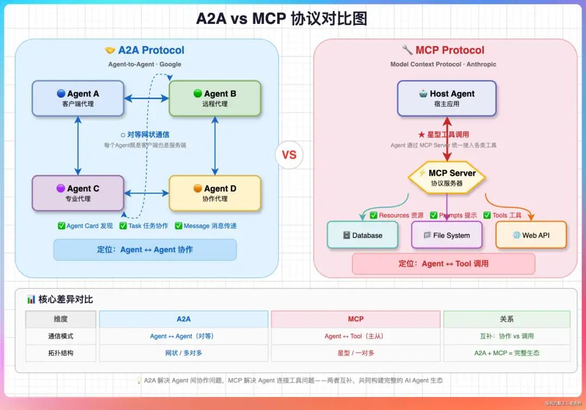
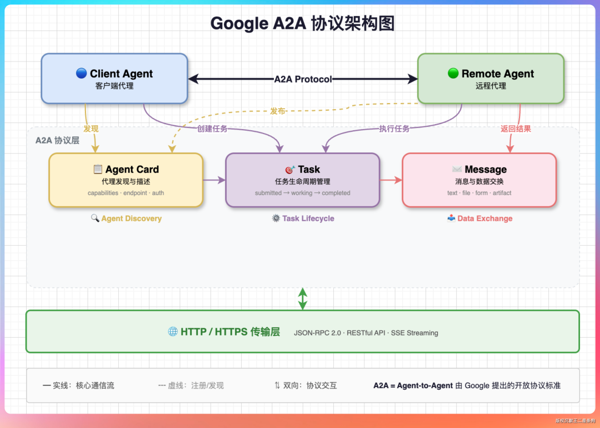

# Agent 生态两大协议：A2A 与 MCP

> 2025-2026 年，AI Agent 生态涌现出两个互补的标准化协议：**A2A**（Agent-to-Agent，Google 主推）和 **MCP**（Model Context Protocol，Anthropic 主推）。
>
> 它们不是竞争关系，而是拼图的两半：A2A 解决"Agent 之间如何通信"，MCP 解决"Agent 如何使用工具"。
>
> 本文梳理两个协议的核心抽象、传输层、典型场景，以及对 Dawning Agent OS 的映射意义。

---

## 1. 协议全景：互补而非竞争



| 维度 | A2A（Agent-to-Agent） | MCP（Model Context Protocol） |
|------|----------------------|-------------------------------|
| 主推方 | Google | Anthropic |
| 核心问题 | Agent 如何发现、沟通、协作 | Agent 如何统一接入工具/资源 |
| 拓扑结构 | **对等网状**：每个 Agent 既是 Client 也是 Server | **星型**：Host Agent 经 MCP Server 接入 N 个工具 |
| 核心实体 | Agent Card / Task / Message / Artifact | Host / MCP Server / Resources / Prompts / Tools |
| 连接对象 | 另一个 Agent | 数据库、文件系统、Web API、本地命令 |
| 发现机制 | `/.well-known/agent.json` | MCP Server 注册 + 能力协商 |
| 身份认证 | OAuth 2.0 / API Key / mTLS | Server 自定义 + Capability-based |
| 流式传输 | SSE / WebSocket / long-polling | stdio / SSE |
| 类比 | HTTP（应用间协议） | ODBC / JDBC（数据/工具访问层） |

**结论**：一个完整的 Agent 运行时**需要同时支持两个协议**。

---

## 2. A2A 协议深度解析

### 2.1 设计目标

> 让任意两个 Agent 能够像浏览器访问网站一样**相互发现、协商能力、交换任务**，而无需关心彼此使用什么框架或语言。

### 2.2 三大核心抽象



#### 2.2.1 Agent Card — Agent 身份与能力声明

每个 A2A Agent 必须在 `/.well-known/agent.json` 暴露自己的名片：

```json
{
  "name": "TravelPlannerAgent",
  "description": "专门规划跨城市行程的 Agent",
  "url": "https://travel.example.com/a2a",
  "version": "1.0.0",
  "capabilities": {
    "streaming": true,
    "pushNotifications": true,
    "stateTransitionHistory": true
  },
  "skills": [
    { "id": "plan-trip", "name": "Plan a trip", "tags": ["travel"] }
  ],
  "authentication": {
    "schemes": ["Bearer", "OAuth2"]
  }
}
```

**类比**：相当于 Agent 的"简历 + API 文档"。

#### 2.2.2 Task — 异步任务生命周期

A2A 中的所有交互都抽象为 `Task`，状态机严格定义：

```
submitted ──► working ──► input-required ──► working ──► completed
                │                                        │
                └──────────────► failed ◄────────────────┘
                                  │
                              canceled
```

| 状态 | 含义 |
|------|------|
| `submitted` | 任务已创建，尚未开始 |
| `working` | 执行中 |
| `input-required` | 需要客户端补充输入（HITL 场景） |
| `completed` | 成功完成 |
| `failed` | 失败（携带错误详情） |
| `canceled` | 被取消 |

**关键设计**：Task 是**有状态、可恢复、可查询**的第一等实体，不是一次性 RPC 调用。

#### 2.2.3 Message & Artifact — 数据载荷

**Message**（对话消息）：

```json
{
  "role": "user" | "agent",
  "parts": [
    { "type": "text", "text": "..." },
    { "type": "file", "file": { "uri": "...", "mimeType": "..." } },
    { "type": "data", "data": { /* 结构化 JSON */ } }
  ]
}
```

**Artifact**（任务产物）：Task 完成后产生的文件、报告、结构化数据等。

### 2.3 传输层

| 层 | 技术 |
|----|------|
| 协议 | HTTP/HTTPS |
| 方法 | JSON-RPC 2.0 + RESTful 扩展 |
| 流式 | Server-Sent Events（SSE）推送状态变更 |
| 长任务推送 | PushNotificationConfig（webhook 回调） |

**核心方法**：

| JSON-RPC Method | 作用 |
|-----------------|------|
| `tasks/send` | 提交新任务 |
| `tasks/sendSubscribe` | 提交并订阅流式更新 |
| `tasks/get` | 查询任务状态 |
| `tasks/cancel` | 取消任务 |
| `tasks/pushNotification/set` | 注册 webhook 回调 |

### 2.4 典型场景

1. **跨框架调用**：LangGraph Agent 调用 Dawning Agent 调用 MAF Agent
2. **专家协作**：规划 Agent 委托编码 Agent 完成子任务
3. **企业 Agent 网格**：财务 / HR / 研发 Agent 通过 A2A 互相查询能力
4. **Marketplace**：Agent 通过公开 Agent Card 被发现和调用

### 2.5 已实现的框架

| 框架 | 支持程度 |
|------|---------|
| **Google ADK** | 原生 SDK + 内置 A2AAgentExecutor |
| **Microsoft Agent Framework (MAF)** | 原生支持（v1.0+） |
| **Pydantic AI** | 支持 A2A Server + Client |
| **LangGraph** | 社区适配器 |
| **CrewAI** | 社区适配器 |

---

## 3. MCP 协议深度解析

### 3.1 设计目标

> 让 Agent 以**统一接口**接入任意工具、数据源、本地能力，消除"每个框架一套工具 SDK"的碎片化。

### 3.2 三大核心资源类型

MCP Server 向 Host 暴露三种能力：

| 类型 | 用途 | 类比 |
|------|------|------|
| **Tools** | 可调用的函数（有副作用） | RPC 方法 |
| **Resources** | 只读数据源（文件、数据库记录） | 文件系统 / REST GET |
| **Prompts** | 预置 Prompt 模板 | SQL 存储过程 |

### 3.3 架构模型

```
┌─────────────┐      MCP Protocol       ┌─────────────────┐
│  Host       │ ◄─────────────────────► │  MCP Server     │
│  (Agent /   │   JSON-RPC over         │  ┌───────────┐  │
│   Claude /  │   stdio or SSE          │  │ Tools     │  │
│   IDE)      │                         │  │ Resources │  │
│             │                         │  │ Prompts   │  │
└─────────────┘                         │  └───────────┘  │
                                        └────────┬────────┘
                                                 │
                                        ┌────────┴────────┐
                                        │  实际后端        │
                                        │  DB / FS / API  │
                                        └─────────────────┘
```

### 3.4 传输层

| 模式 | 场景 |
|------|------|
| **stdio** | 本地进程（Claude Desktop 启动子进程） |
| **SSE** | 远程 MCP Server（HTTP + Server-Sent Events） |
| **WebSocket**（新） | 双向流式 |

**握手流程**：

1. `initialize` — 协商协议版本、客户端/服务端能力
2. `initialized` — 握手完成
3. `tools/list` `resources/list` `prompts/list` — 枚举可用能力
4. `tools/call` `resources/read` `prompts/get` — 实际使用

### 3.5 典型 MCP Server 清单（官方 + 社区）

| Server | 暴露能力 |
|--------|---------|
| `filesystem` | 读写本地文件（受沙盒限制） |
| `postgres` | 只读查询 Postgres |
| `github` | Issue / PR / Repo 操作 |
| `slack` | 发消息、查频道 |
| `brave-search` | Web 搜索 |
| `puppeteer` | 浏览器自动化 |
| `memory` | 简易 KV 记忆 |

### 3.6 安全模型

- **能力最小化**：Server 在握手时声明暴露哪些工具/资源
- **用户授权**：Host 可在每次调用前要求用户确认（HITL）
- **沙盒**：stdio 模式下 Server 运行在受限进程中

---

## 4. 互补关系：一个完整 Agent 运行时的分层

```
┌──────────────────────────────────────────────────┐
│  应用层：业务 Agent（dawning-assistant 等）        │
├──────────────────────────────────────────────────┤
│  Agent 协作层（A2A）                              │
│  - Agent Card 发现  - Task 生命周期  - Artifact  │
├──────────────────────────────────────────────────┤
│  工具 / 数据访问层（MCP）                          │
│  - Tools  - Resources  - Prompts                 │
├──────────────────────────────────────────────────┤
│  LLM 驱动层（OpenAI / Anthropic / Ollama / ...）   │
└──────────────────────────────────────────────────┘
```

**重要洞察**：
- A2A 是**水平协议**（Agent ↔ Agent）
- MCP 是**垂直协议**（Agent ↔ Tool/Data）
- 二者正交，可独立演进

---

## 5. 对 Dawning Agent OS 的映射

### 5.1 协议在 OS 层中的位置

| 协议 | Dawning Layer | 对应抽象 |
|------|--------------|---------|
| **A2A** | Layer 6（消息总线） | `IMessageBus` + `IAgentDirectory` |
| **MCP** | Layer 1（Tool 协议） | `IToolRegistry` + `IMcpClient` |

### 5.2 A2A 在 Dawning 中的实现方向

```csharp
// Dawning 侧 A2A Server（暴露 Agent）
services
    .AddAgentOSKernel()
    .AddA2AServer(a2a => {
        a2a.PublishAgentCard(new AgentCard {
            Name = "DawningAssistant",
            Skills = [...]
        });
        a2a.UseOAuth2Authentication();
    });

// Dawning 侧 A2A Client（调用远程 Agent）
var remoteAgent = await a2aClient.DiscoverAsync("https://other.example.com");
var task = await remoteAgent.SendTaskAsync(new Message { ... });
await foreach (var update in task.StreamAsync()) { /* ... */ }
```

**Layer 6 映射**：
- Agent Card → Agent 注册表（`IAgentDirectory`）
- Task 状态机 → 检查点存储（`ICheckpointStore`）
- Message 传输 → `IMessageBus` 的异步契约
- SSE 推送 → `IStreamingTransport`

### 5.3 MCP 在 Dawning 中的实现方向

```csharp
services
    .AddAgentOSKernel()
    .AddMcpClient(mcp => {
        mcp.AddStdioServer("filesystem", "npx @modelcontextprotocol/server-filesystem /workspace");
        mcp.AddSseServer("github", "https://mcp.github.com/sse");
    });

// MCP 工具自动注册到 IToolRegistry
var tools = toolRegistry.GetToolsAsync();  // 包含 MCP Server 暴露的所有工具
```

**Layer 1 映射**：
- MCP Tools → `ITool` 的适配器
- MCP Resources → `IResourceProvider`
- MCP Prompts → `IPromptLibrary`

### 5.4 Dawning 的差异化价值

| 能力 | 大多数框架 | Dawning |
|------|-----------|---------|
| A2A Server | 需要单独部署进程 | **.NET 进程内原生托管**（`AddA2AServer`） |
| MCP Client | 每次调用开销高 | **与 `IToolRegistry` 统一抽象**，LLM 不关心工具来自哪里 |
| 协议桥接 | 通常缺失 | **A2A ↔ MCP 双向桥**：远程 A2A Agent 可被暴露为本地 MCP Tool |
| 治理 | 通常缺失 | **Layer 7 策略引擎**统一管控（RBAC / 审计 / PII） |

---

## 6. 协议演进时间线（2024-2026）

| 时间 | 事件 |
|------|------|
| 2024-11 | Anthropic 发布 MCP v0.1 |
| 2025-Q1 | Claude Desktop 内建 MCP 支持，生态启动 |
| 2025-04 | Google 发布 A2A 协议草案 |
| 2025-Q3 | Google ADK 原生 A2A；多家大厂表态支持 |
| 2025-Q4 | MAF v1.0 原生 A2A + MCP |
| 2026-Q1 | MCP 1.0 稳定版；SSE + WebSocket 双传输 |
| 2026-Q2 | A2A 1.0 稳定版；加入 `pushNotifications` 等企业特性 |

---

## 7. 延伸阅读

- **A2A 官方**：[google.github.io/A2A](https://google.github.io/A2A/)
- **MCP 官方**：[modelcontextprotocol.io](https://modelcontextprotocol.io/)
- **Google ADK 实现参考**：[[entities/frameworks/google-adk.zh-CN]] §3.2
- **框架生态全景**：[[comparisons/agent-framework-landscape.zh-CN]]
- **Dawning 位置**：[[concepts/agent-os-architecture.zh-CN]] Layer 1 / Layer 6

---

## 8. 小结

> **MCP 让 Agent 看得见世界，A2A 让 Agent 看得见彼此。**
> 一个完整的 Agent OS 必须同时内建两个协议栈，而不是二选一。
>
> Dawning 的定位：**.NET 生态中第一个把 A2A 和 MCP 作为 Layer 1 + Layer 6 一等公民的 Agent OS**。
