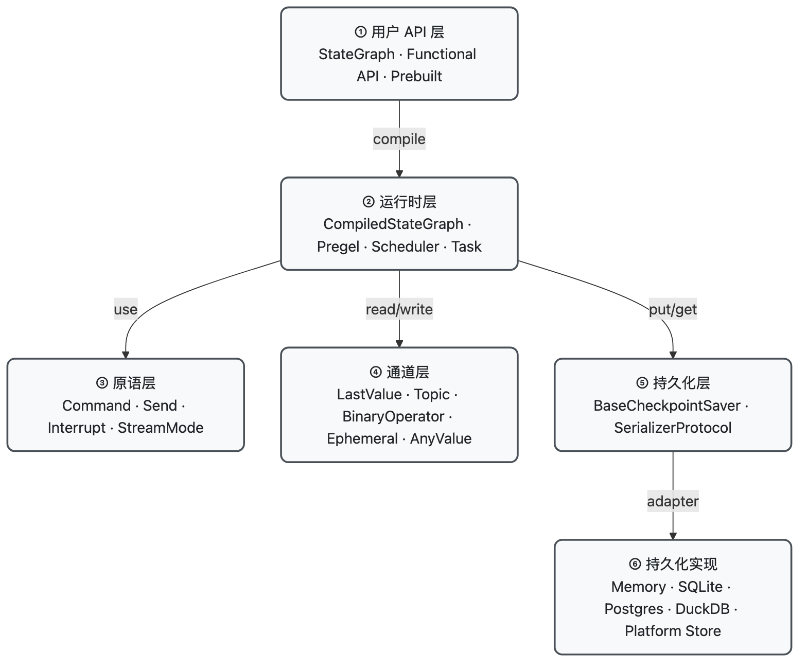
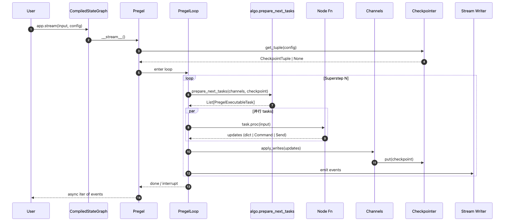
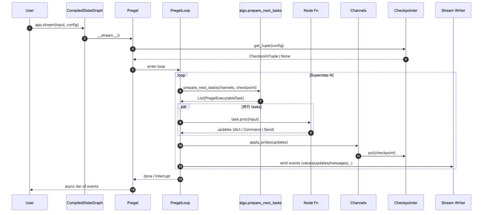
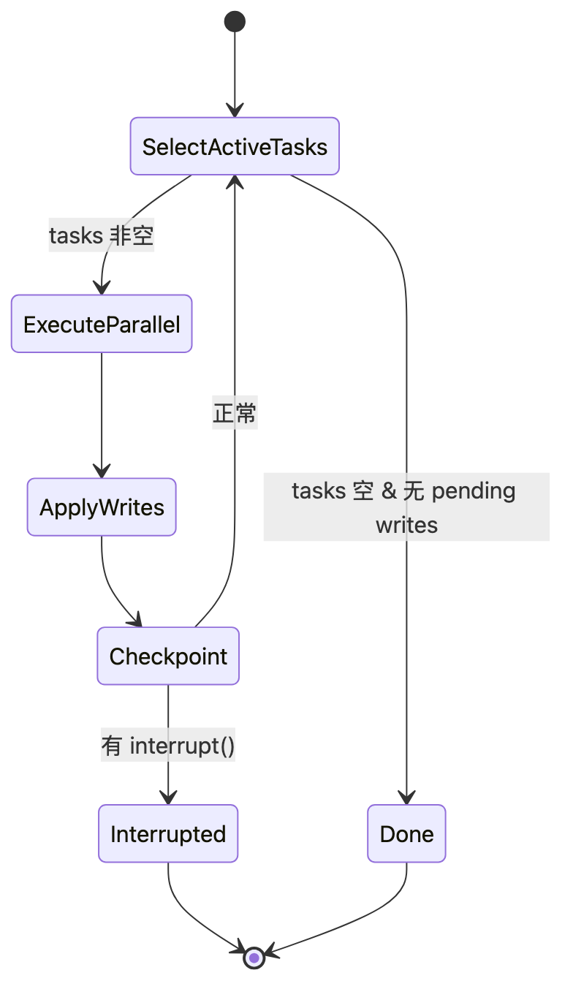
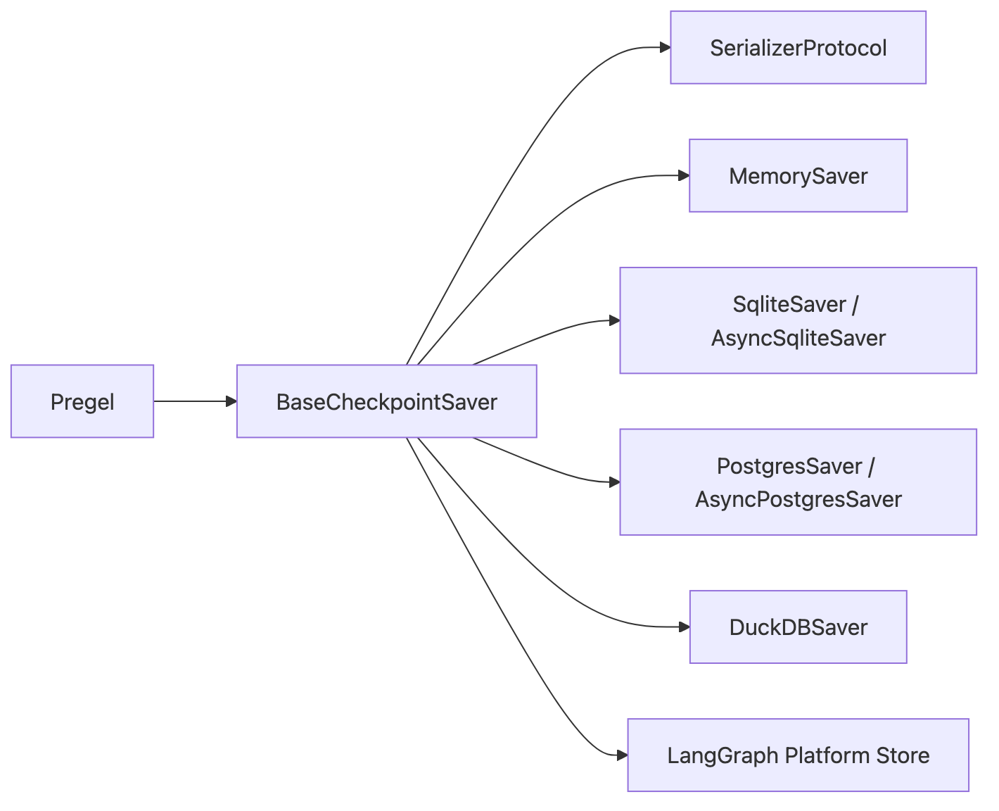
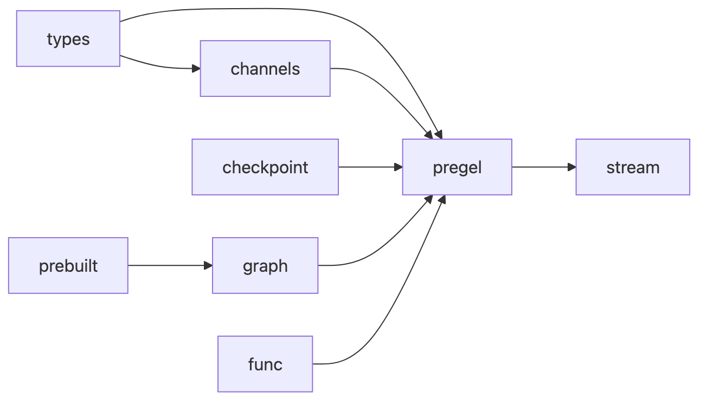

# LangGraph — 01 整体架构

> 本文回答三个问题：
> 1. LangGraph 由哪些**模块**组成，它们之间如何调用？
> 2. 一次 `graph.stream(input, config)` 调用在内部经历了哪些步骤？
> 3. 哪些模块对应 Dawning 的哪一层？
>
> 细节模块源码见 `02..N-*`。本文给"地图"。
>
> **前置阅读**：如果你对"channel / 版本号 / BSP / 激活判定"这些词陌生，先看 [[../../concepts/dataflow-channel-version]]，再回来读本文。

---

## 1. 模块地图

把 LangGraph 想象成一个 **从上到下的 6 层调用栈**。上层是"用户写的东西"，下层是"运行时和底层适配"。每层只依赖更下层，不回调。

### 1.1 分层总览（只看层 + 关键方向）



> 源文件：[`diagrams/module-map.mmd`](./diagrams/module-map.mmd)

每层**一句话职责**：

| 层 | 职责 | 关键源文件 |
|---|------|----------|
| ① 用户 API | 用 Python 语法把"图"描述出来 | `graph/state.py`、`func/*.py`、`prebuilt/*.py` |
| ② 运行时 | BSP 循环：选任务 → 并发跑 → 合并写 | `pregel/__init__.py`、`pregel/loop.py`、`pregel/algo.py` |
| ③ 原语 | 跨节点"控制消息" | `types.py` |
| ④ 通道 | 状态合并语义（reducer） | `channels/*.py` |
| ⑤ 持久化接口 | 快照 / 恢复 / 版本 | `checkpoint/base.py` |
| ⑥ 持久化实现 | 真正落盘 | `checkpoint/memory.py`、`checkpoint-sqlite/`、`checkpoint-postgres/`、`checkpoint-duckdb/` |

### 1.2 运行时内部（只放第②层）

分层图不展开运行时细节。真要看 Pregel 内部，用这张：



> 源文件：[`diagrams/stream-lifecycle.mmd`](./diagrams/stream-lifecycle.mmd)

### 1.3 Channel 家族一览（不进图）

| Channel | 语义 | 典型用途 |
|---------|------|---------|
| `LastValue` | 后写覆盖前写 | 普通字段 |
| `BinaryOperatorAggregate` | 用 reducer 合并 | `Annotated[list, add_messages]` |
| `Topic` | pub-sub，保留历史 | Fan-out / 广播 |
| `AnyValue` | 多源合并 | Send 目标 |
| `EphemeralValue` | 单超步可见，不持久 | 临时中间量 |

### 1.4 持久化实现矩阵（不进图）

| 实现 | Python 包 | 并发 | 跨进程 | 适合 |
|------|---------|------|-------|------|
| `MemorySaver` | `langgraph-checkpoint` | 进程内 | ❌ | 单测 / dev |
| `SqliteSaver` | `langgraph-checkpoint-sqlite` | 单机 | ✅（文件锁） | 单机小流量 |
| `PostgresSaver` | `langgraph-checkpoint-postgres` | 集群 | ✅ | 生产首选 |
| `DuckDBSaver` | `langgraph-checkpoint-duckdb` | 单机 | ✅ | 分析 / 嵌入式 |
| `Platform Store` | LangGraph Platform | 托管 | ✅ | 企业 SaaS |


---

## 2. 各模块一句话职责

| 模块 | 一句话 |
|------|--------|
| `graph/state.py` | 把用户写的 TypedDict / Pydantic State + 节点函数"**编译**"成一个 Pregel |
| `graph/message.py` | MessageGraph：为 message list 优化的 StateGraph |
| `pregel/__init__.py` | 运行时主入口，`.invoke() / .stream() / .ainvoke() / .astream()` |
| `pregel/loop.py` | 单次 superstep 的调度循环（选择任务 → 并发执行 → 合并） |
| `pregel/algo.py` | 选择激活节点、构建 PregelExecutableTask、版本号管理 |
| `pregel/read.py` / `write.py` | Channel 读写原语 |
| `channels/*.py` | 各种 reducer 语义的实现 |
| `checkpoint/base.py` | `BaseCheckpointSaver` 接口 + 版本管理 |
| `checkpoint/serde/*.py` | 序列化（msgpack / json） |
| `prebuilt/chat_agent_executor.py` | `create_react_agent` 实现 |
| `types.py` | `Command / Send / Interrupt / StreamMode` 等 |
| `func/*.py` | Functional API：`@entrypoint` / `@task` |
| `constants.py` | `START` / `END` / `NS_SEP` 等常量 |

---

## 3. 一次运行的生命周期

以下是 `app.stream(input, config, stream_mode="updates")` 的高层时序：



> 源文件：[`diagrams/run-lifecycle.mmd`](./diagrams/run-lifecycle.mmd)

重点：
- 每 superstep 先从 **channels 版本** 选出激活节点（类 Pregel 超步语义）
- 节点并行跑；跑完**同步屏障**，一起写 channels → 落 checkpoint
- Checkpoint 成为"下一超步恢复点"，也就是 Durability 基础
- Stream 按 `stream_mode` 把事件吐给调用方

---

## 4. 数据流：State → Channels → Reducer

用户写的 `State` TypedDict 在编译期被翻译为一组 **Channel**：

```
class State(TypedDict):
    messages: Annotated[list, add_messages]   # → BinaryOperatorAggregate
    step: int                                 # → LastValue
```

| State 写法 | 编译后 Channel | 语义 |
|-----------|---------------|------|
| 普通字段 | `LastValue` | "后写覆盖前写" |
| `Annotated[T, reducer]` | `BinaryOperatorAggregate[reducer]` | "用 reducer 合并" |
| `MessagesState` 预设 | 内置 `add_messages` reducer | append + dedupe + tool_call 语义 |
| `Send(...)` 目标字段 | `Topic` / `AnyValue` | fan-out |
| 临时字段 | `EphemeralValue` | 当 step 可见，不持久 |

这就是为什么 **State 的 reducer 决定了图的并发语义**。`04-channels.zh-CN.md` 会专门拆这一层。

---

## 5. 执行模型：Pregel BSP 语义

BSP = Bulk Synchronous Parallel。LangGraph 的一个 **superstep** 大致等价于"一个回合"：



> 源文件：[`diagrams/bsp-superstep.mmd`](./diagrams/bsp-superstep.mmd)

这意味着：
- 并发安全性靠 **barrier + reducer** 保证，而不是锁
- 每个 superstep 是一次原子 checkpoint 机会
- "图" 结构本质上是 "哪些 channel 的版本号变化 → 哪些节点变活"

---

## 6. 控制原语（types.py）

三个关键类型在节点返回值里"搭便车"：

| 原语 | 用途 |
|------|------|
| `Command(update=..., goto=..., resume=...)` | 原子：同时更新 state + 跳转 |
| `Send(node, input)` | fan-out：为目标节点单独排一份 input |
| `interrupt(value)` | HITL：冻结当前任务，值暴露给客户端 |

这些原语让 LangGraph 从"静态图"升级为"带副作用的调度器"。后续 `06-interrupt-hitl.zh-CN.md` 会展开。

---

## 7. 持久化分层



> 源文件：[`diagrams/checkpoint-stack.mmd`](./diagrams/checkpoint-stack.mmd)

- `Saver` 只管**写读+版本**；序列化独立
- `Serde` 默认 msgpack，可换 JSON（调试友好）
- 每 thread/user session 对应一个 `thread_id`；支持 `checkpoint_ns` 分层命名空间

---

## 8. Stream 子系统

`pregel/stream.py` + `types.StreamMode`：

| Mode | 粒度 | 用途 |
|------|------|------|
| `values` | 超步结束后的完整 state | 兼容老代码 |
| `updates` | 超步内部的 per-node update | UI 动画 |
| `messages` | LLM token 粒度 | Chat UI |
| `custom` | 节点内 `get_stream_writer()` 自定义 emit | 自定义事件 |
| `debug` | 内部超步细节 | 诊断 |

多 mode 可叠加：`stream_mode=["updates", "messages"]`。

---

## 9. 模块依赖 DAG



> 源文件：[`diagrams/module-deps.mmd`](./diagrams/module-deps.mmd)

- 无循环依赖
- `types` 是"词汇表"层，最干净
- `pregel` 是所有模块的汇合点
- `prebuilt` 只依赖 `graph`，不直接碰 `pregel`

---

## 10. 与 Dawning 的 Layer 映射

| LangGraph 模块 | Dawning Layer | Dawning Interface | 对应关系 |
|----------------|---------------|-------------------|---------|
| `graph/state.py`（构图 DSL） | Layer 6（Skill） | `IWorkflow` / `ISkillComposition`（规划） | 部分：Dawning 更偏"声明式 skill + runtime" |
| `pregel/` 运行时 | Layer 5（编排） | `IAgentRuntime` / `IWorkflowEngine`（规划） | 同构概念，Dawning 可接 Temporal / 自建 |
| `channels/` | Layer 2（Working Memory） | `IWorkingMemory` | reducer 语义可映射到 memory 合并 |
| `checkpoint/` | Layer 5（编排） | `IWorkflowCheckpoint`（规划） | 直接参考：Saver + Serde 分离 |
| `types.Command/Send/Interrupt` | Layer 4 / Layer 7 | `IReasoningStrategy` / `IHitlGate` | Command≈reasoning step，Interrupt≈HITL |
| `stream` | Layer 7（观测 / UX） | `IAgentEventStream` | 直接参考：多 mode 并行 |
| `prebuilt/` | Layer 6（Skill） | 预置 Skill | Dawning 内置 `ReactSkill`、`SupervisorSkill` |
| `func/` (Functional API) | Layer 6 | `ISkillDsl` | 提供 decorator 风格构图 |
| `checkpoint-postgres` 等 | Layer 2 / Layer 5 持久化 | 适配器 | Dawning.Workflow.Postgres 参考 |

完整映射表见后续 [[../_cross-module-comparison/checkpoint-impl.zh-CN]] 与 [[../_cross-module-comparison/state-model.zh-CN]]。

---

## 11. 阅读入口

建议从以下三条入口往下切：

- **想懂"图怎么被跑"** → `02-state-graph` + `03-pregel-runtime`
- **想懂"状态为什么能合"** → `04-channels`
- **想懂"为什么能 pause/resume"** → `05-checkpointer` + `06-interrupt-hitl`
- **想懂"Chat UI 怎么做流"** → `07-streaming`
- **想懂"prebuilt 怎么搭"** → `08-prebuilt-agents`
- **想懂"子图 / Functional API"** → `09-subgraph-functional-api`
- **想懂"企业化怎么落"** → `10-platform-integration`

---

## 12. 延伸阅读

- [[00-overview]] — 本框架定位
- [[../README]] — 源码解剖库说明
- [[../../comparisons/maf-vs-langgraph.zh-CN]] — 与 MAF 对比
- [[../../comparisons/workflow-vs-agent.zh-CN]] — Workflow 引擎对比
- [[../../concepts/state-persistence.zh-CN]] — 状态持久化综述
- Pregel 论文：<https://research.google/pubs/pregel-a-system-for-large-scale-graph-processing/>
- 官方 Conceptual Guide：<https://langchain-ai.github.io/langgraph/concepts/low_level/>
