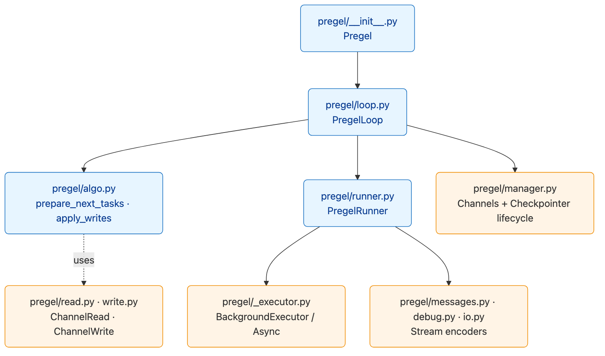
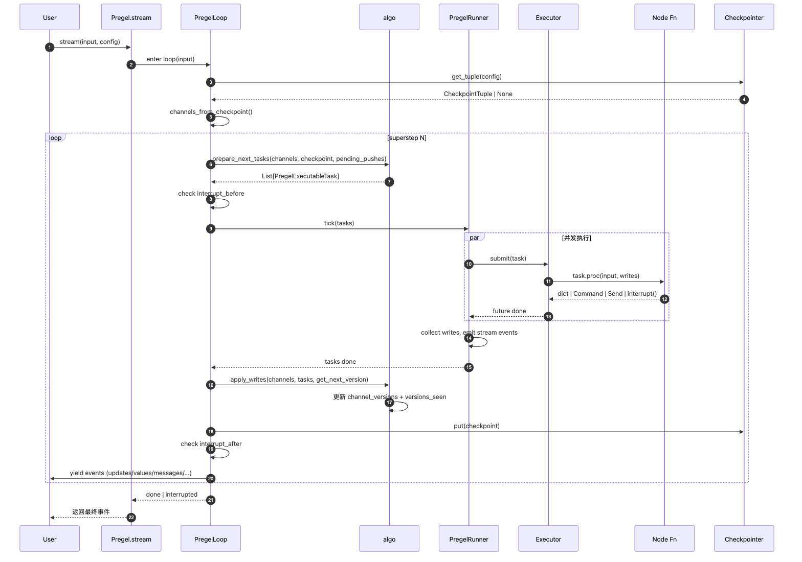
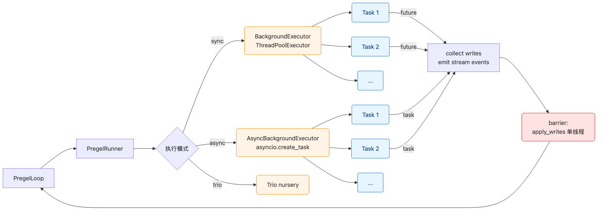
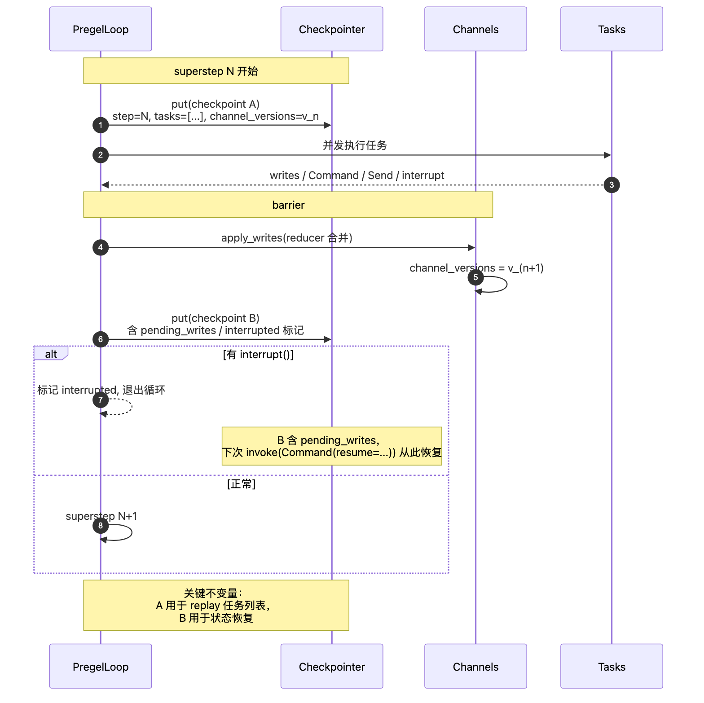

# LangGraph — 03 Pregel 运行时：BSP 调度核心

> 本文回答：调用 `app.invoke()` / `app.stream()` 时，LangGraph 在内部到底做了什么？
>
> 重点路径：`langgraph/pregel/__init__.py`、`pregel/loop.py`、`pregel/algo.py`、`pregel/runner.py`、`pregel/_executor.py`。

---

## 1. 范围与边界

| 在范围 | 不在范围 |
|--------|---------|
| Pregel BSP 超步循环 | StateGraph 编译 → [[02-state-graph]] |
| 任务选择算法（algo.prepare_next_tasks） | Channel 实现 → [[04-channels]] |
| Writes 应用与版本号管理 | Checkpoint 落盘 → [[05-checkpointer]] |
| 并发执行（Sync/Async/Trio） | Stream 子系统 → [[07-streaming]] |
| Send / Command / interrupt 的运行时落点 | 用户视角语义 → [[06-interrupt-hitl]] |

---

## 2. 一句话回答

> Pregel 是个"**channel-driven actor scheduler**"：
> 每个超步里，**版本号比上次大的 channel** 决定哪些 actor 激活，
> actor 并发跑完写回 channel，
> barrier 后统一 reduce + 落 checkpoint，
> 然后开下一超步。直到没有节点激活或遇到 interrupt。

---

## 3. 模块结构



> 源文件：[`diagrams/pregel-modules.mmd`](./diagrams/pregel-modules.mmd)

| 文件 | 职责 |
|------|------|
| `pregel/__init__.py` | `Pregel` 类，对外的 `invoke / stream / ainvoke / astream` 入口 |
| `pregel/loop.py` | `PregelLoop`：单次运行从开始到结束的循环外壳，串起 algo / runner / checkpointer |
| `pregel/algo.py` | 纯函数：`prepare_next_tasks`、`apply_writes`、`local_read`、版本号比较 |
| `pregel/runner.py` | `PregelRunner`：把任务交给 executor，处理 retry、cache、stream 转发 |
| `pregel/_executor.py` | `BackgroundExecutor` / `AsyncBackgroundExecutor`：线程池 / asyncio task 池 |
| `pregel/read.py` / `write.py` | 节点用的 `ChannelRead` / `ChannelWrite` runnable |
| `pregel/io.py` | input/output channel 编解码 |
| `pregel/types.py` | `PregelTask`、`PregelExecutableTask`、`StateSnapshot` |
| `pregel/manager.py` | 异步 manager：包装 channels + checkpointer 的 lifecycle |
| `pregel/debug.py` | debug stream mode 的事件构造 |
| `pregel/messages.py` | messages stream mode 的过滤逻辑 |

---

## 4. 顶层入口：`Pregel.stream()`

简化伪代码：

```python
class Pregel(Runnable):
    def stream(self, input, config=None, *, stream_mode="updates",
               output_keys=None, interrupt_before=None, interrupt_after=None,
               debug=None, subgraphs=False):
        config = ensure_config(config)
        with PregelLoop(input, config, self, stream_mode, ...) as loop:
            with PregelRunner(loop) as runner:
                while loop.tick(input_keys=self.input_channels):
                    for _ in runner.tick(loop.tasks, ...):
                        # runner.tick 是 generator，每个 yield 代表一个 stream 事件
                        yield from loop.output_writes()
                # 退出循环：要么 done，要么 interrupt
                yield from loop.output_writes(final=True)
```

要点：
- `loop.tick()` 是**单次超步**的"准备阶段"——返回 True 表示"还有任务可跑"
- `runner.tick(tasks)` 是**单次超步的并发执行**
- 两者解耦的目的是：复用同一套 algo 给 sync / async / debug / replay 不同上下文

---

## 5. 单次超步的内部时序



> 源文件：[`diagrams/pregel-tick.mmd`](./diagrams/pregel-tick.mmd)

### 5.1 PregelLoop.tick — 准备

```python
def tick(self, *, input_keys) -> bool:
    # 1. 第一次：把输入写入 START channel
    if self.step == 0:
        self._first_tick(input_keys)

    # 2. 拉最新 checkpoint 状态
    self.channels = channels_from_checkpoint(self.checkpoint, self.specs)

    # 3. 算下一批任务
    self.tasks = prepare_next_tasks(
        self.checkpoint,
        self.pending_writes,
        self.nodes,                # PregelNode 字典
        self.channels,             # 当前 channel 状态
        managed=self.managed_values,
        config=self.config,
        step=self.step,
        for_execution=True,
        store=self.store,
        checkpointer=self.checkpointer,
        manager=self.manager,
    )

    # 4. 没任务 + 没 pending writes → 终止
    if not self.tasks:
        return False

    # 5. 检查 interrupt_before：命中则冻结当前任务，抛出 GraphInterrupt
    self._check_interrupts_before()
    return True
```

### 5.2 algo.prepare_next_tasks — 选谁跑

核心算法：**对比 channel 版本号**。

```python
def prepare_next_tasks(checkpoint, pending_writes, nodes, channels, ...):
    tasks = []
    for name, node in nodes.items():
        # 该 node 的触发 channels 里，有没有版本号比上次本节点见过的更新？
        triggers = node.triggers
        if any(channels[t].is_available()
               and channel_versions[t] > seen_versions[name].get(t, 0)
               for t in triggers):
            # 这个节点要跑
            task = _make_executable_task(name, node, channels, ...)
            tasks.append(task)

    # 处理 PUSH / SEND：上一超步的 Send(x, payload) 也是触发
    for push in pending_pushes:
        tasks.append(_make_executable_task_for_push(push, ...))

    return tasks
```

要点：
- 不是"按拓扑顺序遍历"，而是"被新版本 channel 唤醒"。这就是 Pregel **channel-driven** 的本质
- `seen_versions` 是 per-node-per-channel 的"上次看到的版本号"，存于 checkpoint
- `Send(x, payload)` 不走 channel 版本，直接进 pending pushes，下超步必跑

### 5.3 PregelRunner.tick — 怎么跑

```python
def tick(self, tasks, *, timeout=None, retry_policy=None, ...):
    # 1. 选执行器：sync 用 ThreadPoolExecutor，async 用 asyncio
    futures = {
        self.submit(task.proc, task.input, task.config, task.writes, task.id): task
        for task in tasks
    }

    # 2. 边出结果边 yield stream 事件
    for fut, task in as_completed(futures):
        try:
            result = fut.result(timeout)
        except Exception as exc:
            self._handle_failure(task, exc)
            continue
        # cache 命中也走这里
        self._collect_writes(task, result)
        yield from self._yield_stream_events(task)
```

### 5.4 algo.apply_writes — barrier 后合并

```python
def apply_writes(checkpoint, channels, tasks, get_next_version):
    updated_channels = set()
    for task in tasks:
        for chan, value in task.writes:
            channels[chan].update([value])    # 调 reducer
            updated_channels.add(chan)
            checkpoint["channel_versions"][chan] = get_next_version(...)
    # 更新 seen_versions：这些任务"看到了"它们触发的版本
    for task in tasks:
        for trigger in task.triggers:
            checkpoint["versions_seen"][task.name][trigger] = checkpoint["channel_versions"][trigger]
    return updated_channels
```

**这是整个并发安全模型的核心：**

- 所有节点写到自己的 `task.writes` 缓冲，不直接改 channel
- barrier 后单线程依次 `apply_writes`，保证 reducer 调用顺序确定
- 版本号严格单调递增，`get_next_version` 默认是 `int + 1`，可换为 vector clock

---

## 6. 并发模型



> 源文件：[`diagrams/pregel-executor.mmd`](./diagrams/pregel-executor.mmd)

| Mode | 执行器 | 适合 |
|------|-------|------|
| sync | `BackgroundExecutor`（基于 `concurrent.futures.ThreadPoolExecutor`） | CLI / 脚本 / 阻塞 LLM SDK |
| async | `AsyncBackgroundExecutor`（基于 `asyncio.create_task`） | Web / Streaming / 高并发 |
| trio | `AsyncBackgroundExecutor` 的 trio 兼容路径 | Trio 生态 |
| debug | 顺序执行 + 逐 step 暴露 | 测试 / replay |

**关键设计：**

- **任务级隔离**：每个 `PregelExecutableTask` 持有自己的 `config / writes / triggers`，不共享可变状态
- **失败局部化**：单任务异常不影响同超步其他任务；失败任务的 writes 被丢弃；按 `retry_policy` 决定是否重排
- **取消传播**：`config["configurable"]["__cancel__"]` 通过 cancel scope 触发；async 走 `asyncio.CancelledError`
- **背压**：runner 通过 `concurrency_limit` 限制并发度（默认无限）

---

## 7. Checkpoint 与超步的关系



> 源文件：[`diagrams/pregel-checkpoint.mmd`](./diagrams/pregel-checkpoint.mmd)

每个 superstep 产生 **2 个** checkpoint：

| 时机 | 内容 | 用途 |
|------|------|------|
| superstep 开始前 | `{step: N, tasks: [...], channel_versions: {...}}` | 重启时知道"这一步本应跑哪些任务" |
| `apply_writes` 之后 | 上面 + `pending_writes`（如有 interrupt） | 真正落盘的"完成态" |

> v1.x 的优化：**只在 channel_versions 变化时**才写 checkpoint；纯流式的 superstep 可以无写。

恢复语义：

```
get_state(config) → 最新 checkpoint
update_state(config, values, as_node="x")
    → 模拟 x 节点的 writes，产生新 checkpoint
    → 下一次 invoke 从这个新 checkpoint 启动
```

---

## 8. Send / Command / interrupt 的运行时落点

| 节点返回值 | 谁处理 | 何时生效 |
|-----------|-------|---------|
| `dict` | `apply_writes`：按 channel 名分发到对应 reducer | 本超步末尾 |
| `Command(update=..., goto=..., resume=...)` | `algo._convert_command_to_writes`：拆成 (writes, push) | 本超步末尾写，下超步 push 触发 |
| `[Send("x", payload), ...]` | 加入 `pending_pushes` | 下超步 `prepare_next_tasks` 必跑 |
| `interrupt(value)` 抛出 `GraphInterrupt` | runner 捕获，task 标记 interrupted；保留 pending_writes | 下次 `invoke` 带 `Command(resume=...)` 才能继续 |

> **关键**：`interrupt()` 不是抛异常给用户，是抛给 runner 让它**优雅冻结**，保留现场到 checkpoint。

---

## 9. Stream 子系统的接入点

`PregelRunner` 在三个时机往 stream 里 push 事件：

| 事件源 | stream_mode 关键字 |
|--------|------------------|
| 节点开始 / 结束（带 update） | `updates` |
| 超步结束后的完整 state | `values` |
| 节点内部触发的 LLM token | `messages` |
| 节点内 `get_stream_writer().write(...)` | `custom` |
| 调度器内部状态（task 选择 / writes） | `debug` |

多 mode 同时开：`stream_mode=["updates", "messages"]`，事件以 `(mode, payload)` 元组返回。

详细见 [[07-streaming]]。

---

## 10. 几个关键 invariants

| 不变量 | 由谁保证 | 破坏后果 |
|--------|---------|---------|
| 同一超步内，所有节点看到的是**起点 channels 的快照** | `channels_from_checkpoint` 在 tick 开头创建 | 否则会出现"读到本步内别人写的"的不可重现行为 |
| `apply_writes` 单线程 | runner 把所有 task.writes 收回 loop 处理 | 否则 reducer 并发执行会出非确定结果 |
| `channel_versions[c]` 严格单调递增 | `get_next_version` 提供 | 否则 `prepare_next_tasks` 无法判定"新" |
| `seen_versions[node][c] <= channel_versions[c]` | apply_writes 同步更新 | 否则节点会被"重复唤醒" |
| 节点函数纯 + 写入只通过返回值 | 用户合约 | 否则中断恢复后会重复副作用（详见 [[06-interrupt-hitl]] §HITL 与幂等） |

---

## 11. 错误处理

| 错误 | 处理位置 | 行为 |
|------|---------|------|
| 节点函数抛异常 | runner.tick `as_completed` 分支 | 走 `RetryPolicy`：retry / 升级为 GraphInterrupt / 抛出 |
| `RetryPolicy.max_attempts` 用尽 | runner | 抛 `GraphRecursionError` 之外的原异常给 stream 终止 |
| 超出 `recursion_limit`（默认 25） | loop.tick 开头 | 抛 `GraphRecursionError`；不是真递归是超步数 |
| 节点写不存在的 channel | `apply_writes` | `InvalidUpdateError` |
| 死锁（节点都不激活但 pending writes 非空） | loop.tick | 抛 `EmptyChannelError`，提示 reducer/triggers 不一致 |
| Cancellation | runner / executor | 当前 task `CancelledError`，未跑的 task 直接丢弃；checkpoint 仍尝试落盘 |

---

## 12. 性能优化清单

| 优化 | 说明 |
|------|------|
| Checkpoint 写最小化 | 只在版本变化时写，且 `pending_writes` 只放本超步增量 |
| Channel 序列化用 msgpack | 比 json 快 2~3x，且支持二进制 |
| Async 优先 | LLM 调用是 IO-bound，async 比 ThreadPool 节省 ~50% 内存 |
| Cache 短路 | `cache_policy` 命中后跳过 task.proc，但仍走 apply_writes 维持版本一致 |
| `defer=True` | 把"汇总"节点推到这一超步最后，避免被 fan-out 中间态触发 |
| `EphemeralValue` channel | 不进 checkpoint，省 IO；适合"中间产物" |
| Subgraph thread 隔离 | 父子图共享 thread_id 时按 `checkpoint_ns` 分层，避免冲突 |

---

## 13. 与 Dawning 的对应

| LangGraph 概念 | Dawning 对应 | 备注 |
|----------------|-------------|------|
| `Pregel` | `IAgentRuntime` / `IWorkflowEngine`（规划） | 同构概念 |
| `PregelLoop.tick` | `IWorkflowEngine.AdvanceAsync` | 单超步语义 |
| `PregelRunner` + Executor | Dawning 自有 `IExecutionStrategy` | sync / async / parallel 抽象一致 |
| `prepare_next_tasks` | Dawning `IActivationSelector` | 版本号驱动 vs 事件驱动可以是两种实现 |
| `apply_writes` | Dawning `IStateMerger` | reducer 概念直接搬 |
| `RetryPolicy` | Dawning.Resilience `RetryProfile` | 直接复用 SDK |
| `recursion_limit` | Dawning `WorkflowOptions.MaxSupersteps` | 命名建议改 |
| `interrupt()` 冻结现场 | Dawning `IHitlGate.SuspendAsync` | 落点都在 checkpoint |
| `Send(...)` fan-out | Dawning `IBranchDispatcher` | 概念等价 |
| Checkpoint 双写时机 | Dawning `IWorkflowCheckpoint`（规划） | "起点 + 终点" 模式建议直接抄 |

---

## 14. 阅读顺序

- 已读 → [[02-state-graph]] 知道编译后的 Pregel 是什么形状
- 下一步 → [[04-channels]] 看 reducer 在 `apply_writes` 里到底做什么
- 想了解持久化语义 → [[05-checkpointer]]
- 想看 HITL 怎么靠 interrupt + checkpoint 实现 → [[06-interrupt-hitl]]
- 想看 stream 多 mode 同时输出怎么实现 → [[07-streaming]]

---

## 15. 延伸阅读

- 源码：`libs/langgraph/langgraph/pregel/{__init__,loop,algo,runner,_executor}.py`
- Pregel 论文：<https://research.google/pubs/pregel-a-system-for-large-scale-graph-processing/>
- 官方 Conceptual Guide - Low Level：<https://langchain-ai.github.io/langgraph/concepts/low_level/>
- BSP 模型综述：<https://en.wikipedia.org/wiki/Bulk_synchronous_parallel>
- [[01-architecture]] §3 一次运行的生命周期（高层视角）
- [[../_cross-module-comparison/runtime-model.zh-CN]]（待写：vs Temporal / vs Akka）
