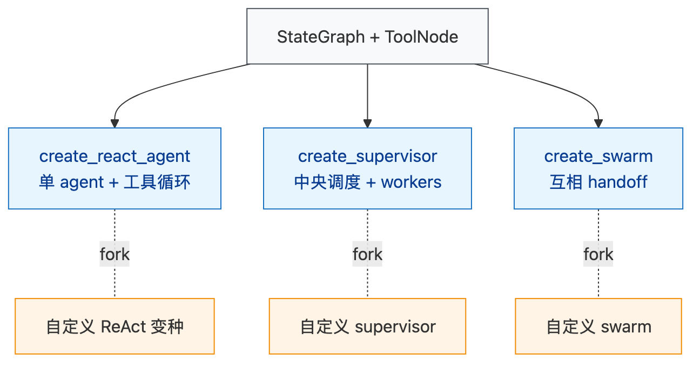
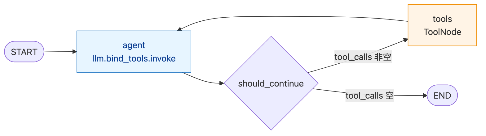
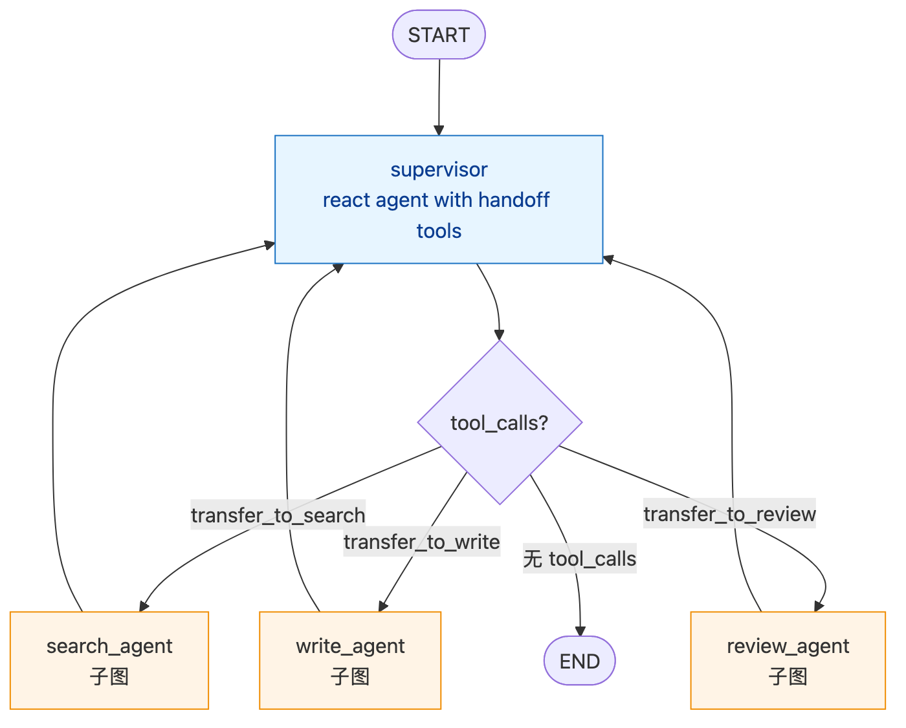

# LangGraph — 08 Prebuilt Agents：现成可用的图模板

> 本文回答：`create_react_agent` 内部到底是个什么图？`ToolNode` 怎么处理工具？supervisor / swarm 这些范式背后是哪些 StateGraph？

> 重点路径：`langgraph/prebuilt/{chat_agent_executor.py, tool_node.py, supervisor.py, swarm.py}`。

---

## 1. 范围

| 在范围 | 不在范围 |
|--------|---------|
| 4 个核心 prebuilt：ReAct / ToolNode / Supervisor / Swarm | 自定义 supervisor → [[09-subgraph-functional-api]] |
| 它们的 state schema 和图结构 | LangChain Tool 抽象 → 上游 LangChain |
| 选型与扩展点 | 部署 → [[10-platform-integration]] |

---

## 2. 一句话回答

> Prebuilt = 把"常见 Agent 模式"封装成一行 `create_xxx(...)` API，
> 但本质都是 **StateGraph + 几个固定节点**，
> 看懂源码就知道怎么 fork 改造。

---

## 3. 全家福



> 源文件：[`diagrams/prebuilt-family.mmd`](./diagrams/prebuilt-family.mmd)

| API | 范式 | 适合 |
|-----|------|------|
| `create_react_agent` | ReAct（思考-行动-观察循环） | 单 Agent 工具调用 |
| `ToolNode` | 工具调度节点 | 自定义图里的工具桥接 |
| `create_supervisor` | Supervisor → Workers | 显式分工 + 严格路由 |
| `create_swarm` | 多 Agent 互相 handoff | 松耦合协作 / 角色切换 |

---

## 4. `create_react_agent`（核心）

### 4.1 用法

```python
from langgraph.prebuilt import create_react_agent

agent = create_react_agent(
    model="openai:gpt-4o",
    tools=[search, calculator],
    prompt="You are a helpful assistant.",
    state_schema=MessagesState,           # 默认
    checkpointer=MemorySaver(),
    interrupt_before=[],
    debug=False,
)

agent.invoke({"messages": [HumanMessage("最新汇率？")]})
```

### 4.2 内部图



> 源文件：[`diagrams/prebuilt-react.mmd`](./diagrams/prebuilt-react.mmd)

```python
# chat_agent_executor.py 简化
def create_react_agent(model, tools, prompt=None, ...):
    bound_model = model.bind_tools(tools) if isinstance(model, str) or model.bind_tools else model
    tool_node = ToolNode(tools)

    def agent_node(state):
        messages = state["messages"]
        if prompt:
            messages = [SystemMessage(prompt)] + messages
        result = bound_model.invoke(messages)
        return {"messages": [result]}

    def should_continue(state):
        last = state["messages"][-1]
        if last.tool_calls:
            return "tools"
        return END

    builder = StateGraph(state_schema)
    builder.add_node("agent", agent_node)
    builder.add_node("tools", tool_node)
    builder.add_edge(START, "agent")
    builder.add_conditional_edges("agent", should_continue, ["tools", END])
    builder.add_edge("tools", "agent")
    return builder.compile(checkpointer=checkpointer, ...)
```

**3 个节点 + 1 个条件边 + 1 个回边** = 全部。

### 4.3 进阶参数

| 参数 | 说明 |
|------|------|
| `state_schema` | 自定义 state（默认 MessagesState） |
| `pre_model_hook` / `post_model_hook` | LLM 调用前后注入处理 |
| `response_format` | Pydantic schema → 强制结构化输出 |
| `version` | `"v1"` 单工具 / `"v2"` 并发多工具 |
| `interrupt_before=["tools"]` | 工具执行前暂停（HITL） |
| `store=...` | 长期记忆（不同于 checkpoint） |
| `cache=...` | 节点级缓存 |

---

## 5. `ToolNode`

### 5.1 用法

```python
from langgraph.prebuilt import ToolNode

tool_node = ToolNode(tools=[search, calculator])
```

可以单独作为节点用于自定义图。

### 5.2 内部行为

```python
class ToolNode:
    def __init__(self, tools, *, name="tools", handle_tool_errors=True, ...):
        self.tools_by_name = {t.name: t for t in tools}

    def invoke(self, state):
        last = state["messages"][-1]
        if not last.tool_calls:
            return {"messages": []}

        # 并发执行所有 tool_calls
        futures = []
        for tc in last.tool_calls:
            tool = self.tools_by_name[tc["name"]]
            futures.append(self.executor.submit(tool.invoke, tc["args"]))

        results = []
        for tc, fut in zip(last.tool_calls, futures):
            try:
                output = fut.result()
            except Exception as e:
                if self.handle_tool_errors:
                    output = f"Error: {str(e)}"
                else:
                    raise
            results.append(ToolMessage(content=str(output), tool_call_id=tc["id"], name=tc["name"]))
        return {"messages": results}
```

**关键设计**：

- 同 LLM 一次返回的多个 tool_call **并发执行**
- 错误默认转为 `ToolMessage(content="Error: ...")`，不中断图
- 支持 `Send` 形式 fan-out 到子图（可以传 `Send` 进 ToolNode）
- 工具可以是 `BaseTool` / `@tool` / 普通函数 / `Runnable`

### 5.3 工具命名空间

工具按 `tool.name` 索引；冲突时报错。
推荐用 `@tool("explicit_name")` 显式命名以防重复。

---

## 6. `create_supervisor`

### 6.1 用法

```python
from langgraph_supervisor import create_supervisor   # langgraph-supervisor 包

supervisor = create_supervisor(
    agents=[search_agent, write_agent, review_agent],
    model="openai:gpt-4o",
    prompt="You orchestrate 3 specialists. Hand off to the right one.",
).compile(checkpointer=checkpointer)
```

### 6.2 内部图



> 源文件：[`diagrams/prebuilt-supervisor.mmd`](./diagrams/prebuilt-supervisor.mmd)

每个 worker 暴露为 supervisor 的工具：
- supervisor 是个 `create_react_agent`，工具是 `transfer_to_search_agent` / `transfer_to_write_agent` 这样的"handoff tool"
- handoff tool 内部 `Command(goto="worker_name", update={...})`
- worker 是子图（默认）或独立 agent

### 6.3 输出回 supervisor

worker 处理完 → 回到 supervisor 节点 → supervisor 决定下一步（再 handoff 或 END）。

通过 `output_mode="last_message"` / `"full_history"` 控制 worker 给 supervisor 看多少。

---

## 7. `create_swarm`

### 7.1 用法

```python
from langgraph_swarm import create_swarm   # langgraph-swarm 包

swarm = create_swarm(
    agents=[planner, coder, reviewer],
    default_active_agent="planner",
).compile()
```

### 7.2 与 supervisor 区别

| 维度 | Supervisor | Swarm |
|------|-----------|-------|
| 路由权 | 中央 supervisor | 每个 agent 自己决定下一个 |
| 控制 | 强 | 弱 |
| 适合 | 严格流程 | 松耦合协作 |
| 扩展性 | 加 worker 不动 supervisor 提示 | 加 agent 要更新所有 agent prompt |

Swarm 内部：每个 agent 拿到一份 `transfer_to_X` 工具集，调用即切换。
**追踪当前活跃 agent 用一个 `active` channel**，类型 `LastValue[str]`。

---

## 8. 选型决策树

```
需要工具调用循环？
├─ 是 + 单 agent → create_react_agent
└─ 是 + 多 agent
   ├─ 中央调度 → create_supervisor
   ├─ 互相 handoff → create_swarm
   └─ 自定义拓扑 → 自己 StateGraph + ToolNode
```

---

## 9. 自己复刻 ReAct（不用 prebuilt）

```python
def agent(state):
    response = llm_with_tools.invoke(state["messages"])
    return {"messages": [response]}

def tools(state):
    last = state["messages"][-1]
    msgs = []
    for tc in last.tool_calls:
        result = tool_registry[tc["name"]].invoke(tc["args"])
        msgs.append(ToolMessage(content=str(result), tool_call_id=tc["id"]))
    return {"messages": msgs}

def should_continue(state):
    return "tools" if state["messages"][-1].tool_calls else END

builder = StateGraph(MessagesState)
builder.add_node("agent", agent)
builder.add_node("tools", tools)
builder.add_edge(START, "agent")
builder.add_conditional_edges("agent", should_continue)
builder.add_edge("tools", "agent")
```

**为什么自己写**：

- 想 hook tool 执行（审计 / 速率限制 / 缓存）
- 想加额外节点（pre-process / post-process / safety check）
- 想换 state schema（messages 之外的字段）

---

## 10. 工程踩坑

| 项 | 说明 |
|---|------|
| LLM 不返回 tool_call | should_continue 直接 END；可能要加重试节点 |
| 工具超时 | ToolNode 默认无 timeout，设 `RetryPolicy` 或包工具 |
| Tool args 类型不匹配 | LangChain Tool 的 schema 校验；建议用 Pydantic args_schema |
| handoff 死循环 | supervisor / swarm 加 hop 上限（`recursion_limit` 也兜底） |
| message 累积爆炸 | 长会话加摘要节点（`pre_model_hook` 是好挂载点） |

---

## 11. 与 Dawning 的对应

| LangGraph | Dawning |
|-----------|---------|
| `create_react_agent` | `Dawning.Agents.Skills.ReactSkill` |
| `ToolNode` | `IToolNode` / `IToolDispatcher` |
| `create_supervisor` | `Dawning.Agents.Skills.SupervisorSkill` |
| `create_swarm` | `Dawning.Agents.Skills.SwarmSkill`（规划） |
| `pre_model_hook` / `post_model_hook` | `IAgentMiddleware` |
| `response_format` 结构化 | `IStructuredOutputBinder` |

---

## 12. 阅读顺序

- 已读 → [[02-state-graph]] 了解构图 DSL
- 已读 → [[04-channels]] 了解 `add_messages`
- 下一步 → [[09-subgraph-functional-api]] 子图 + Functional API
- 案例 → [[cases/open-deep-research]] 用 Send fan-out + 子图（不直接用 supervisor）

---

## 13. 延伸阅读

- 官方 Prebuilt：<https://langchain-ai.github.io/langgraph/concepts/agentic_concepts/>
- `langgraph-supervisor`：<https://github.com/langchain-ai/langgraph-supervisor-py>
- `langgraph-swarm`：<https://github.com/langchain-ai/langgraph-swarm-py>
- 源码：`libs/langgraph/langgraph/prebuilt/`
