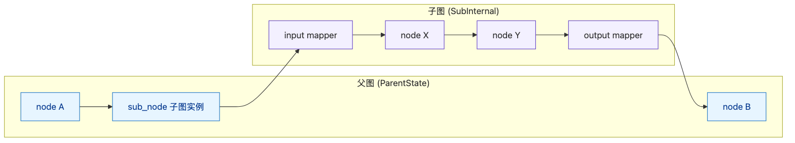
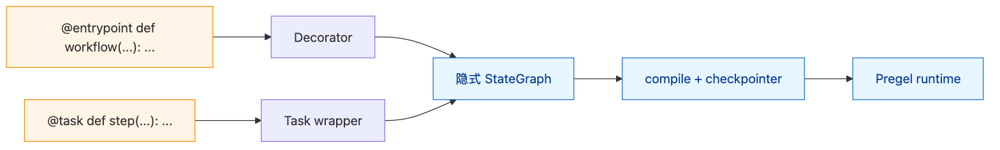

# LangGraph — 09 子图与 Functional API

> 本文回答：子图怎么作为节点？schema 怎么映射？
> Functional API（`@entrypoint` / `@task`）和 StateGraph 是什么关系？

> 重点路径：`graph/state.py` 的子图嵌入逻辑、`func/{__init__,types}.py`。

---

## 1. 范围

| 在范围 | 不在范围 |
|--------|---------|
| 子图作为节点的 3 种模式 | StateGraph 编译细节 → [[02-state-graph]] |
| 父子图 state 映射 | Pregel runtime → [[03-pregel-runtime]] |
| `checkpoint_ns` 命名空间机制 | Checkpoint schema → [[05-checkpointer]] |
| Functional API 的 `@entrypoint` / `@task` | LCEL 与 Runnable → 上游 LangChain |

---

## 2. 子图：3 种嵌入模式

| 模式 | 用法 | 适合 |
|------|------|------|
| 共享 schema | 子图 state schema = 父图 state schema 子集 | 业务逻辑分层 |
| 独立 schema + input/output 函数 | 子图独立 schema，靠两个函数桥接 | 隔离 / 复用 |
| Send 派发 | 父图通过 `Send` 给子图独立 input | fan-out 场景 |

### 2.1 共享 schema

```python
parent_schema = MyState
sub_builder = StateGraph(MyState)        # 同 schema
sub_builder.add_node(...)
sub = sub_builder.compile()

parent_builder = StateGraph(MyState)
parent_builder.add_node("sub", sub)      # 直接当节点
parent_builder.add_edge("a", "sub")
```

**最简单**，父子图字段直接共用 channel。

### 2.2 独立 schema + 桥接

```python
class SubInputState(TypedDict): query: str
class SubOutputState(TypedDict): result: str
class SubInternal(TypedDict): query: str; intermediate: list; result: str

sub = StateGraph(SubInternal, input=SubInputState, output=SubOutputState)\
    .add_node(...)\
    .compile()

def adapt_in(parent_state) -> SubInputState:
    return {"query": parent_state["topic"]}

def adapt_out(sub_output) -> dict:
    return {"final_answer": sub_output["result"]}

# 在父图：
parent_builder.add_node("sub_wrapped", lambda s: adapt_out(sub.invoke(adapt_in(s))))
```

或更优雅地用子图本身（自动按 input/output schema 取字段）：

```python
parent_builder.add_node("sub", sub)   # 框架自动按 input schema 选字段
```

### 2.3 Send 派发

```python
def fan_out(state):
    return [Send("sub", {"query": q}) for q in state["queries"]]

parent_builder.add_conditional_edges("planner", fan_out, ["sub"])
```

每个 `Send` 是子图的一次独立 invoke，state 完全隔离。Open Deep Research 用的就是这种。

---

## 3. 父子图 state 流动



> 源文件：[`diagrams/subgraph-state-flow.mmd`](./diagrams/subgraph-state-flow.mmd)

---

## 4. `checkpoint_ns` 命名空间

```
父图 thread_id="t1", ns=""
└─ 子图 ns="parent_node:0"          ← 第一次进入子图
└─ 子图 ns="parent_node:1"          ← Send fan-out 的第二个
   └─ 孙子图 ns="parent_node:0:inner_node:0"
```

- `ns` 由父图节点名 + 调用 index 组成
- 每层都有自己独立的 checkpoint 链
- `get_state(config, subgraphs=True)` 返回**所有层级**的 state

---

## 5. interrupt 在子图中

子图 `interrupt(value)` → 抛 `GraphInterrupt(ns=...)` → 冒泡到父图 → 父 checkpoint 记录

恢复路径：

```python
# 拿状态（含子图）
state = graph.get_state(config, subgraphs=True)
# state.tasks[0].interrupts → [Interrupt(value=..., ns="...")]

# 续跑：用 root config（不是子图 config）
graph.invoke(Command(resume=decision), config)
```

框架按 `ns` 自动路由 resume 到正确子图实例。

---

## 6. 子图常见模式

### 6.1 Map-Reduce（最常用）

```
父图: planner → fan_out → [sub1, sub2, sub3] → barrier → reducer
```

每个 sub 是同一子图的不同 invoke。`Annotated[list, operator.add]` 在父图收集结果。

### 6.2 Pipeline

```
父图: A → sub_1 → B → sub_2 → C
```

子图作为复用单元（如"validate + transform"组合）嵌入主流程。

### 6.3 Hierarchical Supervisor

```
父图: supervisor → worker_a (子图) | worker_b (子图)
worker_a 内部: sub_supervisor → sub_worker_x | sub_worker_y
```

支持任意深度，靠 `recursion_limit` 兜底。

---

## 7. Functional API：`@entrypoint` / `@task`

### 7.1 用法

```python
from langgraph.func import entrypoint, task
from langgraph.checkpoint.memory import MemorySaver

@task
def search(query: str) -> list[str]:
    return tavily.invoke({"query": query})

@task
def write(query: str, results: list[str]) -> str:
    return llm.invoke([SystemMessage(...), HumanMessage(...)])

@entrypoint(checkpointer=MemorySaver())
def workflow(query: str) -> str:
    results = search(query).result()
    return write(query, results).result()
```

调用：

```python
config = {"configurable": {"thread_id": "t1"}}
result = workflow.invoke("最新汇率", config)
```

### 7.2 与 StateGraph 的关系



> 源文件：[`diagrams/functional-api.mmd`](./diagrams/functional-api.mmd)

- `@entrypoint` 装饰器把函数包成一个 **隐式 StateGraph**
- `@task` 调用产生一个 future，运行时按图调度（并发安全）
- state schema 自动推断（参数 + 返回值）

### 7.3 何时用

| 场景 | 推荐 |
|------|-----|
| 简单线性流程，少量 if | Functional API（更短） |
| 多 Agent / 复杂路由 / fan-out | StateGraph（更显式） |
| 需要 conditional self-loop | StateGraph |
| 团队已熟悉 LCEL/Runnable 风格 | Functional API |

> Functional API 不是替代品，是**简化入口**。所有功能（HITL / checkpoint / stream）通用。

---

## 8. Functional API 的 HITL

```python
from langgraph.types import interrupt

@task
def get_human_input(prompt: str) -> str:
    return interrupt({"prompt": prompt})

@entrypoint(checkpointer=MemorySaver())
def workflow(query: str) -> str:
    plan = make_plan(query).result()
    confirmed = get_human_input(f"OK to run: {plan}?").result()
    if confirmed:
        return execute(plan).result()
    return "cancelled"
```

`interrupt()` 在 task 内同样工作；resume 按 task 调用顺序对齐。

---

## 9. 性能与陷阱

| 项 | 说明 |
|---|------|
| 子图 checkpoint 体积 | 每个子图实例独立 checkpoint 链 → 大量 fan-out 时表行数激增 |
| 子图 + interrupt 嵌套深 | 调试复杂；建议层数 ≤ 3 |
| `Send` payload 太大 | 序列化开销；建议子图自己拉数据 |
| Functional API 的 future 误用 | `.result()` 阻塞当前协程；想并发要先批量发起再统一收 |
| Schema 推断不精确 | Functional API 复杂场景退化为 `dict`；产线建议 StateGraph |

---

## 10. 错误清单

| 错误 | 触发 | 解法 |
|------|-----|------|
| `Subgraph result missing field` | output schema 不匹配 | 显式定义子图 output schema |
| `checkpoint_ns mismatch on resume` | Command(resume=...) 的 config 不是 root | 用 root config |
| Functional API state lost | task 之间没有共享 state 概念 | 显式传参；或退回 StateGraph |
| 子图 stream 无事件 | 没传 `subgraphs=True` | `graph.stream(..., subgraphs=True)` |

---

## 11. 与 Dawning 的对应

| LangGraph | Dawning |
|-----------|---------|
| 子图作节点 | `IWorkflowComposition.Embed(subWorkflow)`（规划） |
| `checkpoint_ns` 自动命名 | `WorkflowKey.Namespace` |
| `Send` 子图 fan-out | `IBranchDispatcher.FanOut(subWorkflow, payloads)` |
| `@entrypoint` / `@task` | Dawning `[Workflow] [Step]` attribute（规划） |
| Functional API 的 future | C# `Task<T>` 自然映射 |
| HITL 在子图 | 同样冒泡到父 checkpoint |

---

## 12. 阅读顺序

- 已读 → [[02-state-graph]] / [[05-checkpointer]] / [[06-interrupt-hitl]]
- 案例 → [[cases/open-deep-research]]（Send + 子图 fan-out 范本）
- 案例 → [[cases/linkedin-hr-agent]]（子图 + 子图 HITL）
- 下一步 → [[10-platform-integration]]

---

## 13. 延伸阅读

- 子图：<https://langchain-ai.github.io/langgraph/concepts/subgraphs/>
- Functional API：<https://langchain-ai.github.io/langgraph/concepts/functional_api/>
- 源码：`libs/langgraph/langgraph/{graph/state.py, func/}`
