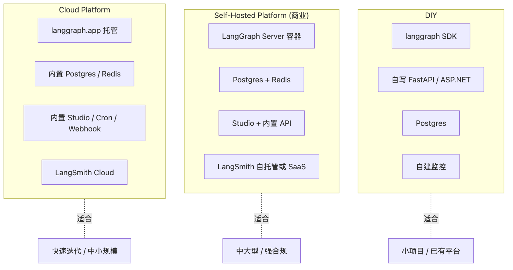

# LangGraph — 10 Platform Integration：部署、Studio、LangSmith

> 本文回答：把 LangGraph 上生产，社区版 / 自托管 / 托管 Platform 三条路怎么选？
> Studio / LangSmith / langgraph-cli 各自负责什么？

---

## 1. 范围

| 在范围 | 不在范围 |
|--------|---------|
| 三种部署形态 | LLM Provider 配置 → 上游 |
| LangGraph Server REST API | OpenAPI 规范细节（自查） |
| Studio / LangSmith 集成 | 业务监控（自配 Grafana 等） |

---

## 2. 三种部署形态



> 源文件：[`diagrams/platform-deployment.mmd`](./diagrams/platform-deployment.mmd)

| 形态 | 谁运维 | 用什么 | 适合 |
|------|-------|-------|------|
| **DIY** | 自己 | `langgraph` SDK + 自写 FastAPI/ASP.NET 网关 + Postgres + 监控 | 小型项目 / 已有平台 |
| **Self-Hosted Platform** | 自己（含 LangGraph Server） | LangGraph Platform 容器镜像 + Postgres + Redis + 自建网关 | 中大型，要 Studio + 协议 |
| **Cloud Platform** | LangChain | langgraph.app 托管 | 想立刻用 / 中小规模 |

---

## 3. DIY 部署

最小生产架构：

```
┌─────────────┐    ┌──────────────────┐    ┌────────────┐
│  Frontend   │───▶│ FastAPI / ASP.NET│───▶│ LangGraph  │
└─────────────┘    │  + Auth/RateLimit│    │ (in-proc)  │
                   └─────┬────────────┘    └────────────┘
                         │                       │
                         ▼                       ▼
                   ┌──────────┐           ┌──────────┐
                   │ Postgres │◀──────────│ Saver    │
                   └──────────┘           └──────────┘
```

**手写 4 个端点**：
- `POST /threads` 创建 thread
- `POST /threads/{tid}/runs` 启动一次 invoke（含 SSE）
- `POST /threads/{tid}/state` 续跑 `Command(resume=...)`
- `GET /threads/{tid}/state` 查暂停态

**痛点**：要自己实现 Studio UI / 历史浏览 / 时间旅行 UI。

---

## 4. LangGraph CLI / Server

```bash
pip install langgraph-cli
```

`langgraph.json` 项目文件：

```json
{
  "dockerfile_lines": [],
  "graphs": {
    "agent": "./agent.py:graph",
    "supervisor": "./supervisor.py:graph"
  },
  "env": ".env",
  "python_version": "3.12",
  "dependencies": ["./", "langchain-openai"]
}
```

```bash
langgraph build       # 构建 docker 镜像
langgraph dev         # 本地起 server + 自动开 Studio
langgraph up          # 拉 server + Postgres + Redis 一起跑（docker-compose）
```

**Server 提供的内置 API**（OpenAPI）：

| 端点 | 用途 |
|------|------|
| `/assistants` | 一个 graph 的多份配置（不同 prompt / model） |
| `/threads` | 会话 / 任务实例 |
| `/threads/{id}/runs` | 启动一次 invoke |
| `/threads/{id}/runs/stream` | SSE 流式 |
| `/threads/{id}/state` | 当前 state + interrupts |
| `/threads/{id}/history` | 历史链 |
| `/store` | 跨 thread 长期记忆（KV + 向量索引） |
| `/runs/cron` | 定时任务（Platform 增强） |

---

## 5. LangGraph Studio

桌面应用 / Web UI（连 langgraph dev/up 起来的 server）：

- 可视化图结构
- Thread 列表 + 每个 thread 的 state / history
- 时间旅行：选历史 checkpoint → 修改 → fork
- HITL 调试：在 interrupt 处直接确认
- LangSmith trace 链接

适合**开发期 + QA + 业务方审阅**。

---

## 6. LangSmith 集成

```bash
export LANGSMITH_API_KEY="ls_..."
export LANGSMITH_TRACING=true
export LANGSMITH_PROJECT="my-app"
```

**自动捕获**：

- 每个节点 / LLM / tool 调用为一个 span
- prompt + response 完整记录
- token / cost / latency 指标
- HITL interrupt 标注
- error stack trace

**用 LangSmith 做什么**：

| 场景 | 方法 |
|------|-----|
| 对比 prompt 改动 | Dataset + Evaluation |
| 找慢节点 | trace 火焰图 |
| 复现 bug | 从 trace 点击 "rerun in playground" |
| 监控成本 | dashboard token/$ |
| Regression 测试 | CI 跑 evaluator |

**注意点**：

- prompt 中可能含 PII，开 `LANGSMITH_HIDE_INPUTS / OUTPUTS` 控制
- 自托管 LangSmith 走 `LANGSMITH_ENDPOINT=https://your-langsmith.com`
- 离线模式：仅 console log，不上传

---

## 7. Cloud / Self-Hosted Platform 增量功能

相对 DIY，Platform（不论云端还是自托管）多了：

| 功能 | 说明 |
|------|------|
| 内置 Server (FastAPI) | 不用自写 REST 端点 |
| Built-in Postgres + Redis | 一键跑 |
| Cron / scheduled runs | 周期任务 |
| Webhook | run 完成后回调 |
| Background runs | run 不阻塞 client |
| TTL / archive | thread 自动归档 |
| Multi-assistant | 一个图多份配置 |
| LangGraph Studio 直连 | 调试体验 |
| LangSmith 一键 | 监控 |
| 持续部署 | git push → 自动 deploy（Cloud） |

---

## 8. 自托管 Platform 部署

```bash
# 申请 license key
docker run -p 8123:8123 \
  -e DATABASE_URI=postgres://... \
  -e REDIS_URI=redis://... \
  -e LANGGRAPH_LICENSE_KEY=... \
  langchain/langgraph-server:latest
```

或用 helm chart 部署到 K8s（见官方 docs）。
**License 必须**：自托管 Platform 是商业产品。

---

## 9. 与 Cloud Platform 对比

| 维度 | Self-Hosted | Cloud |
|------|------------|-------|
| 数据所在 | 自己 | LangChain（可选 region） |
| License | 商业，按 seat / org | 按用量 |
| 部署运维 | 自管 K8s / docker | 零运维 |
| 升级 | 手动 | 自动 |
| 合规 | 完全控制 | SOC2 + 提供 BAA |
| 适合 | 强合规企业 / 大规模 | 中小规模 / 快速迭代 |

---

## 10. 多种部署形态共存

很多团队的真实路径：

```
开发期: langgraph dev (本地 SQLite + Studio)
测试期: langgraph up (Docker compose, Postgres)
生产期: 自托管 Platform 或 DIY
```

代码完全不变，只换 `checkpointer` + 部署方式。

---

## 11. 性能与运维

| 项 | 推荐 |
|---|------|
| Postgres 实例 | 读写分离；checkpoint 表 partitioning by thread_id |
| Redis | Platform 用作 task queue + cache；DIY 可选 |
| Worker / Server CPU | LLM IO-bound，CPU 不是瓶颈；ASGI worker count = 2~4×core |
| 内存 | 单 thread 状态可能 MB 级，规划 5~10GB / instance |
| Auto-scale | 按 in-flight runs metric scale |
| 日志 | LangSmith + 自有 ELK 双轨 |

---

## 12. 与 Dawning 的对应

| LangGraph Platform | Dawning 对应 |
|-------------------|-------------|
| LangGraph Server REST | `Dawning.Hosting.AspNetCore` |
| Studio | Dawning Admin（待规划） |
| LangSmith | OpenTelemetry + 自有 dashboard |
| Cron / scheduled | `IWorkflowScheduler`（规划） |
| Webhook | `IWorkflowEventDispatcher` |
| Multi-assistant | `IAgentRegistry`（一个 SkillId 多 config） |
| Store（长期记忆） | `ILongTermMemory` + Vector Store |

---

## 13. 阅读顺序

- 已读 → 全 02..09
- 案例 → [[cases/linkedin-hr-agent]] 看企业部署形态
- 跨案例 → [[cases/_cross-case-comparison]]（待写）
- 跨模块 → [[../_cross-module-comparison]]（待写）
- 横向 → 进入下一框架 OpenAI Agents SDK

---

## 14. 延伸阅读

- LangGraph Platform：<https://langchain-ai.github.io/langgraph/concepts/langgraph_platform/>
- 部署：<https://langchain-ai.github.io/langgraph/cloud/deployment/setup/>
- LangSmith：<https://docs.smith.langchain.com/>
- langgraph-cli：<https://github.com/langchain-ai/langgraph/tree/main/libs/cli>
