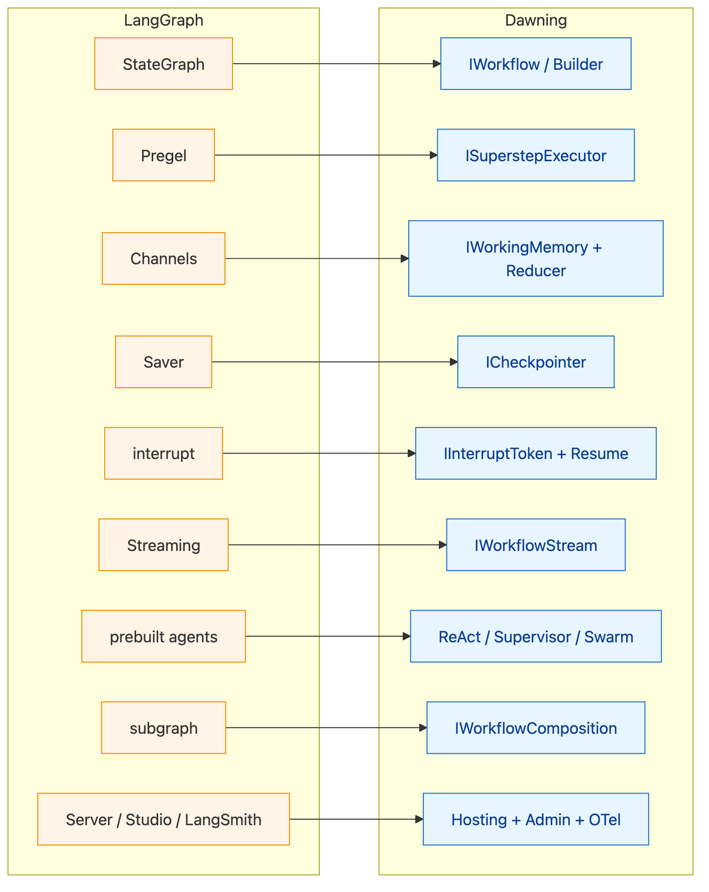

# LangGraph ↔ Dawning 模块映射总表

> 把 LangGraph 11 个模块（00-10）逐项映射到 Dawning 已有 / 规划的能力，标出"已实现 / 规划中 / 待 RFC"。
> 用于：(1) 给 Dawning 立 issue；(2) 给社区一份"Dawning 在 LangGraph 域里相当于谁"的速查表。

---

## 1. 总览

> 源文件：[`diagrams/module-mapping.mmd`](./diagrams/module-mapping.mmd)

---

## 2. 模块映射表

| LangGraph 模块 | 核心抽象 | Dawning 对应 | 状态 | Issue / RFC |
|--------------|---------|-------------|-----|-----------|
| [[00-overview]] | 整体定位 | `Dawning.Agents` | ✅ | — |
| [[01-architecture]] | StateGraph + Pregel + Channels + Saver | `IWorkflow` + `IWorkflowExecutor` + `IWorkingMemory` + `ICheckpointer` | 🟡 部分 | RFC-WF-001 |
| [[02-state-graph]] | StateGraph DSL | `IWorkflowBuilder.AddNode/AddEdge` | 🟡 规划 | RFC-WF-002 |
| [[03-pregel-runtime]] | superstep / barrier / channel update | `ISuperstepExecutor` | ⏳ 待设计 | RFC-WF-003 |
| [[04-channels]] | LastValue / Topic / BinaryAggregate / EphemeralValue | `IWorkingMemoryField<T>` 多种合并策略 | ⏳ 待设计 | RFC-WF-004 |
| [[05-checkpointer]] | BaseCheckpointSaver + Postgres/SQLite/Memory | `ICheckpointer` + `Postgres/SqlServer/Memory` | 🟡 接口已有 | — |
| [[06-interrupt-hitl]] | interrupt() + Command(resume) | `IInterruptToken` + `WorkflowResumeRequest` | ⏳ 待设计 | RFC-WF-005 |
| [[07-streaming]] | 5 stream modes + astream_events | `IWorkflowStream<TEvent>` 多通道 | 🟡 部分 | — |
| [[08-prebuilt-agents]] | create_react_agent / supervisor / swarm | `Dawning.Agents.ReAct` / `.Supervisor` / `.Swarm` | 🟡 ReAct 已有 | RFC-AG-001 |
| [[09-subgraph-functional-api]] | 子图 + checkpoint_ns / `@entrypoint` | `IWorkflowComposition` + `[Workflow][Step]` 属性 | ⏳ 待设计 | RFC-WF-006 |
| [[10-platform-integration]] | LangGraph Server + Studio + LangSmith | `Dawning.Hosting.AspNetCore` + Admin + OpenTelemetry | 🟡 Hosting 部分 | — |

图例：✅ 已实现 / 🟡 部分实现 / ⏳ 待 RFC

---

## 3. 概念粒度对比（关键抽象）

| 抽象 | LangGraph | Dawning（现有 / 计划） | 差异 |
|------|----------|--------------------|------|
| 状态容器 | `dict + Channels` | `IWorkingMemory` | LG 类型靠 `TypedDict` + `Annotated`；Dawning 走泛型 + 属性 |
| 节点 | python function / Runnable | `INode<TIn,TOut>` | Dawning 强类型边界 |
| 调度器 | Pregel BSP | `ISuperstepExecutor`（设计） | 思路一致 |
| 持久化 | `BaseCheckpointSaver` | `ICheckpointer` | 接口形态相似，存储后端可对齐 |
| 流式 | `astream(stream_mode=...)` | `IWorkflowStream<T>` | LG 多模式更灵活；Dawning 类型更强 |
| HITL | `interrupt()` 抛异常 | `IInterruptToken.Throw()` | 思路一致，C# 用 exception/CancellationToken 双轨 |
| 子图 | StateGraph as node | `IWorkflowComposition` | 思路一致 |
| 工具 | `BaseTool` + `ToolNode` | `ITool` + `IToolExecutor` | Dawning 多了拦截器（OWASP） |
| Trace | LangSmith | OpenTelemetry + 自有 dashboard | OTel 是开放标准，更灵活 |

---

## 4. 直接复用 / 借鉴 / 拒绝

| LangGraph 设计 | 决策 | 理由 |
|--------------|-----|------|
| BSP superstep | ✅ 复用 | 模型清晰，方便 checkpoint |
| Channel 抽象 | ✅ 复用 | 解耦 reducer，易扩展 |
| `Annotated` reducer | ❌ 拒绝（Python only） | C# 用 attribute / fluent builder 替代 |
| `Send` API | ✅ 借鉴 | C# `IBranchDispatcher.FanOut` |
| interrupt 抛异常 | ✅ 借鉴 | + CancellationToken 双轨支持 |
| LangGraph Server REST | ✅ 借鉴 schema | Dawning Hosting 直接对齐 |
| LangGraph Studio | ✅ 借鉴 UI 范式 | Dawning Admin 设计参考 |
| LangSmith 闭源 SaaS | ❌ 拒绝 | 走 OpenTelemetry 开源标准 |
| Functional API | 🟡 评估 | C# 已有 source generator，可做更好 |
| `add_messages` 内置 | ✅ 借鉴 | Dawning `[ConcatList]` attribute |
| Postgres schema 设计 | ✅ 复用思路 | 4 表结构（threads / writes / checkpoints / blobs） |

---

## 5. RFC 优先级

| RFC | 标题 | 优先级 | 阻塞谁 |
|-----|-----|-------|-------|
| RFC-WF-001 | 统一 IWorkflow / IExecutor / IMemory 接口 | P0 | 全部 |
| RFC-WF-002 | StateGraph builder API（Fluent / Source Gen） | P0 | 002+ |
| RFC-WF-003 | Pregel BSP 执行器 | P0 | runtime 全部 |
| RFC-WF-004 | Channel + reducer 抽象 | P0 | state 模型 |
| RFC-WF-005 | Interrupt + Resume + Time Travel | P1 | HITL 案例 |
| RFC-WF-006 | 子图 + 命名空间 | P1 | 多 Agent 案例 |
| RFC-AG-001 | Supervisor / Swarm prebuilt | P1 | 多 Agent 案例 |

---

## 6. 测试 / 复刻清单

为验证 Dawning 设计可行，必须能复刻这 4 个案例：

- [ ] **Klarna 简化版**：Supervisor + 3 Worker，handoff 工具
- [ ] **ODR 简化版**：3 Researcher 子图 + Send fan-out + Postgres checkpoint
- [ ] **Replit 简化版**：Manager / Editor / Verifier + 反馈环 + max iters
- [ ] **LinkedIn HR 简化版**：3 阶段 HITL + 长 thread + store 候选人画像

每个简化版都应：
- 用纯 Dawning API（不依赖 LangGraph）
- 跑通 + 流式 + 持久化 + 恢复
- 有 e2e 测试

---

## 7. 何时启动 RFC

满足任一即可启动：

- 已有至少 2 框架完成"模块映射表"（LangGraph + 下一框架，如 OpenAI Agents SDK）
- 已收到至少 1 个企业用户需求
- Dawning 主分支至少 v0.2.0

---

## 8. 阅读顺序

- 已读 → 全部 LangGraph 模块 00-10
- 模块对比 → [[../_cross-module-comparison]]（跨框架，待写）
- 案例对比 → [[_cross-case-comparison]]
- 进入下一框架 → OpenAI Agents SDK / Microsoft Agent Framework / 等

---

## 9. 延伸

- Dawning 项目仓库：`dawning-agents/`
- Roadmap：[[../../../decisions/roadmap]]
- 项目愿景：[[../../../decisions/phase-0-overview]]
