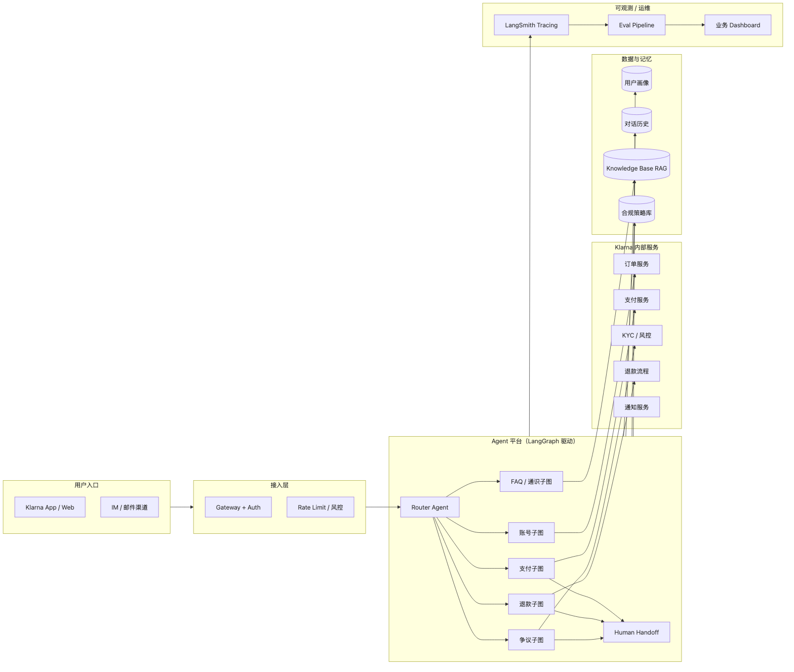
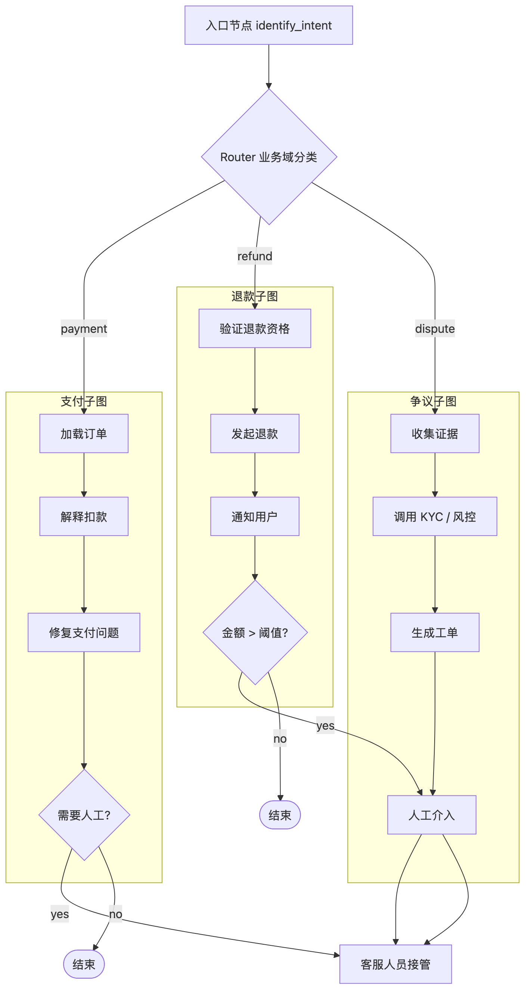
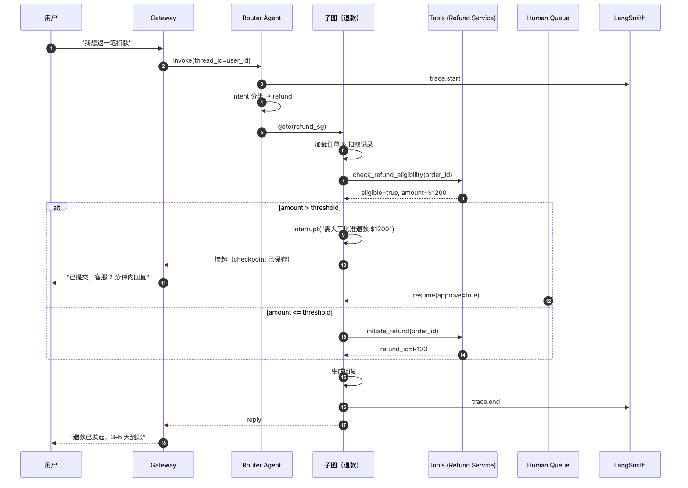

# Klarna Customer Support Agent（基于 LangGraph）

> Klarna 用 LangGraph 重构的客服 Agent，服务 **1 亿+用户 · 覆盖 23 个市场 · 35 种语言**，据官方披露：**等待时间从 11 分钟降到 2 分钟**，客服工作量相当于**700 名全职客服**，年化节省 \$4000 万以上（OpenAI / Klarna 2024 公开数据）。
> 2025 年起 Klarna 把底座从早期 OpenAI Assistants 架构迁移到 **LangGraph + LangSmith**，是 LangGraph 最经典的"企业级客服 Agent"案例。
>
> 本文依据公开资料（LangChain 博客、LangChain Interrupt 大会分享、LangSmith Customer Stories）复盘其架构。未披露细节会**显式标注"推测"**。

---

## 1. 产品背景

### 1.1 Klarna 是谁

- 瑞典金融科技公司，BNPL（先买后付）领域全球领先
- 1 亿+用户，数百万商户
- 业务覆盖：支付、消费分期、退款、账单、争议、忠诚度等

### 1.2 客服场景

- 多语种、多市场、多业务线
- 合规要求高（金融 KYC / 反欺诈 / 隐私）
- 人工客服成本巨大
- 用户问题长尾：查订单、改地址、申请退款、报欺诈、解释利率、争议处理……

### 1.3 AI 客服演进

| 阶段 | 技术 | 痛点 |
|------|------|------|
| 2023 早期 | OpenAI Assistants API | 状态管理弱、黑盒、难调试 |
| 2024 | LangChain + 自研编排 | 编排复杂、observability 缺 |
| 2025 迁移 | **LangGraph + LangSmith** | 图模型显式、可观测、HITL 原生 |
| 2026 现状 | 多 Agent + Checkpoint + Eval | 可迭代、可回归、可部署多模型 |

### 1.4 为什么是 LangGraph

Klarna 工程团队在 LangChain Interrupt 2025 给出的选型理由：

1. **显式 state machine**：客服流程逻辑复杂，图比隐式 loop 清晰
2. **Checkpointer 原生**：多轮对话、跨 session 状态恢复
3. **Subgraph**：按业务线（支付 / 退款 / 争议）切分独立子图，团队并行开发
4. **HITL 原语**：金融场景不敢让 AI 全自动——`interrupt()` 直接用
5. **LangSmith 闭环**：tracing + eval + prompt 管理一体

---

## 2. 整体架构

### 2.1 系统全景图



> 源文件：[`diagrams/klarna-system.mmd`](./diagrams/klarna-system.mmd)

> 📌 图中子图切分是**推测**，参考 Klarna 公开提到的业务域；实际命名可能不同。

### 2.2 Agent 拓扑



> 源文件：[`diagrams/klarna-topology.mmd`](./diagrams/klarna-topology.mmd)

**设计要点（推测 + 公开）**：

- **Router** 是顶层 StateGraph，根据 intent 分流到**子图**（Subgraph）
- 每个业务域一个子图，由不同团队维护
- 金额 / 风险超阈值的节点一律 `interrupt()` 让人工介入
- HITL 由 LangGraph Platform 的 **assistants + store** 承载暂停状态

### 2.3 典型请求时序



> 源文件：[`diagrams/klarna-refund-sequence.mmd`](./diagrams/klarna-refund-sequence.mmd)

---

## 3. 框架用法映射

### 3.1 用到的 LangGraph 模块

| 模块 | 用途 | 证据 |
|------|------|------|
| `StateGraph` | 顶层 router 图 | 公开 |
| Subgraph | 按业务域切分 | 公开 |
| `Checkpointer`（Postgres） | 对话状态持久化 | 公开（LangGraph Platform）|
| `interrupt()` + `Command(resume=...)` | HITL 暂停 / 恢复 | 公开 |
| Stream modes `messages` + `updates` | App 内流式 UI | 推测 |
| `create_react_agent` | 子图内部若干节点 | 推测 |
| LangGraph Platform assistants | 多租户部署 | 公开 |
| LangSmith tracing | 生产 observability | 公开 |

### 3.2 推测的 State 结构

```python
# 推测
class SupportState(TypedDict):
    thread_id: str
    user_id: str
    locale: str                # 市场 / 语言
    messages: Annotated[list, add_messages]
    intent: Literal["payment", "refund", "dispute", "account", "faq"]
    entity: dict               # 提取的订单号 / 金额等
    policy_context: list       # 触发的合规条款
    risk_score: float
    human_required: bool
    human_review_note: str | None
    tool_trace: list
```

### 3.3 节点划分哲学

- **输入理解节点**：intent 分类 + 实体抽取
- **上下文装配节点**：加载用户画像 / 订单 / 历史
- **业务执行节点**：调内部服务（订单、支付、KYC）
- **策略检查节点**：合规 / 风险阈值判断
- **生成节点**：根据上下文 + policy 生成回复
- **HITL 节点**：interrupt + 人工队列对接
- **审计节点**：落 LangSmith + 内部合规存储

---

## 4. 数据与记忆

### 4.1 记忆分层

| 层 | 存储 | 生命周期 |
|---|------|---------|
| 短期对话 | LangGraph State / messages channel | 单次会话 |
| 跨会话上下文 | Postgres Checkpoint + thread_id | 持久 |
| 用户画像 | 内部 User Service（行为 / 订单 / 偏好） | 持久 |
| 知识库 | RAG over 客服 FAQ / 政策文档 | 持久 |
| 合规策略 | 策略库（Policy as Data） | 持久 |

### 4.2 RAG pipeline（推测）

- 嵌入：OpenAI / 自建（未披露具体模型）
- 向量库：内部托管（推测 Postgres + pgvector 或托管向量服务）
- 重排：有（跨市场语义差异大）
- 多语言检索：per-locale 索引

### 4.3 个性化

- 用户历史投诉、支付习惯、风险画像注入到系统 prompt
- 隐私：仅在需要的节点内注入，避免全图看到敏感数据

---

## 5. 工具集

### 5.1 工具类别

| 类别 | 例子 |
|------|------|
| 订单查询 | `get_order`, `list_user_orders` |
| 支付 | `get_payment_status`, `retry_payment` |
| 退款 | `check_refund_eligibility`, `initiate_refund` |
| 账户 | `update_address`, `change_email`（需 MFA）|
| KYC / 风控 | `check_fraud_risk`, `flag_case` |
| 通知 | `send_email`, `send_push` |
| 知识库检索 | `search_kb(query, locale)` |

### 5.2 权限与安全

- 每个工具**最小权限**：只读 / 写 / 需 MFA 分层
- 工具 schema 强类型（Pydantic）
- 写操作必过策略引擎 + HITL（大额 / 高风险）
- 审计：每次工具调用写入 LangSmith + 内部审计日志

### 5.3 失败处理

- Tool 失败 → 重试（指数退避）→ 仍失败 → 转人工
- LLM 幻觉传参 → schema 校验拦住 → 让 LLM 重新生成

---

## 6. 可观测与运维

### 6.1 LangSmith 深度使用

- 每次 run 完整 trace：节点 → 工具 → LLM token
- Prompt 版本管理（可 A/B）
- 数据集管理：从生产 trace 筛样本入 eval 数据集

### 6.2 Eval 体系

- **上线前**：回归 eval（对照已标注数据集）
- **上线后**：采样 live trace + LLM-as-Judge + 人工 spot check
- **持续**：按市场 / 业务域分桶监控质量

### 6.3 SLO / 关键指标（公开 + 推测）

| 指标 | 公开数值 |
|------|----------|
| 平均响应时间 | 2 分钟（vs 原 11 分钟）|
| 首次响应 | 秒级（LLM 即时） |
| 问题解决率 | 与人工客服持平 |
| 覆盖语种 | 35 |
| 自动化占比 | 2/3+（约 2/3 请求不转人工） |
| 等价节省人力 | 约 700 名全职客服 |

### 6.4 HITL 队列

- interrupt 挂起 → 写 store → 通知人工后台
- 人工审批 → resume → Agent 继续
- 关键：人工只看"决策点"，不接全对话 → 工作量可控

---

## 7. 关键工程决策

### 7.1 为什么从 Assistants API 迁到 LangGraph

官方公开原因：
- Assistants 状态模型黑盒，复杂业务逻辑难表达
- HITL 在 Assistants 里是"外挂"，LangGraph 是"原生"
- 多 Agent / subgraph 表达更直接
- LangSmith 一体化 observability

### 7.2 为什么 Subgraph 切分按业务域

- 团队边界对齐组织边界（康威定律）
- 各域发版节奏不同
- 风控 / 合规策略按域独立

### 7.3 为什么选 LangGraph Platform

- 长任务（HITL 暂停可能几分钟到几小时）
- 多租户 / 多市场部署
- Store 抽象简化 checkpoint 管理
- LangSmith 无缝集成

### 7.4 踩过的坑（从 talk 整理）

- **State 膨胀**：早期把全部 tool 原始响应塞 state → checkpoint 爆炸 → 改为只存摘要
- **多语言 prompt 发散**：35 种语言 prompt 管理混乱 → 引入 prompt 模板 + 本地化层
- **Subgraph 边界泄漏**：子图越权调他域工具 → 严格工具 scope
- **LLM 幻觉传参**：订单号 / 金额幻觉 → 强 schema + 二次校验

---

## 8. 对 Dawning 的启示

| 观察 | Dawning 设计建议 |
|------|----------------|
| Router + Subgraph 按业务域 | `ISkillRouter` + "业务域 Skill Pack" 模式 |
| HITL 原生 | `IHitlGate` + 暂停 / 恢复与 `IWorkflow` 深度集成 |
| Checkpoint 分层 | Layer 5 `IWorkflowCheckpoint` + 可插拔 Postgres / DuckDB / 云托管 |
| State 瘦身 | 内置 state 膨胀检测 + 摘要策略 |
| Policy as Data | Layer 7 `IPolicyEngine` 与 Agent 解耦（OPA / Cedar） |
| 多语言 prompt | `IPromptRegistry` + 本地化层 |
| 工具强 schema | `ITool` + JSON Schema + Pydantic 等价体 |
| Observability 一体化 | Layer 7 `IAgentEventStream` + OTel + LangSmith/LangFuse 适配 |

Dawning 不自建客服平台，但应让"搭一个 Klarna 风格的客服 Agent"变得 **声明式、可观测、可治理**。

---

## 9. 局限与未解

Klarna 未公开披露：

- 具体 LLM 选型（推测：OpenAI / 自建 + 路由）
- 向量库选型
- 子图数量与命名
- Prompt 具体模板
- 实际 eval 指标数值
- 故障处理预案细节
- 内部 fine-tune 是否存在

本文中凡属这些部分均使用"推测"标注。

---

## 10. 参考资料

- LangChain Customer Story — Klarna（2024）<https://blog.langchain.com/customers-klarna/>
- LangGraph Platform 案例页：<https://www.langchain.com/langgraph-platform>
- LangChain Interrupt 2025 大会：<https://interrupt.langchain.com/>
- OpenAI × Klarna 公告（早期数据源）：<https://openai.com/index/klarna/>
- LangSmith Customer Stories：<https://blog.langchain.com/tag/customers/>

---

## 11. 延伸阅读

- [[README]] — 本案例集索引
- [[../00-overview]] — LangGraph 定位
- [[../01-architecture]] — LangGraph 架构
- [[../../_cross-case-comparison/customer-support-agents.zh-CN]] — 客服 Agent 跨框架对比（规划中）
- [[../../../concepts/agent-ux-patterns.zh-CN]] — HITL / Streaming UX
- [[../../../concepts/observability-deep.zh-CN]] — 可观测
- [[../../../concepts/state-persistence.zh-CN]] — 状态持久化
- [[../../../concepts/agent-security.zh-CN]] — 金融场景安全
