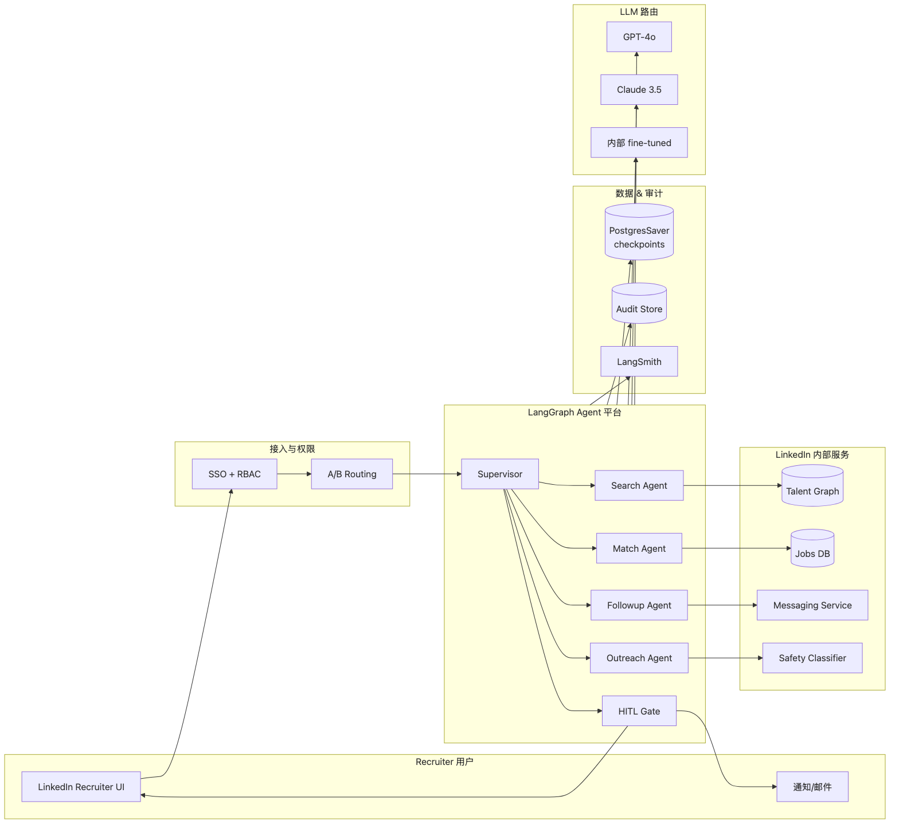
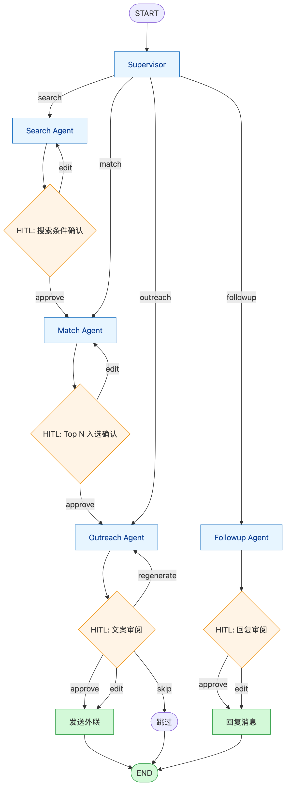
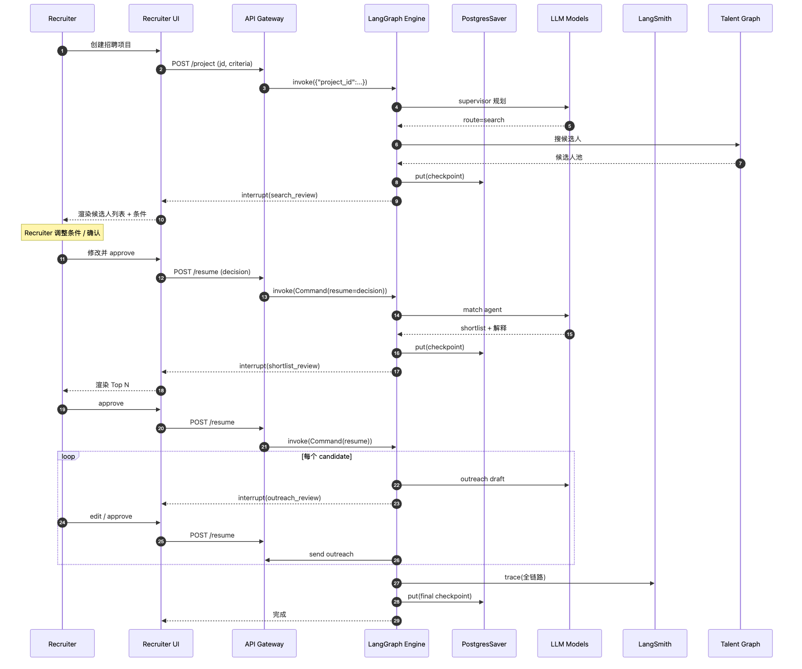

# 案例：LinkedIn HR Agent（企业级 HITL 多 Agent）

> LinkedIn 内部 GenAI Recruiter Experience 的核心架构基于 LangGraph。
> 用它来回答："**强 HITL + 多 Agent + 严格审计** 在 LangGraph 里到底怎么落"。

> 注：源码闭源，本案例基于 LinkedIn 官方博客、LangChain Customer Story、KubeCon/AI Eng Summit 公开演讲整理。

---

## 1. 背景

| 项目 | 信息 |
|------|------|
| 用途 | LinkedIn Recruiter（人力招聘）的 AI 助手 |
| 用户 | LinkedIn 内部数十万企业 Recruiter |
| 业务流程 | 找候选人 → 评估 → 个性化外联 → 跟进 |
| 上线 | 2024 H2 GA |
| 引擎 | LangGraph + LangSmith |
| 规模 | 日处理百万级 query |

**核心特点 vs Klarna / ODR**：

- **HITL 是产品功能**而非容错。Recruiter **必须** 在关键节点确认（外联文案、候选人筛选）
- **多 Agent 强分工**：Search Agent / Match Agent / Outreach Agent / Followup Agent
- **审计强制**：每一次 LLM 输出都要可追溯 + 可复审

---

## 2. 系统架构

### 2.1 全景图



> 源文件：[`diagrams/linkedin-system.mmd`](./diagrams/linkedin-system.mmd)

### 2.2 Agent 拓扑（Supervisor 模式）



> 源文件：[`diagrams/linkedin-topology.mmd`](./diagrams/linkedin-topology.mmd)

**核心模式：单 Supervisor + N Workers + 强 HITL gate**。

| Agent | 输入 | 输出 |
|-------|------|------|
| Supervisor | Recruiter 自然语言意图 | 调度计划 |
| Search Agent | 搜索条件 | 候选人池 |
| Match Agent | 候选人 + JD | Top N + 解释 |
| Outreach Agent | Top N + Recruiter 风格 | 外联文案草稿 |
| Followup Agent | 历史对话 | 跟进建议 |

**HITL Gate** 在 4 个位置：
1. 搜索条件确认（防误搜大盘）
2. Top N 入选确认（防偏见）
3. 外联文案确认（防错发）
4. 重要回复审阅（防错答）

---

## 3. 状态模型与命名空间

```python
class RecruiterState(TypedDict):
    project_id: str                            # 招聘项目 ID
    job_description: dict
    search_criteria: dict
    candidates: Annotated[list[Candidate], merge_candidates]
    shortlist: list[Candidate]                 # 经 HITL 确认
    outreach_drafts: dict[str, str]
    sent_outreaches: Annotated[list, operator.add]
    audit_trail: Annotated[list[AuditEvent], operator.add]
```

**关键设计**：

- 每个 Recruiter Project = 一个 `thread_id`，对应一条独立的 checkpoint 链
- `audit_trail` 用 `operator.add` 累积；每次 HITL 决策也 append
- 通过 `checkpoint_ns` 隔离子图（如 `project-42:outreach`）方便分层查询

---

## 4. 一次招聘的完整时序



> 源文件：[`diagrams/linkedin-sequence.mmd`](./diagrams/linkedin-sequence.mmd)

**HITL 不是异常路径，是正常步骤**：每个关键节点 `interrupt(...)` 暴露给前端，前端用按钮 / 修改文案，再 `Command(resume=...)` 续跑。

---

## 5. 用到的 LangGraph 关键能力

| 能力 | 这里怎么用 | 对应文档 |
|------|----------|---------|
| `interrupt(value)` HITL | 4 个节点强制人工 confirm | [[../06-interrupt-hitl]] |
| `Command(resume=..., update=...)` | 前端 confirm/edit 时回传 | 同上 |
| Supervisor `add_conditional_edges` | 顶层动态路由到 worker | [[../02-state-graph#43-add_conditional_edges]] |
| Subgraph + `checkpoint_ns` | 各 Agent 子图独立审计 | [[../09-subgraph-functional-api]] |
| PostgresSaver + 多副本 | 跨实例热切换 | [[../05-checkpointer]] |
| LangSmith trace | 全链路可观测 | [[../10-platform-integration]] |
| `update_state(as_node=...)` | 人工修改后回填 | [[../05-checkpointer#9]] |
| 自定义 reducer `merge_candidates` | 多次 search 累计去重 | [[../04-channels]] |

---

## 6. 关键工程实践

### 6.1 HITL 的"乐观 UI"

```python
# 节点：草稿生成
def draft_outreach(state):
    draft = llm.invoke([SystemMessage(...), HumanMessage(...)])
    state["outreach_drafts"][candidate_id] = draft

    # 暂停，把草稿吐给前端
    decision = interrupt({
        "type": "outreach_review",
        "candidate_id": candidate_id,
        "draft": draft,
        "actions": ["approve", "edit", "regenerate", "skip"],
    })

    # 前端按钮回传
    if decision["action"] == "approve":
        return {"sent_outreaches": [draft]}
    elif decision["action"] == "edit":
        return {"sent_outreaches": [decision["edited_text"]]}
    elif decision["action"] == "regenerate":
        return Command(goto="draft_outreach")  # 自跳
    else:
        return {}                              # skip
```

**关键点**：

- `interrupt()` 把决策请求挂起到 checkpoint
- 前端拿到 thread_id + 暂停位置 → 渲染审阅 UI
- Recruiter 操作后 → POST `/resume` → 后端 `graph.invoke(Command(resume=decision), config)`
- 整个过程 **底层数据始终在 checkpoint，前端只是 view**

### 6.2 审计追溯

```python
def with_audit(node_fn):
    """装饰器：节点前后写 audit"""
    def wrapped(state, config):
        before = audit_event("node_start", node_fn.__name__, state, config)
        result = node_fn(state, config)
        after = audit_event("node_end", node_fn.__name__, result, config)
        return {**result, "audit_trail": [before, after]}
    return wrapped

@with_audit
def search_candidates(state, config):
    ...
```

- Audit event 含 `node`、`step`、`actor`（人/AI）、`prompt_hash`、`output_hash`
- 借 `Annotated[list, operator.add]` 自动 append 到 channel
- 与 LangSmith trace 关联（trace_id 写入 audit）

### 6.3 多 LLM 路由

不同 worker 用不同模型：

| Worker | Model | 原因 |
|--------|------|------|
| Supervisor | GPT-4o | 路由要快 |
| Match Agent | Claude 3.5 Sonnet | 长 reasoning |
| Outreach Agent | LinkedIn 内部 fine-tuned | 风格控制 |
| Search Agent | GPT-4o-mini | 简单工具调用 |

通过 config 注入 model：

```python
config = {"configurable": {"thread_id": ..., "models": {...}}}
```

节点内 `model = config["configurable"]["models"][role]`。

### 6.4 严格的 timeout & cancel

- Recruiter 关页面 → 后端 cancel 当前 thread → 现场已在 checkpoint，下次打开续跑
- 单节点超时（30s）→ retry policy 转为 fallback prompt 或人工接管
- 整 thread 超时（24h）→ 自动 archive（thread 不删，状态置为 paused）

---

## 7. 落地难点 & 解法

| 难点 | 解法 |
|------|------|
| **LLM 输出不可重现** → 审计困难 | 每次 LLM 输入完整记录（prompt + temperature + seed）→ 复审可重跑 |
| **HITL 卡顿** → Recruiter 等急 | 把 HITL 暴露成 task list，Recruiter 批量审阅；不阻塞队列 |
| **多人协作** → 同一 thread 多人改 | thread 加 actor lock；冲突时强制 fork（依靠 `update_state` 的 fork 语义） |
| **Prompt 注入风险** → 候选人 profile 含恶意指令 | 在 Search Agent 内做 sanitize；外联文案过 safety classifier |
| **大规模并发** → 每天百万级 thread | Postgres 分表（按 project_id sharding）；checkpoint 按 TTL 归档冷库 |
| **跨地域合规** | thread 路由到所属地域的 saver 实例（GDPR / 数据主权） |

---

## 8. 与其他案例对比

| 维度 | Klarna | ODR | LinkedIn HR |
|------|-------|-----|-------------|
| HITL | 异常态接管 | 几乎无 | **核心产品流程** |
| Agent 数 | 5+ 业务子图 | 1 supervisor + N section sub | 1 supervisor + 4 worker |
| 任务时长 | 秒级 | 分钟级 | **小时~天级**（横跨多次会话） |
| 审计 | 业务日志为主 | 弱 | **强制 + 可复审** |
| Checkpoint 用途 | 跨 session 上下文 | 故障重跑 | **承载 HITL 决策状态** |
| 多 LLM | 单模型 | 三模型 | 四模型 + fine-tune |
| 失败的代价 | 工单 | 重跑 | **高**（错发候选人） |

---

## 9. 与 Dawning 的映射

| LinkedIn 用法 | Dawning 对应 |
|--------------|-------------|
| `interrupt()` HITL gate | `IHitlGate.RequestApprovalAsync` |
| `Command(resume=...)` | `IWorkflowControl.ResumeAsync(decision)` |
| Audit trail channel | `IAuditTrailMemory`（规划） |
| 多 LLM 路由 | `ILLMRouter` 按 SkillId / Role 选 provider |
| Supervisor + Workers | `ISupervisorAgent` + `IWorkerAgent[]` |
| Checkpoint TTL 归档 | `IWorkflowArchiveStrategy`（规划） |
| Thread actor lock | `IWorkflowConcurrencyControl` |

---

## 10. 学习清单

| Level | 做什么 |
|-------|-------|
| L1 | 用 LangGraph + InMemory + interrupt 实现一个简化版（1 Supervisor + 2 Worker + 2 HITL gate） |
| L2 | 加 PostgresSaver + LangSmith，跑一遍可观测 |
| L3 | 加审计装饰器 + actor lock |
| L4 | 用 Dawning 重写 Supervisor + HITL gate，对齐两套 |

---

## 11. 参考

- LangChain Customer Story: <https://blog.langchain.com/customers-linkedin/>
- LinkedIn Engineering Blog: <https://blog.linkedin.com/2024/november/14/under-the-hood-of-our-genai-powered-recruiter-experience>
- Talk: "GenAI Recruiter at LinkedIn" — InfoQ AI/ML Conference 2025
- [[klarna-customer-support.zh-CN]] · [[open-deep-research.zh-CN]]
- [[../06-interrupt-hitl]]
