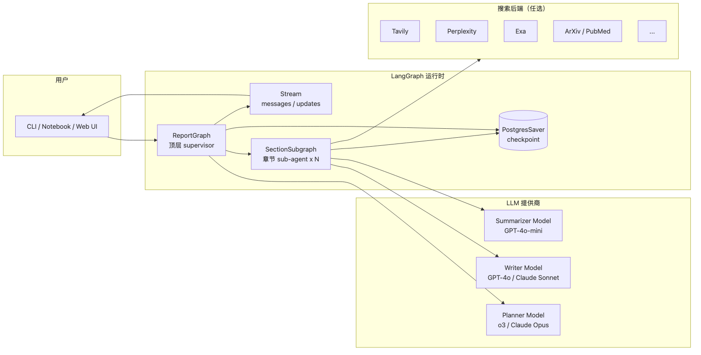
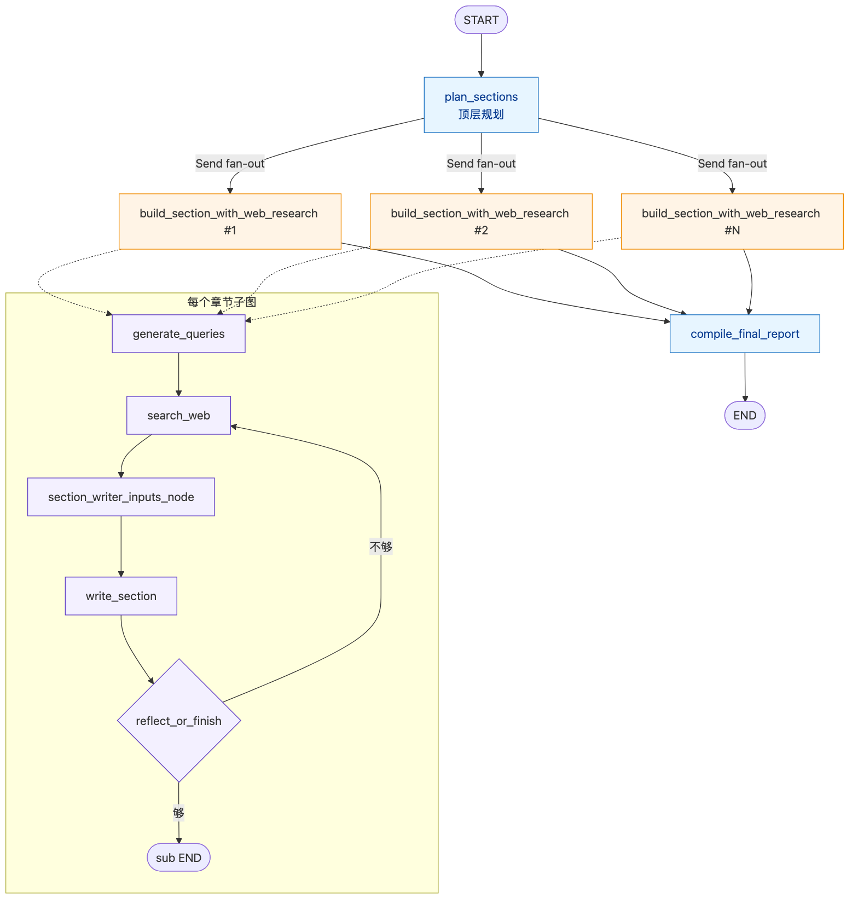
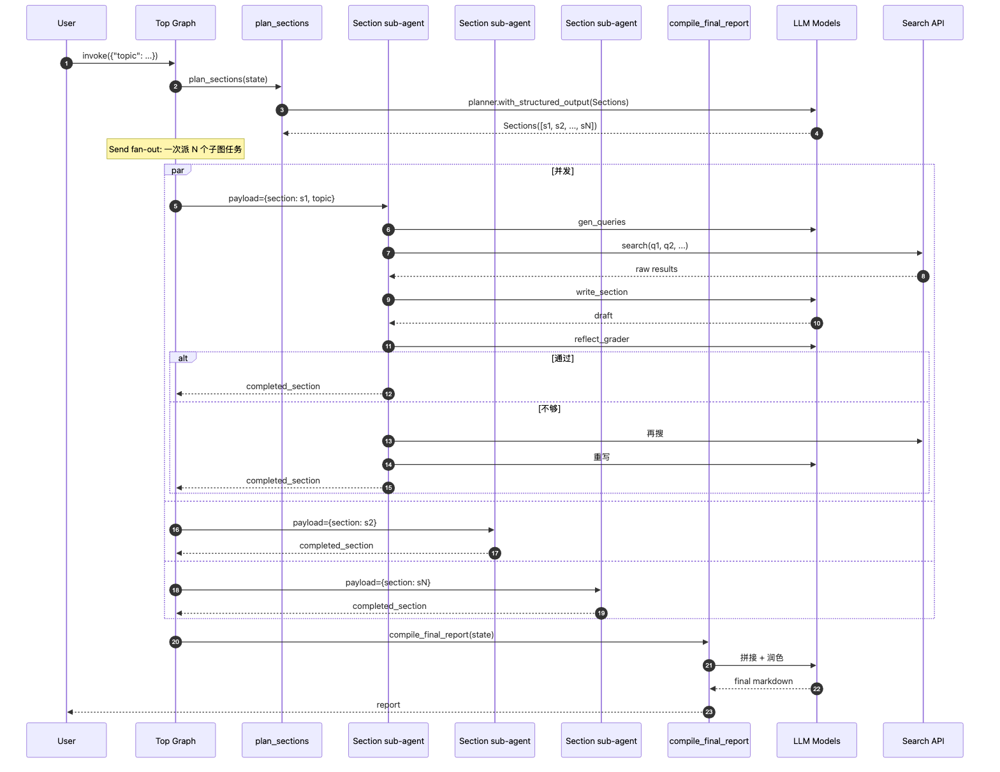

# 案例：Open Deep Research（开源研究 Agent）

> 与 Klarna 案例（生产但闭源）相反，这是 **LangChain 官方开源**的研究 Agent，源码完整可读。
> 用它来回答："多 Agent 协作 + 长任务 + 结构化输出" 在 LangGraph 里到底怎么搭？

---

## 1. 背景

| 项目 | 信息 |
|------|------|
| 仓库 | <https://github.com/langchain-ai/open_deep_research> |
| 定位 | 开源版 OpenAI Deep Research / Perplexity Deep Research |
| 维护方 | LangChain 官方 |
| Stars | 6k+（2026-04） |
| 入口 | `pip install open-deep-research` 或直接克隆运行 |
| 技术栈 | LangGraph + LangChain + 任意 LLM + 任意 Search Tool |

**用户输入**：自然语言研究主题（如 *"对比 Rust 和 Go 在嵌入式场景的工程化成熟度"*）。
**输出**：一份结构化的多章节 Markdown 报告（含引文）。
**典型耗时**：2~10 分钟，几十次 LLM + 上百次搜索调用。

---

## 2. 系统架构

### 2.1 全景图



> 源文件：[`diagrams/odr-system.mmd`](./diagrams/odr-system.mmd)

### 2.2 Agent 拓扑（核心创新）



> 源文件：[`diagrams/odr-topology.mmd`](./diagrams/odr-topology.mmd)

**两层 supervisor 模式**：

| 层 | 角色 | 输入 | 输出 |
|---|------|------|------|
| 顶层 supervisor | 拆解主题 → 章节列表 | 主题 | `Section[]` |
| 章节级 researcher | 针对单章节做"搜→读→写" 循环 | `Section` | 章节 markdown |
| 顶层 writer | 把所有章节拼成最终报告 | `Section[] + draft[]` | 报告 markdown |

**关键设计**：每个章节由独立 sub-agent 跑，**靠 `Send(...)` 并发 fan-out**。这是 LangGraph 区别于"单线程 Agent loop" 的杀手级用法。

### 2.3 一次研究的时序



> 源文件：[`diagrams/odr-sequence.mmd`](./diagrams/odr-sequence.mmd)

---

## 3. 状态模型

```python
class ReportState(TypedDict):
    topic: str
    sections: list[Section]                      # 顶层规划产物
    completed_sections: Annotated[list[Section], operator.add]  # 各 sub-agent 写回
    final_report: str

class SectionState(TypedDict):                   # 子图独立 state
    section: Section
    search_iterations: int
    search_queries: list[SearchQuery]
    source_str: str                              # 累积搜索结果
    completed_section: Section                   # 写完后回吐
```

**Reducer 选择的关键决策**：

- `completed_sections: Annotated[..., operator.add]` —— 子图并发回写时**追加**而不是覆盖
- `source_str` 在 SectionState 内是 `LastValue`（每次替换），因为子图内部串行
- 顶层和子图通过 **input/output 映射** 解耦，子图 schema 不污染父图

---

## 4. 图结构（源码级）

### 4.1 顶层图

```python
from langgraph.graph import StateGraph, START, END
from langgraph.types import Send

def initiate_research(state: ReportState):
    """fan-out：每个章节派一个 sub-agent"""
    return [
        Send("build_section_with_web_research",
             {"section": s, "topic": state["topic"]})
        for s in state["sections"]
    ]

builder = StateGraph(ReportState)
builder.add_node("plan_sections", plan_sections_node)
builder.add_node("build_section_with_web_research", section_subgraph)  # 子图作为节点
builder.add_node("compile_final_report", compile_node)

builder.add_edge(START, "plan_sections")
builder.add_conditional_edges("plan_sections", initiate_research, ["build_section_with_web_research"])
builder.add_edge("build_section_with_web_research", "compile_final_report")
builder.add_edge("compile_final_report", END)

graph = builder.compile(checkpointer=PostgresSaver(...))
```

**重点**：`plan_sections → initiate_research`（一个 `add_conditional_edges` 但实际是 fan-out）→ 多个 `build_section_with_web_research` 实例并行 → barrier 在 `compile_final_report`。

### 4.2 章节子图

```python
section_builder = StateGraph(SectionState, output=SectionOutputState)
section_builder.add_node("generate_queries", gen_queries_node)
section_builder.add_node("search_web", search_node)
section_builder.add_node("write_section", write_node)
section_builder.add_node("section_writer_inputs_node", inputs_node)

section_builder.add_edge(START, "generate_queries")
section_builder.add_edge("generate_queries", "search_web")
section_builder.add_edge("search_web", "section_writer_inputs_node")
section_builder.add_edge("section_writer_inputs_node", "write_section")
section_builder.add_conditional_edges("write_section", reflect_or_finish,
                                      {"search_web": "search_web", END: END})

section_subgraph = section_builder.compile()
```

**反思循环**：`write_section` 后由 `reflect_or_finish` 判定是否需要再搜一轮。这是**条件边构造的 self-loop**——LangGraph 对此天然支持，靠 `recursion_limit` 兜底。

---

## 5. 用到的 LangGraph 关键能力

| 能力 | 这里怎么用 | 对应文档 |
|------|----------|---------|
| `Send(node, payload)` fan-out | 顶层一次性派发 N 个章节 sub-agent | [[../03-pregel-runtime#send]] |
| 子图作为节点 | `section_subgraph` 整体当节点 | [[../09-subgraph-functional-api]] |
| `Annotated[list, operator.add]` | 子图回写聚合 | [[../04-channels]] |
| Conditional self-loop | `write_section` ↔ `search_web` 反思循环 | [[../02-state-graph#43-add_conditional_edges]] |
| `recursion_limit` | 防止反思 / 搜索失控 | [[../03-pregel-runtime#errors]] |
| Checkpoint 中断恢复 | 长任务故障重跑（开启 PostgresSaver） | [[../05-checkpointer]] |
| Streaming `messages` mode | 前端实时显示当前思考内容 | [[../07-streaming]] |
| 输入/输出 schema 分离 | 子图 `SectionState` vs 父图 `ReportState` | [[../02-state-graph#5]] |

---

## 6. 工程实践亮点

### 6.1 三大 LLM 角色分离

```python
config = {
    "planner_model": "openai:o3",          # 推理强：拆主题
    "writer_model": "openai:gpt-4o",       # 写作强：填章节
    "summarizer_model": "openai:gpt-4o-mini",  # 便宜：搜索结果摘要
}
```

不同节点拿不同模型—— **节点是 LLM 路由的最小单位**，不需要在节点内手动 `if-else` 选模型。

### 6.2 搜索工具抽象

```python
class SearchAPI(StrEnum):
    TAVILY = "tavily"
    PERPLEXITY = "perplexity"
    EXA = "exa"
    ARXIV = "arxiv"
    PUBMED = "pubmed"
    LINKUP = "linkup"
    DUCKDUCKGO = "duckduckgo"
    GOOGLESEARCH = "googlesearch"
```

通过 config 切换搜索后端。**Search 在节点内调用**，没有把 Search 做成独立节点——因为搜索结果只对当前 section 有意义，不需要进 channel。

### 6.3 用 Pydantic 强约束 LLM 结构化输出

```python
class Section(BaseModel):
    name: str = Field(description="Name of the section.")
    description: str = Field(description="Brief overview...")
    research: bool = Field(description="Whether to do research...")
    content: str = Field(description="Section content (filled later).")

planner = planner_model.with_structured_output(Sections)
result = planner.invoke([SystemMessage(...), HumanMessage(topic)])
```

Pydantic v2 + `with_structured_output` —— 从 LLM 拿到的就是 `Section` 对象，不需要正则解析。

### 6.4 反思循环的退出条件

```python
def reflect_or_finish(state: SectionState):
    if state["search_iterations"] >= MAX_SEARCH_ITERATIONS:
        return END
    # 让 LLM 评估"够不够"
    grade = grader_model.invoke([SystemMessage(GRADE_PROMPT), HumanMessage(state["completed_section"].content)])
    if grade.grade == "pass":
        return END
    return "search_web"
```

**两条退出路径**：硬上限（次数）+ 软退出（LLM 自评）。生产建议两个都开。

---

## 7. 性能与成本

| 维度 | 量级 |
|------|------|
| 单次研究 LLM 调用 | 30~80 次 |
| 单次研究搜索调用 | 50~200 次 |
| 单次研究 token 消耗 | 50k~200k input + 5k~20k output |
| 端到端耗时 | 2~10 分钟（章节并发） |
| 美元成本（GPT-4o） | $0.5~$3 |
| Postgres checkpoint 大小 | ~1MB / 任务 |

**优化点**：
- 章节并发数 = `min(章节数, executor.max_workers)`，默认无上限——长报告（>10 章节）需手动 throttle
- `summarizer_model` 用便宜模型把搜索 raw text 压缩，再喂给 writer，**省 70% 输入 token**
- Checkpoint 压力主要来自 `source_str`（搜索 raw text），可考虑写完就清

---

## 8. 4 个生产化坑

| 坑 | 现象 | 解法 |
|---|------|------|
| 章节 fan-out 失控 | 主题太宽 → 20+ 章节 → LLM rate limit + 成本爆炸 | planner 加约束："最多 N 章节"；上层加 thread quota |
| 反思循环死锁 | grader 永远说"不够"，撞 recursion_limit | 硬上限 + 退出 prompt 调教；记录 iteration metric 报警 |
| 搜索结果污染上下文 | 长 source_str 把后续 prompt 撑爆 | summarizer 节点压缩；或 source_str 仅子图可见（已是 SectionState 字段） |
| Checkpoint 体积膨胀 | 子图 source_str 全部入库 | 子图改用 `SectionOutputState` 只输出 completed_section，源材料丢弃 |

---

## 9. 与 Klarna 案例的对比

| 维度 | Klarna 客服 | Open Deep Research |
|------|-----------|-------------------|
| 时长 | 秒级 | 分钟级 |
| 子图作用 | 业务域隔离（支付 / 退款 / 争议） | 任务并发隔离（每章节一份 state） |
| Send 用法 | 几乎不用（路由为主） | 核心机制（fan-out 章节） |
| HITL | 强（人工接管） | 弱（基本全自动） |
| Checkpoint 用途 | 跨人工对话恢复 | 长任务故障重跑 |
| 反思循环 | 无 | 有（写→评→搜） |
| 多模型 | 单模型为主 | 三模型分工 |

> 这两个案例代表了 LangGraph 的两条主线：**会话型 Agent** vs **任务型 Agent**。

---

## 10. 与 Dawning 的映射

| ODR 用法 | Dawning 对应 |
|---------|-------------|
| `Send` fan-out | `IBranchDispatcher.FanOut` |
| 子图作节点 | `IWorkflowComposition`（规划） |
| `operator.add` reducer | `IWorkingMemory` 的 list-merge 策略 |
| 三模型分工 | `ILLMProvider` + 路由配置（按 SkillId 选 provider） |
| `with_structured_output` | `IStructuredOutputBinder`（规划） |
| Search 多后端切换 | Dawning.Tools 的 SearchTool 适配器集 |
| `recursion_limit` | `WorkflowOptions.MaxSupersteps` |

---

## 11. 学习清单

读完本案例，可以分三级深入：

| Level | 做什么 | 文档 |
|-------|-------|------|
| L1 | 在本地跑一遍，调一个主题 | 仓库 README |
| L2 | 改 supervisor prompt，加章节约束 | 源码 `src/open_deep_research/prompts.py` |
| L3 | 把 search backend 换成 Dawning.Tools 实现 | [[../../../entities/frameworks/]] + 自写 adapter |
| L4 | 用 Dawning 重写顶层 supervisor，对齐两个框架 | [[../../_cross-module-comparison/multi-agent-orchestration]]（待写） |

---

## 12. 参考

- 源码：<https://github.com/langchain-ai/open_deep_research>
- 官方 Blog：<https://blog.langchain.com/open-deep-research/>
- LangGraph Conceptual Guide：<https://langchain-ai.github.io/langgraph/concepts/multi_agent/>
- 对比 OpenAI Deep Research：<https://openai.com/index/introducing-deep-research/>
- [[klarna-customer-support.zh-CN]]
- [[../03-pregel-runtime]] §8 Send/Command
- [[../09-subgraph-functional-api]]
