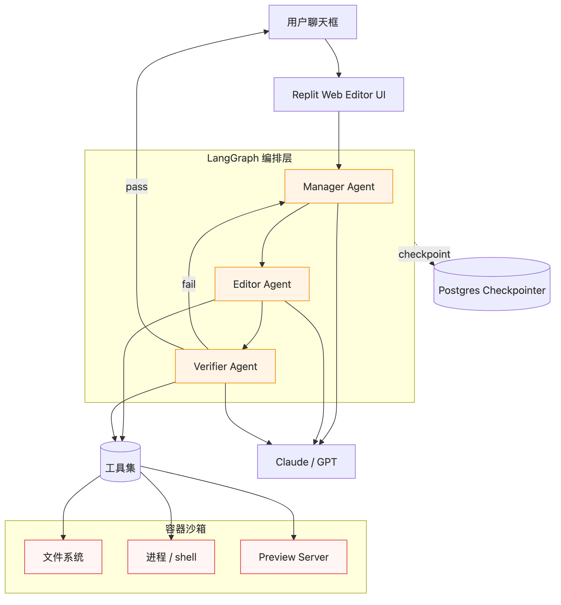
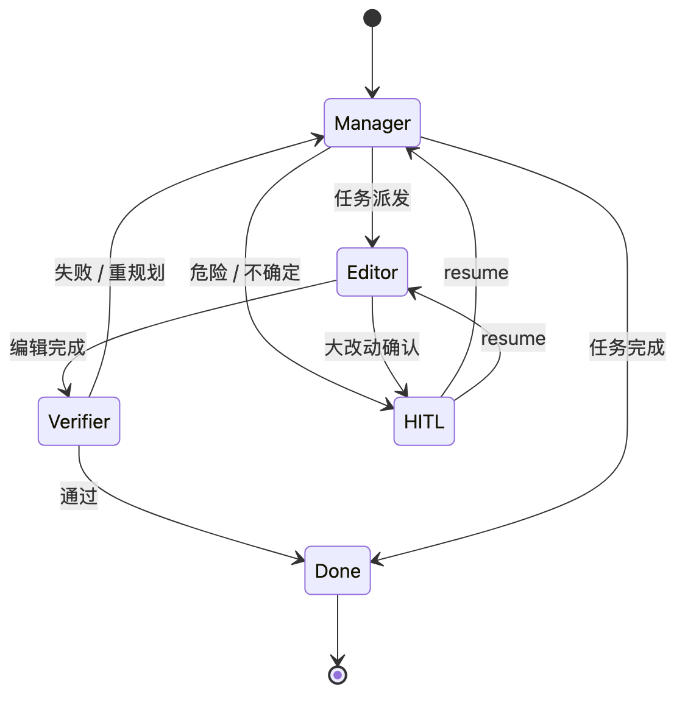
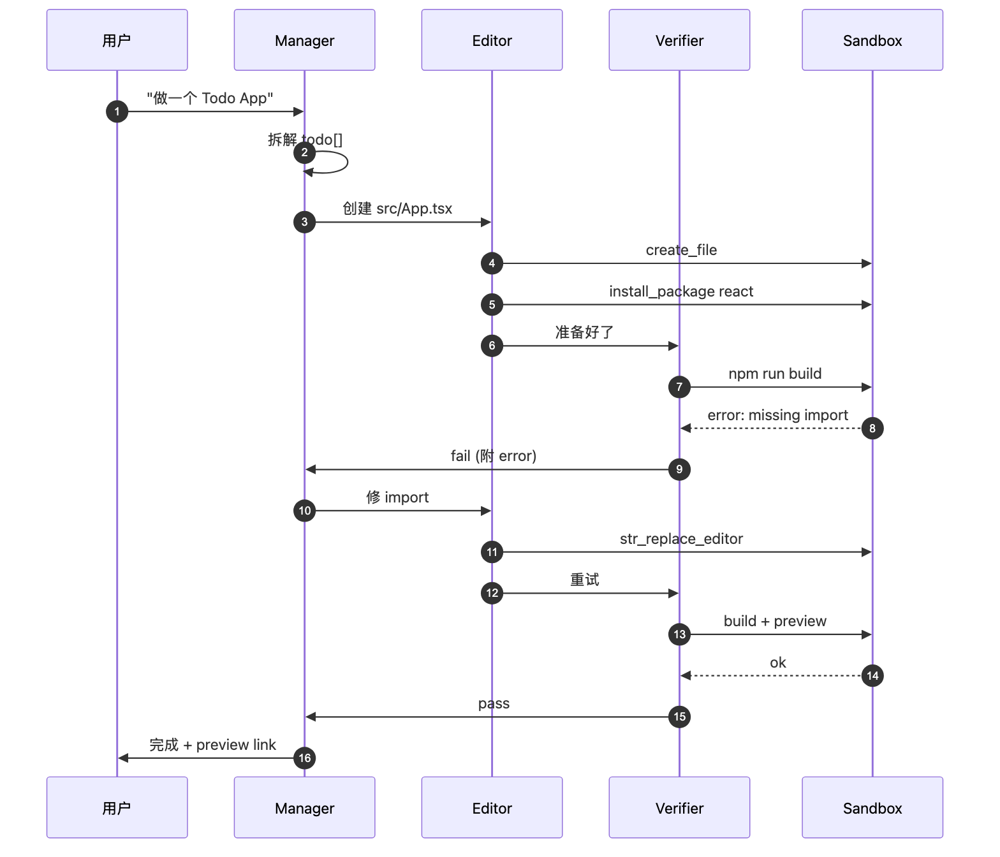

# 案例：Replit Agent — 浏览器内的代码生成 Agent

> 在 Replit 网页编辑器内部，用 LangGraph 编排"读 → 规划 → 编辑 → 执行 → 修复"全流程的代码生成 Agent。
> 信息来源：Replit 官方博客、LangChain 案例分享、产品观察。Replit Agent 闭源，本文聚焦**架构与编排**而非具体源码。

---

## 1. 问题域

| 项 | 说明 |
|---|------|
| 业务 | 用户用自然语言描述需求 → Agent 生成项目（多文件） + 真机运行 + 自动修 bug |
| 输入 | "做一个 Todo List Web 应用，React + Tailwind" |
| 输出 | 一个真实跑起来的 Replit project（多文件、依赖、运行结果） |
| 上下文长 | 项目可能 20+ 文件，几千行代码 |
| 工具多 | 文件读写、shell、依赖安装、log 解析、浏览器预览 |
| 反馈环 | 必须能跑代码 + 看错误 + 自动修 |

---

## 2. 架构总览



> 源文件：[`diagrams/replit-system.mmd`](./diagrams/replit-system.mmd)

---

## 3. 关键编排模式

### 3.1 Manager / Editor / Verifier 三角

```
Manager (LLM)
  ├─ 拆解需求 → 任务列表
  ├─ 决定下一步动作
  └─ 答用户问题

Editor (LLM + tools)
  ├─ str_replace_editor / create_file / view 文件
  └─ 安装依赖 / 跑命令

Verifier (检查 + LLM)
  ├─ 跑测试 / 启动 web preview
  ├─ 解析 stderr / build error
  └─ 判定"完成"或"需要修"
```

3 个 Agent 各为一个子图（或 prebuilt ReAct），由 Manager Supervisor 调度。

### 3.2 Agent loop = ReAct + 反馈

每一步：

```
Manager 决策 → Editor 修改 → Verifier 检查 → 若失败 → Manager 重规划
```

直到 Verifier 通过 / 达到 max iterations / 用户 cancel。

---

## 4. State 设计推测

```python
class ReplitState(TypedDict):
    # 用户对话
    messages: Annotated[list, add_messages]
    # 任务计划（Manager 维护）
    todo: list[Todo]
    # 文件状态快照（指针，不是全量）
    workspace_snapshot: dict[str, str]   # path -> content_hash
    # 最近一次 verifier 结果
    last_verify: VerifyResult | None
    # 当前 active sub-agent
    current_agent: Literal["manager", "editor", "verifier"]
```

体积控制：`workspace_snapshot` 存 hash 而非内容；真实文件靠 tool 现场读。

---

## 5. 工具集

| 类别 | 工具 | 安全考虑 |
|------|-----|---------|
| 文件 | view / create_file / str_replace_editor / delete | 限制在 project 沙箱目录 |
| Shell | run_command（受限） | 容器隔离，超时 |
| 依赖 | install_package（npm/pip/cargo） | 黑名单 + 资源限额 |
| Web | web_search / fetch_url | RBAC + rate limit |
| Preview | start_preview / get_preview_logs | 内部端口转发 |
| Browser | screenshot / click（VLM 辅助） | headless 容器 |

工具 schema 用 `langchain_core.tools.tool` 装饰；调用通过 prebuilt `ToolNode`（[[../08-prebuilt-agents]]）。

---

## 6. 拓扑



> 源文件：[`diagrams/replit-topology.mmd`](./diagrams/replit-topology.mmd)

---

## 7. Sequence：一次任务生命周期



> 源文件：[`diagrams/replit-sequence.mmd`](./diagrams/replit-sequence.mmd)

---

## 8. Streaming 与用户体验

| LangGraph 模式 | UI 表现 |
|---------------|---------|
| `messages` | Manager 文字流式打到聊天框 |
| `updates` | 任务进度条（todo 状态变化） |
| `custom`（自定义事件） | "正在编辑 src/App.tsx" / "正在跑 npm install" |
| Tool span | 工具调用展开 / 折叠 |
| Preview event | 网页预览 iframe 自动刷新 |

> 多模式同时订阅，前端按事件类型分发到不同 UI 区域。

---

## 9. HITL 场景

| 场景 | 触发 | resume 数据 |
|------|-----|------------|
| 危险命令 | `rm -rf /` | "approve" / "deny" |
| 模型不确定 | "用 React 还是 Vue?" | "react" |
| 大改动确认 | 改 > 10 文件 | bool |
| 需付费 API key | tool 缺少凭证 | API key |

interrupt() 在 Editor 子图触发；前端弹模态。

---

## 10. Checkpoint 与历史

- 每个 Replit project = 1 thread
- `thread_id` = `user_id + project_id`
- 大量 fan-out 时 `checkpoint_ns` 很深 → 表行膨胀 → 定期归档
- Time travel 给用户："撤销最近 3 步操作"

---

## 11. 工程关键点

### 11.1 沙箱

- 每次 run 在独立容器（gVisor / Firecracker）
- CPU / 内存 / disk quota
- 出网白名单
- 容器生命周期 = 一次 thread 的活跃期；冻结后可恢复

### 11.2 增量上下文

- workspace 不进 prompt（太大），靠 tool 按需 view
- 编辑用 `str_replace_editor`（diff），不是全量重写
- 错误日志只截关键行入 prompt

### 11.3 自我修复

```
loop:
  edit → verify
  if pass: break
  else:
    error_summary = compress(stderr)
    manager.replan(error_summary)
```

`recursion_limit` 兜底，超过则 escalate 到 HITL。

### 11.4 多 Agent 并发

UI 同一聊天框可有多个 task 并行（不同 thread_id），共用一个 project。冲突靠工具层文件锁。

---

## 12. 与 Open Deep Research 对比

| 维度 | Open Deep Research | Replit Agent |
|------|-------------------|-------------|
| 域 | 文本 / 报告 | 代码 / 可执行 |
| Fan-out | 多 Researcher 并行 | 极少 fan-out（顺序编辑文件） |
| 反馈环 | LLM 自评（弱反馈） | run + stderr（强反馈） |
| HITL | clarify 1 次 | 多次（危险/不确定） |
| 工具数量 | ~5 | ~30+ |
| 沙箱 | 不需要 | 强需要 |
| 状态 | 偏文本 | 文件 + 进程 + 日志 |

---

## 13. 与 Dawning 的对应

| Replit Agent | Dawning 对应 |
|-------------|-------------|
| Manager / Editor / Verifier 子图 | `IAgent` 多个，由 `IBranchDispatcher.Route` 调度 |
| 工具沙箱 | `ITool` + `IToolExecutor` 拦截器（OWASP） |
| Verify 反馈环 | `IFeedbackLoop` + `MaxIterations` |
| 多 stream 模式 | `IWorkflowStream<TEvent>` 多通道 |
| 文件 / 进程工具 | `Dawning.Tools.FileSystem`、`Dawning.Tools.Process`（规划） |
| 沙箱容器 | `IExecutionSandbox`（K8s ephemeral pod） |

---

## 14. 复用清单

- ✅ Manager / Editor / Verifier 三角拓扑
- ✅ Verify → Replan 反馈环（带 max iters）
- ✅ 工具按风险分级 + HITL approve
- ✅ workspace 不进 prompt，靠 tool 现场读
- ✅ str_replace 模式（diff 编辑）
- ✅ 一 project = 一 thread

---

## 15. 延伸阅读

- Replit 博客：<https://blog.replit.com/agent>
- LangChain 案例库：<https://www.langchain.com/built-with-langgraph>
- 工具沙箱：gVisor / Firecracker
- 模式启示：[[../../../concepts/agent-loop]]
