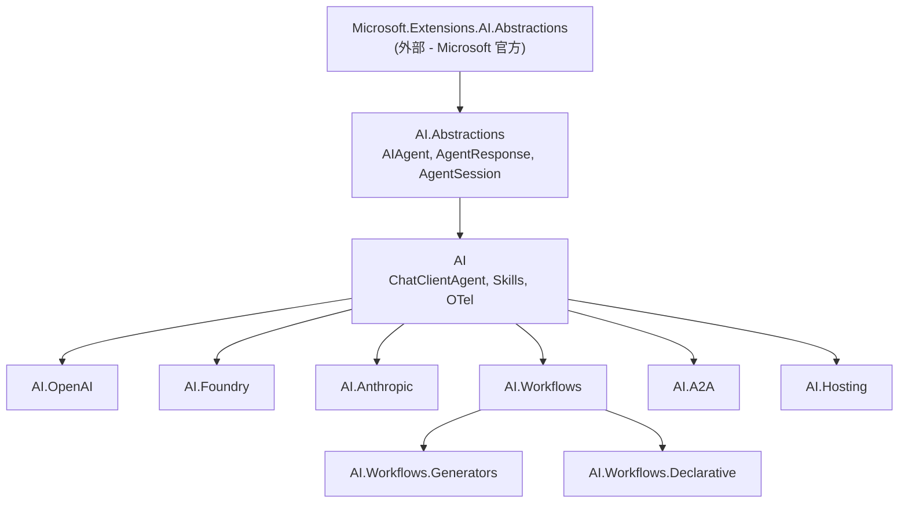

# MAF 源码解析：项目结构全景

> Microsoft Agent Framework (MAF) .NET 端的仓库结构、NuGet 包依赖、核心类型总览。
>
> 本文仅覆盖 .NET 端（`dotnet/`），Python 端不在分析范围内。

---

## 1. 仓库顶层结构

```
microsoft/agent-framework/          ← monorepo（Python 50.5% + C# 45.3%）
├── dotnet/                          ← .NET 端全部代码
│   ├── src/                         ← NuGet 包源码（24+ 项目）
│   ├── tests/                       ← 单元测试 + 集成测试
│   ├── samples/                     ← 分层示例
│   │   ├── 01-get-started/
│   │   ├── 02-agents/
│   │   ├── 03-workflows/
│   │   ├── 04-hosting/
│   │   └── 05-end-to-end/
│   ├── eng/                         ← 构建工程（CI/CD 脚本）
│   ├── nuget/                       ← NuGet 打包配置
│   ├── agent-framework-dotnet.slnx  ← 解决方案文件
│   ├── Directory.Build.props        ← 全局构建属性
│   ├── Directory.Packages.props     ← 中央包版本管理
│   └── global.json                  ← SDK 版本锁定
├── python/                          ← Python 端
├── declarative-agents/              ← 声明式 Agent 定义（YAML/JSON）
├── docs/                            ← 设计文档 + ADR
│   ├── design/                      ← 设计文档
│   └── decisions/                   ← 架构决策记录
└── schemas/                         ← JSON Schema 定义
```

**关键信息**：
- **monorepo**：Python 和 .NET 在同一仓库，共享 `docs/` 和 `schemas/`
- **.NET 10**：`global.json` 锁定 SDK 10.0.200
- **中央包版本管理**：`Directory.Packages.props` 统一管理所有 NuGet 依赖版本
- **samples 分 5 层**：渐进式学习路径，从 hello-world 到完整应用

---

## 2. NuGet 包全景（dotnet/src/）

### 2.1 分层架构

```
┌──────────────────────────────────────────────────────┐
│                   Hosting 层                          │
│  Hosting.A2A.AspNetCore  Hosting.AzureFunctions      │
│  Hosting.AGUI.AspNetCore  Hosting.OpenAI              │
├──────────────────────────────────────────────────────┤
│                  Provider 层                          │
│  AI.Foundry   AI.OpenAI   AI.Anthropic               │
│  AI.CopilotStudio   AI.GitHub.Copilot                │
├──────────────────────────────────────────────────────┤
│                 Workflow 层                           │
│  AI.Workflows   AI.Workflows.Generators              │
│  AI.Workflows.Declarative(.Foundry/.Mcp)             │
├──────────────────────────────────────────────────────┤
│                 功能扩展层                             │
│  AI.A2A   AI.AGUI   AI.DurableTask                   │
│  AI.DevUI   AI.Mem0   AI.Purview                     │
│  AI.CosmosNoSql   AI.AzureAI.Persistent              │
│  AI.FoundryMemory                                    │
├──────────────────────────────────────────────────────┤
│                  Core 层                              │
│  Microsoft.Agents.AI                                 │
│  (ChatClientAgent, Skills, Compaction, Memory,       │
│   OpenTelemetry, Logging, Middleware)                 │
├──────────────────────────────────────────────────────┤
│               Abstractions 层                         │
│  Microsoft.Agents.AI.Abstractions                    │
│  (AIAgent, AgentResponse, AgentSession, AIContext)    │
└──────────────────────────────────────────────────────┘
                        │
                        ▼
          Microsoft.Extensions.AI.Abstractions
                   （外部依赖）
```

### 2.2 完整包清单

| 包名 | 层级 | 说明 | 依赖 |
|------|------|------|------|
| **Microsoft.Agents.AI.Abstractions** | Abstractions | Agent 基类、Session、Response、AIContext | M.E.AI.Abstractions |
| **Microsoft.Agents.AI** | Core | ChatClientAgent、Skills、Compaction、OTel | Abstractions |
| **Microsoft.Agents.AI.OpenAI** | Provider | OpenAI Responses API 适配 | Core + OpenAI SDK |
| **Microsoft.Agents.AI.Foundry** | Provider | Azure AI Foundry 适配 | Core + Azure.AI.Projects |
| **Microsoft.Agents.AI.Anthropic** | Provider | Claude API 适配 | Core + Anthropic SDK |
| **Microsoft.Agents.AI.CopilotStudio** | Provider | Copilot Studio 连接器 | Core |
| **Microsoft.Agents.AI.GitHub.Copilot** | Provider | GitHub Copilot SDK 集成 | Core |
| **Microsoft.Agents.AI.Workflows** | Workflow | 图工作流引擎 | Core |
| **Microsoft.Agents.AI.Workflows.Generators** | Workflow | Source Generator（编译时代码生成） | Workflows |
| **Microsoft.Agents.AI.Workflows.Declarative** | Workflow | 声明式工作流（YAML/JSON） | Workflows |
| **Microsoft.Agents.AI.Workflows.Declarative.Foundry** | Workflow | Foundry 声明式集成 | Declarative + Foundry |
| **Microsoft.Agents.AI.Workflows.Declarative.Mcp** | Workflow | MCP 声明式集成 | Declarative |
| **Microsoft.Agents.AI.A2A** | 协议 | Agent-to-Agent 协议实现 | Core |
| **Microsoft.Agents.AI.AGUI** | 协议 | AG-UI 协议实现 | Core |
| **Microsoft.Agents.AI.DurableTask** | 扩展 | 持久化工作流（Durable Functions） | Workflows |
| **Microsoft.Agents.AI.DevUI** | 扩展 | 开发者调试 UI | Core |
| **Microsoft.Agents.AI.Mem0** | 扩展 | Mem0 记忆集成 | Core |
| **Microsoft.Agents.AI.Purview** | 扩展 | Microsoft Purview 合规集成 | Core |
| **Microsoft.Agents.AI.CosmosNoSql** | 存储 | Cosmos DB 状态存储 | Core |
| **Microsoft.Agents.AI.AzureAI.Persistent** | 存储 | Azure AI 持久化 Session | Core + Foundry |
| **Microsoft.Agents.AI.FoundryMemory** | 存储 | Foundry Memory 集成 | Core + Foundry |
| **Microsoft.Agents.AI.Hosting** | Hosting | 基础托管注册 | Core |
| **Microsoft.Agents.AI.Hosting.A2A** | Hosting | A2A HTTP 托管 | A2A + Hosting |
| **Microsoft.Agents.AI.Hosting.A2A.AspNetCore** | Hosting | A2A ASP.NET Core 集成 | Hosting.A2A |
| **Microsoft.Agents.AI.Hosting.AGUI.AspNetCore** | Hosting | AG-UI ASP.NET Core 集成 | AGUI + Hosting |
| **Microsoft.Agents.AI.Hosting.AzureFunctions** | Hosting | Azure Functions 托管 | Hosting |
| **Microsoft.Agents.AI.Hosting.OpenAI** | Hosting | OpenAI-compatible API 托管 | Hosting |

**总计：25+ NuGet 包。**

### 2.3 核心依赖关系



---

## 3. 核心类型总览

### 3.1 Abstractions 层（AI.Abstractions）

`Microsoft.Agents.AI.Abstractions` 是整个框架的根基，**唯一外部依赖**是 `Microsoft.Extensions.AI.Abstractions`。

| 类型 | 角色 | 关键成员 |
|------|------|---------|
| `AIAgent` | **抽象基类**（非接口） | `RunAsync()`, `RunStreamingAsync()`, `CreateSessionAsync()`, `Id`, `Name`, `Description` |
| `AgentResponse` | 非流式响应 | `Messages`, `Text`, `Usage`, `FinishReason`, `AgentId`, `ContinuationToken` |
| `AgentResponseUpdate` | 流式响应块 | `Contents`, `Text`, `Role`, `FinishReason`, `MessageId`, `ContinuationToken` |
| `AgentSession` | 会话状态 | 维护对话历史 + 状态袋（StateBag） |
| `AgentRunOptions` | 运行时配置 | `AllowBackgroundResponses`, `ContinuationToken` |
| `AgentRunContext` | 运行上下文 | 当前 Agent、Session、Messages、Options（AsyncLocal 流动） |
| `AIContext` | AI 上下文 | 聚合来自 `AIContextProvider` 的上下文信息 |
| `AIContextProvider` | 上下文提供者 | 在 Agent 运行前注入额外上下文（RAG、Memory 等） |
| `AIAgentMetadata` | Agent 元数据 | 描述 Agent 能力，用于 A2A 发现 |
| `DelegatingAIAgent` | 装饰器基类 | 包装另一个 `AIAgent`，实现 AOP 模式 |
| `ChatHistoryProvider` | 聊天历史提供者 | 管理消息历史的存储和检索 |

#### 关键设计决策：抽象类而非接口

MAF 选择 `abstract class AIAgent` 而非 `interface IAIAgent`。理由：

1. **Template Method 模式** — `RunAsync()` 是公开方法，内部调用 `RunCoreAsync()`（子类实现）。公开方法负责设置 `AgentRunContext`（AsyncLocal），子类不需要关心
2. **重载便利** — `RunAsync(string)`、`RunAsync(ChatMessage)`、`RunAsync(IEnumerable<ChatMessage>)` 由基类提供，子类只需实现一个 `RunCoreAsync`
3. **GetService 泛型服务发现** — 类似 `IServiceProvider` 但更轻量，用于 Decorator 链中査找内部 Agent
4. **与 `Microsoft.Extensions.AI` 对齐** — `IChatClient` 也是 interface，但 Agent 比 ChatClient 更重（有 Session、序列化、元数据），用抽象类更合适

### 3.2 Core 层（AI）

`Microsoft.Agents.AI` 是框架的主包，包含具体实现：

| 子目录/类 | 说明 |
|-----------|------|
| `ChatClient/ChatClientAgent` | **核心 Agent 实现** — 包装 `IChatClient`（M.E.AI 接口），实现 Agent Loop（调用 LLM → 处理 tool calls → 重调 LLM） |
| `ChatClient/ChatClientAgentOptions` | Agent 配置：Instructions、Tools、StructuredOutput、最大轮次等 |
| `ChatClient/ChatClientAgentSession` | 基于内存的会话实现 |
| `Skills/` | Agent Skills 系统 — Markdown 技能文件解析、加载、执行 |
| `Compaction/` | 上下文压缩策略（防止超出 token 限制） |
| `Memory/` | 记忆系统集成 |
| `AIContextProviderDecorators/` | AIContextProvider 装饰器实现 |
| `OpenTelemetryAgent` | OpenTelemetry 追踪装饰器 |
| `LoggingAgent` | ILogger 日志装饰器 |
| `FunctionInvocationDelegatingAgent` | 函数调用拦截装饰器 |
| `AIAgentBuilder` | Agent 构建器 — 组装 Agent + Decorator 链 |
| `TextSearchProvider` | 文本搜索上下文提供者 |

#### ChatClientAgent 的核心地位

`ChatClientAgent` 是 MAF .NET 端**最重要的类**。它的关键设计：

```
IChatClient (M.E.AI)          AIAgent (MAF Abstractions)
     ↑                              ↑
     │                              │
     └──── ChatClientAgent ─────────┘
              │
              ├── 持有 IChatClient 实例
              ├── 持有 Instructions（系统指令）
              ├── 持有 ChatOptions（Tools、Temperature 等）
              ├── 实现 RunCoreAsync：Agent Loop
              │     ├── 准备消息 = Instructions + 历史 + 用户输入
              │     ├── 调用 IChatClient.GetResponseAsync()
              │     ├── 如果有 ToolCalls → 执行工具 → 再次调用 LLM
              │     └── 循环直到 FinishReason = Stop
              └── 实现 RunCoreStreamingAsync
```

**关键洞察**：MAF 没有自己的 `ILLMProvider` 接口。它直接使用 `Microsoft.Extensions.AI` 的 `IChatClient` 作为 LLM 抽象。Provider 包（OpenAI、Foundry、Anthropic）提供 `IChatClient` 实现或从各自 SDK 的客户端转换为 `IChatClient`。

### 3.3 Decorator 模式（Agent 装饰链）

MAF 深度使用 Decorator 模式，通过 `DelegatingAIAgent` 基类实现层层包装：

```
用户看到的 AIAgent
  └── OpenTelemetryAgent          ← 追踪 span
       └── LoggingAgent           ← 日志记录
            └── FunctionInvocationDelegatingAgent  ← 拦截工具调用
                 └── ChatClientAgent              ← 实际 LLM 调用
```

这些装饰器通过 `AIAgentBuilder` 构建：

```csharp
var agent = AIAgentBuilder.Create(chatClient)
    .WithName("MyAgent")
    .WithInstructions("...")
    .WithOpenTelemetry()
    .WithLogging(logger)
    .Build();
```

---

## 4. 与 Microsoft.Extensions.AI 的关系

MAF 建立在 `Microsoft.Extensions.AI`（简称 M.E.AI）之上。这是一个关键的架构决策：

| 概念 | M.E.AI | MAF |
|------|--------|-----|
| LLM 交互接口 | `IChatClient` | 不重新定义，直接使用 |
| 消息类型 | `ChatMessage` | 直接使用 M.E.AI 的 |
| 响应类型 | `ChatResponse` / `ChatResponseUpdate` | 包装为 `AgentResponse` / `AgentResponseUpdate` |
| 工具定义 | `AIFunction` / `AITool` | 直接使用 |
| 用量跟踪 | `UsageDetails` | 直接使用 |
| 完成原因 | `ChatFinishReason` | 直接使用 |

**这意味着**：MAF 不是从头构建 LLM 抽象，而是在 M.E.AI 的 `IChatClient` 之上增加了 Agent 层能力（Session、多轮 tool calling loop、指令注入、Decorator 链、可观测性等）。

---

## 5. 关键架构模式总结

| 模式 | MAF 的做法 | 评价 |
|------|-----------|------|
| **LLM 抽象** | 不自己定义，使用 `IChatClient`（M.E.AI） | 依赖微软生态标准，减少重复但绑定生态 |
| **Agent 定义** | `abstract class AIAgent` + Template Method | 重载便利，但与接口相比限制了多继承 |
| **Agent 组合** | Decorator 链（`DelegatingAIAgent`） | 灵活、可测试，与 ASP.NET Core 中间件理念一致 |
| **会话管理** | `AgentSession` + `ChatHistoryProvider` | 分离会话状态和历史存储 |
| **流式** | `IAsyncEnumerable<AgentResponseUpdate>` | .NET 原生异步流 |
| **工具调用** | 在 `ChatClientAgent` 内循环处理 | Agent Loop 是内部实现，不暴露给上层 |
| **可观测性** | Decorator 层（`OpenTelemetryAgent`） | 非侵入式，按需添加 |
| **DI 集成** | Builder 模式 + 扩展方法 | 而非传统 `AddXxx()` — 因为 Agent 是值对象，非单例服务 |
| **包拆分** | 25+ 包，按 Provider/Protocol/Hosting 拆分 | 用户按需引用，但包数量偏多 |
| **构建时代码生成** | Source Generator（Workflows.Generators） | 工作流编译时检查，避免运行时反射 |

---

## 6. 对 dawning-agent-framework 的启示

### 值得借鉴

1. **基于 `Microsoft.Extensions.AI`** — MAF 直接使用 `IChatClient`，避免重新发明 LLM 抽象。dawning-agent-framework 可以考虑同样的策略：让 `ILLMProvider` 成为 `IChatClient` 的薄包装或直接使用 `IChatClient`。但这意味着绑定微软生态。

2. **Decorator 链模式** — `DelegatingAIAgent` 实现 OTel、Logging、Function Interception 的分层组合非常优雅。dawning-agent-framework 的 `FallbackLLMProvider`（Decorator）已经走了类似路线，可以扩展到 Agent 层。

3. **Template Method + 重载** — `RunAsync()` 公开方法处理 context 设置，`RunCoreAsync()` 留给子类，减少子类的样板代码。

4. **AgentRunContext 用 AsyncLocal 流动** — 在异步调用链中传递运行上下文，避免手动参数传递。

5. **会话序列化/反序列化** — `SerializeSessionAsync` / `DeserializeSessionAsync` 原生支持跨进程会话恢复。

6. **ContinuationToken** — 支持后台长时间运行 Agent，客户端可轮询获取结果。

### 需要避免

1. **包数量过多（25+）** — 对于 v0.1 来说过度拆分。dawning-agent-framework 保持 7 个包（Abstractions/Core/Ollama/OpenAI/Azure/Anthropic/Testing）的规划更合理。

2. **不自己控制 LLM 抽象** — MAF 完全依赖 M.E.AI 的 `IChatClient`。如果 dawning-agent-framework 想支持非微软生态（如 Ollama 原生 HTTP API），自己定义 `ILLMProvider` 更灵活。

3. **抽象类 vs 接口** — `abstract class AIAgent` 限制了用户的继承自由度。dawning-agent-framework 使用 `interface IAgent` 可能更符合 .NET 社区惯例。

4. **Agent Loop 深度封装** — `ChatClientAgent` 内部完成整个 tool calling 循环，用户无法介入中间步骤。对于需要自定义 Agent 行为的场景不够灵活。

### 待深入分析

- **ChatClientAgent 的 Agent Loop 实现** → 下一篇：`01-abstractions.zh-CN.md`
- **Skills 系统如何解析 Markdown** → `08-skills.zh-CN.md`
- **Workflows 图引擎** → `05-workflow-graph.zh-CN.md`
- **A2A 协议实现** → `06-multi-agent.zh-CN.md`

---

## 交叉引用

- [[entities/frameworks/microsoft-agent-framework.zh-CN]] — MAF 概览（快速参考）
- [[decisions/layer-0-tech-spec.zh-CN]] — dawning-agent-framework Layer 0 技术规格
- [[decisions/phase-0-overview]] — 架构概览 + Function Calling 决策记录
