# MAF 源码解析：Abstractions 层

> `Microsoft.Agents.AI.Abstractions` 的完整类型分析。
>
> 这是 MAF 整个 .NET 端的根基包，**唯一外部依赖**是 `Microsoft.Extensions.AI.Abstractions`。

---

## 1. 类型关系全局图

```mermaid
classDiagram
    direction TB

    class AIAgent {
        <<abstract>>
        +Id: string
        +Name: string?
        +Description: string?
        +RunAsync(messages, session?, options?) AgentResponse
        +RunStreamingAsync(messages, session?, options?) IAsyncEnumerable~AgentResponseUpdate~
        +RunAsync~T~(messages, session?, options?) AgentResponse~T~
        +CreateSessionAsync() AgentSession
        +SerializeSessionAsync(session) JsonElement
        +DeserializeSessionAsync(json) AgentSession
        +GetService(type, key?) object?
        #RunCoreAsync(messages, session?, options?)* AgentResponse
        #RunCoreStreamingAsync(messages, session?, options?)* IAsyncEnumerable~AgentResponseUpdate~
        #CreateSessionCoreAsync()* AgentSession
        -CurrentRunContext: AgentRunContext? [AsyncLocal]
    }

    class DelegatingAIAgent {
        <<abstract>>
        #InnerAgent: AIAgent
        ── 所有方法转发到 InnerAgent ──
    }

    class AgentSession {
        <<abstract>>
        +StateBag: AgentSessionStateBag
        +GetService~T~(key?) T?
    }

    class AgentSessionStateBag {
        -ConcurrentDictionary state
        +TryGetValue~T~(key) bool
        +GetValue~T~(key) T?
        +SetValue~T~(key, value)
        +TryRemoveValue(key) bool
        +Serialize() JsonElement
        +Deserialize(json)$ AgentSessionStateBag
    }

    class AgentResponse {
        +Messages: IList~ChatMessage~
        +Text: string
        +AgentId: string?
        +ResponseId: string?
        +Usage: UsageDetails?
        +FinishReason: ChatFinishReason?
        +ContinuationToken: ResponseContinuationToken?
        +RawRepresentation: object?
        +ToAgentResponseUpdates() AgentResponseUpdate[]
    }

    class AgentResponseUpdate {
        +Contents: IList~AIContent~
        +Text: string
        +Role: ChatRole?
        +AgentId: string?
        +MessageId: string?
        +FinishReason: ChatFinishReason?
        +ContinuationToken: ResponseContinuationToken?
    }

    class AgentRunOptions {
        +AllowBackgroundResponses: bool?
        +ContinuationToken: ResponseContinuationToken?
        +ResponseFormat: ChatResponseFormat?
        +AdditionalProperties: AdditionalPropertiesDictionary?
        +Clone() AgentRunOptions
    }

    class AgentRunContext {
        +Agent: AIAgent
        +Session: AgentSession?
        +RequestMessages: IReadOnlyCollection~ChatMessage~
        +RunOptions: AgentRunOptions?
    }

    class AIContext {
        +Instructions: string?
        +Messages: IEnumerable~ChatMessage~?
        +Tools: IEnumerable~AITool~?
    }

    class AIContextProvider {
        <<abstract>>
        +StateKeys: IReadOnlyList~string~
        +InvokingAsync(context) AIContext
        +InvokedAsync(context)
        #ProvideAIContextAsync(context) AIContext
        #StoreAIContextAsync(context)
    }

    class ChatHistoryProvider {
        <<abstract>>
        +StateKeys: IReadOnlyList~string~
        +InvokingAsync(context) IEnumerable~ChatMessage~
        +InvokedAsync(context)
        #ProvideChatHistoryAsync(context) IEnumerable~ChatMessage~
        #StoreChatHistoryAsync(context)
    }

    class AIAgentMetadata {
        +ProviderName: string?
    }

    AIAgent <|-- DelegatingAIAgent
    AIAgent --> AgentSession : creates
    AIAgent --> AgentResponse : returns
    AIAgent --> AgentResponseUpdate : yields
    AIAgent --> AgentRunContext : sets AsyncLocal
    AIAgent ..> AgentRunOptions : uses
    AgentSession --> AgentSessionStateBag : contains
    AIContextProvider --> AIContext : returns
    ChatHistoryProvider ..> AgentSession : reads/writes StateBag
    AIContextProvider ..> AgentSession : reads/writes StateBag
```



---

## 2. AIAgent：抽象基类详解

### 2.1 设计选型：抽象类而非接口

MAF 选择 `abstract class` 有明确的技术理由：

| 特性 | 抽象类能做 | 接口做不到 |
|------|-----------|-----------|
| Template Method 模式 | `RunAsync()` 设置 `CurrentRunContext`，然后调用 `RunCoreAsync()` | 无法在接口中封装调用前后的逻辑 |
| 便利重载（4 个） | `RunAsync(string)`/`(ChatMessage)`/`(IEnumerable)` 在基类中相互委托 | 接口的 default 方法语义不同，且 C# 不支持 |
| 部分类（partial class） | `AIAgentStructuredOutput.cs` 使用 `partial class` 在另一个文件中添加 `RunAsync<T>` | 接口不支持 partial |
| AsyncLocal 上下文流动 | `static AsyncLocal<AgentRunContext?> s_currentContext` 在基类中管理 | 放接口默认方法中会不自然 |
| `GetService()` 默认实现 | 默认返回 `this`（如果类型匹配） | 可以用 default 方法，但不够自然 |

**代价**：用户的 Agent 实现必须继承 `AIAgent`，无法同时继承其他基类。对于简单场景没问题，但复杂架构可能受限。

### 2.2 RunAsync 调用链

```
用户调用                        AIAgent 基类                    子类实现
─────────                    ──────────                    ──────────
RunAsync("hello")
  │
  ├─→ RunAsync(ChatMessage)
  │     │
  │     ├─→ RunAsync(IEnumerable<ChatMessage>)  [最终重载]
  │     │     │
  │     │     ├─ CurrentRunContext = new AgentRunContext(this, session, messages, options)
  │     │     │                                           ↑ 设置 AsyncLocal
  │     │     │
  │     │     └─→ RunCoreAsync(messages, session, options, ct)  ← 子类实现
  │     │           │
  │     │           └─ [子类在此执行 Agent Loop]
  │     │
  │     └─ return AgentResponse
```

**关键发现**：
- 所有 `RunAsync` 重载都最终委托到 `RunAsync(IEnumerable<ChatMessage>, ...)`
- **AsyncLocal 上下文设置** 发生在调用 `RunCoreAsync` 之前
- **流式版本** `RunStreamingAsync` 更复杂 — 在 `yield return` 之后需要**恢复上下文**（因为 caller 可能在另一个线程消费 `IAsyncEnumerable`）

流式上下文恢复的代码段：

```csharp
public async IAsyncEnumerable<AgentResponseUpdate> RunStreamingAsync(
    IEnumerable<ChatMessage> messages, ...)
{
    AgentRunContext context = new(this, session, ...);
    CurrentRunContext = context;
    await foreach (var update in this.RunCoreStreamingAsync(...))
    {
        yield return update;
        // 恢复上下文 — caller 代码执行后可能已改变 AsyncLocal
        CurrentRunContext = context;
    }
}
```

### 2.3 会话管理三件套

| 方法 | 职责 | 模式 |
|------|------|------|
| `CreateSessionAsync()` → `CreateSessionCoreAsync()` | 创建新会话 | Template Method |
| `SerializeSessionAsync()` → `SerializeSessionCoreAsync()` | 会话 → JSON | Template Method |
| `DeserializeSessionAsync()` → `DeserializeSessionCoreAsync()` | JSON → 会话 | Template Method |

这允许：
1. **跨进程会话恢复** — 序列化到 Redis/Cosmos DB，另一个进程反序列化继续
2. **Agent 特定会话类型** — 每个 Agent 子类可以有自己的 Session 类型
3. **Session 与 Agent 绑定** — Session 总是由 Agent 创建（不能直接 new），因为 Agent 可能需要附加行为

### 2.4 GetService 服务发现

```csharp
public virtual object? GetService(Type serviceType, object? serviceKey = null)
{
    return serviceKey is null && serviceType.IsInstanceOfType(this) ? this : null;
}
```

作用：在 Decorator 链中穿透查找。例如：

```csharp
// otelAgent → loggingAgent → chatClientAgent
var metadata = otelAgent.GetService<AIAgentMetadata>();
// DelegatingAIAgent.GetService 会先检查自己，然后转发到 InnerAgent
```

`DelegatingAIAgent` 的 override 实现了**链式查找**：

```csharp
public override object? GetService(Type serviceType, object? serviceKey = null)
{
    return serviceKey is null && serviceType.IsInstanceOfType(this)
        ? this
        : this.InnerAgent.GetService(serviceType, serviceKey);
}
```

---

## 3. DelegatingAIAgent：Decorator 模式

### 3.1 透明代理

`DelegatingAIAgent` 是一个**完美的透明代理** — 所有方法都直接转发到 `InnerAgent`：

| 属性/方法 | 行为 |
|-----------|------|
| `IdCore` | → `InnerAgent.Id` |
| `Name` | → `InnerAgent.Name` |
| `Description` | → `InnerAgent.Description` |
| `CreateSessionCoreAsync()` | → `InnerAgent.CreateSessionAsync()` |
| `SerializeSessionCoreAsync()` | → `InnerAgent.SerializeSessionAsync()` |
| `DeserializeSessionCoreAsync()` | → `InnerAgent.DeserializeSessionAsync()` |
| `RunCoreAsync()` | → `InnerAgent.RunAsync()` |
| `RunCoreStreamingAsync()` | → `InnerAgent.RunStreamingAsync()` |
| `GetService()` | 先查自己 → 再查 `InnerAgent` |

**注意转发目标**：`RunCoreAsync()` 调用的是 `InnerAgent.RunAsync()`（公开方法），而非 `InnerAgent.RunCoreAsync()`（protected）。这确保了 InnerAgent 的 `AgentRunContext` 也能被正确设置。

### 3.2 典型继承用法

框架内置三个 Decorator：

```csharp
// 1. OpenTelemetry 追踪
class OpenTelemetryAgent : DelegatingAIAgent
{
    protected override async Task<AgentResponse> RunCoreAsync(...)
    {
        using var activity = source.StartActivity("agent.run");
        activity?.SetTag("agent.name", this.Name);
        var response = await base.RunCoreAsync(...);  // → InnerAgent
        activity?.SetTag("agent.response.finish_reason", ...);
        return response;
    }
}

// 2. 日志记录
class LoggingAgent : DelegatingAIAgent
{
    protected override async Task<AgentResponse> RunCoreAsync(...)
    {
        logger.LogDebug("Agent {Name} invoked", this.Name);
        var response = await base.RunCoreAsync(...);
        logger.LogDebug("Agent {Name} completed", this.Name);
        return response;
    }
}

// 3. 函数调用拦截
class FunctionInvocationDelegatingAgent : DelegatingAIAgent
{
    // 拦截工具调用，在执行前后添加自定义逻辑
}
```

### 3.3 Decorator 链组装

Decorator 通过构造函数嵌套组装：

```
new OpenTelemetryAgent(
    new LoggingAgent(
        new FunctionInvocationDelegatingAgent(
            chatClientAgent         // 最内层：实际 LLM 调用
        )
    )
)
```

`AIAgentBuilder` 封装了这个过程（见 Core 层分析）。

---

## 4. AgentSession：会话状态

### 4.1 核心设计

`AgentSession` 是**抽象类**，不是具体实现。关键原因：

- 不同 Agent 类型需要不同的 Session 实现（如 `ChatClientAgentSession` 在内存中管理聊天历史，而服务端 Agent 可能只存会话 ID）
- Session 必须由 Agent 创建（`CreateSessionAsync()`），确保 Agent 可以附加必要的行为/组件

### 4.2 AgentSessionStateBag

线程安全的 key-value 存储，用于在 Session 中保存任意状态：

```csharp
public class AgentSessionStateBag
{
    // 底层存储
    private readonly ConcurrentDictionary<string, AgentSessionStateBagValue> _state;

    // 类型安全的泛型访问
    public bool TryGetValue<T>(string key, out T? value, ...) where T : class;
    public T? GetValue<T>(string key, ...) where T : class;
    public void SetValue<T>(string key, T? value, ...) where T : class;
    public bool TryRemoveValue(string key);

    // JSON 序列化（跟随 Session 持久化）
    public JsonElement Serialize();
    public static AgentSessionStateBag Deserialize(JsonElement json);
}
```

**设计要点**：
1. **ConcurrentDictionary** — 线程安全，支持多个 AIContextProvider 并发读写
2. **JsonElement 延迟反序列化** — 值存储为 `AgentSessionStateBagValue`（内部可能是 JsonElement 或已反序列化对象），读取时按需反序列化为目标类型
3. **跟随 Session 序列化** — StateBag 的内容会随 `SerializeSessionAsync()` 一起持久化
4. **泛型约束 `where T : class`** — 只支持引用类型

**使用场景**：
- `ChatHistoryProvider` 将压缩后的历史存在 StateBag 中（key = 类型名，如 `"InMemoryChatHistoryProvider"`）
- `AIContextProvider` 将检索到的记忆存在 StateBag 中
- 用户自定义状态（如用户偏好、对话摘要）

### 4.3 GetService 模式

Session 也实现了 `GetService` 模式：

```csharp
public virtual object? GetService(Type serviceType, object? serviceKey = null)
{
    return serviceKey is null && serviceType.IsInstanceOfType(this) ? this : null;
}
```

这允许调用方通过 `session.GetService<ChatHistoryProvider>()` 查找 Session 上附加的服务。

---

## 5. AgentResponse / AgentResponseUpdate：响应体系

### 5.1 双模态响应

| 类型 | 场景 | 返回方式 |
|------|------|---------|
| `AgentResponse` | 非流式（完整响应） | `Task<AgentResponse>` |
| `AgentResponseUpdate` | 流式（增量块） | `IAsyncEnumerable<AgentResponseUpdate>` |

两者可以**双向转换**：
- `AgentResponse.ToAgentResponseUpdates()` → 完整响应拆成更新块数组
- `IAsyncEnumerable<AgentResponseUpdate>.ToAgentResponseAsync()` → 收集所有更新块合并为完整响应

### 5.2 AgentResponse 详解

```csharp
public class AgentResponse
{
    // 核心内容
    public IList<ChatMessage> Messages { get; set; }  // 可能多条（工具调用中间步骤）
    public string Text { get; }                        // 便利属性：拼接所有 TextContent

    // 元数据
    public string? AgentId { get; set; }
    public string? ResponseId { get; set; }
    public DateTimeOffset? CreatedAt { get; set; }
    public ChatFinishReason? FinishReason { get; set; }
    public UsageDetails? Usage { get; set; }

    // 后台响应支持
    public ResponseContinuationToken? ContinuationToken { get; set; }

    // 底层表示
    public object? RawRepresentation { get; set; }
    public AdditionalPropertiesDictionary? AdditionalProperties { get; set; }
}
```

**关键设计**：
- **Messages 可多条** — Agent Loop 中每次 LLM 调用和 Tool 执行的结果都可以作为独立 message 加入
- **从 ChatResponse 构造** — `new AgentResponse(ChatResponse)` 直接桥接 M.E.AI 响应
- **ContinuationToken** — 实验性功能，支持长时间运行 Agent（后台执行 + 轮询获取结果）
- **泛型版本** `AgentResponse<T>` — 结构化输出，自动将 JSON 响应反序列化为指定类型

### 5.3 Structured Output（泛型响应）

`AIAgent` 的 partial class 部分（`AIAgentStructuredOutput.cs`）提供 `RunAsync<T>()` 方法：

```csharp
public async Task<AgentResponse<T>> RunAsync<T>(
    IEnumerable<ChatMessage> messages, ...)
{
    // 1. 从 T 生成 JSON Schema
    var responseFormat = ChatResponseFormat.ForJsonSchema<T>(serializerOptions);

    // 2. 处理非对象类型（如 int、string[]）— 包装为 { "value": ... }
    (responseFormat, bool isWrapped) = StructuredOutputSchemaUtilities.WrapNonObjectSchema(responseFormat);

    // 3. 设置到 options.ResponseFormat
    options.ResponseFormat = responseFormat;

    // 4. 调用普通 RunAsync
    AgentResponse response = await this.RunAsync(messages, session, options, ct);

    // 5. 包装为 AgentResponse<T>（含反序列化逻辑）
    return new AgentResponse<T>(response, serializerOptions) { IsWrappedInObject = isWrapped };
}
```

子类（如 `ChatClientAgent`）不需要知道结构化输出的存在 — 基类通过 `ResponseFormat` 在 `AgentRunOptions` 中传递，子类只需将其转发到 `IChatClient`。

---

## 6. AgentRunContext 与 AgentRunOptions

### 6.1 AgentRunContext — AsyncLocal 上下文

```csharp
public sealed class AgentRunContext
{
    public AIAgent Agent { get; }
    public AgentSession? Session { get; }
    public IReadOnlyCollection<ChatMessage> RequestMessages { get; }
    public AgentRunOptions? RunOptions { get; }
}
```

通过 `AIAgent.CurrentRunContext`（`static AsyncLocal<AgentRunContext?>`）在整个异步调用链中流动。

**使用场景**：
- Decorator 层可以通过 `AIAgent.CurrentRunContext` 获取当前运行的完整上下文
- 工具函数执行时可以访问当前 Agent、Session 信息
- 与 ASP.NET Core 的 `HttpContext.Current` 类似

### 6.2 AgentRunOptions — 运行时配置

```csharp
public class AgentRunOptions
{
    public ResponseContinuationToken? ContinuationToken { get; set; }  // 后台响应轮询
    public bool? AllowBackgroundResponses { get; set; }                // 允许后台执行
    public ChatResponseFormat? ResponseFormat { get; set; }            // 结构化输出格式
    public AdditionalPropertiesDictionary? AdditionalProperties { get; set; }
    public virtual AgentRunOptions Clone();                            // 深拷贝
}
```

**可扩展设计**：子类可以继承 `AgentRunOptions` 添加 Agent 特定选项（如 `ChatClientAgentRunOptions`），通过 `Clone()` 的 virtual 方法支持多态拷贝。

---

## 7. AIContext 与 AIContextProvider：上下文注入体系

### 7.1 AIContext — 上下文容器

```csharp
public sealed class AIContext
{
    public string? Instructions { get; set; }          // 附加系统指令
    public IEnumerable<ChatMessage>? Messages { get; set; }  // 附加消息（RAG、Memory）
    public IEnumerable<AITool>? Tools { get; set; }    // 附加工具
}
```

三个字段代表了 Agent 调用时可以动态注入的三类上下文。这是 MAF 的**核心扩展点**之一。

### 7.2 AIContextProvider — 两阶段生命周期

```
Agent 调用前（Invoking 阶段）              Agent 调用后（Invoked 阶段）
────────────────────────              ────────────────────────
AIContextProvider.InvokingAsync()     AIContextProvider.InvokedAsync()
  │                                     │
  ├─ 从知识库检索相关信息                   ├─ 将对话结果存入记忆
  ├─ 注入系统指令                          ├─ 提取用户偏好
  ├─ 提供动态工具                          ├─ 记录审计日志
  └─ 返回 AIContext                        └─ 清理临时状态
```

#### Template Method 模式

```
InvokingAsync(context)           [公开方法，不可 override]
  └─ InvokingCoreAsync(context)  [protected virtual，可 override]
       │
       ├─ 创建过滤后的 InvokingContext（只保留 External 消息）
       ├─ 调用 ProvideAIContextAsync(filteredContext)  ← 子类通常 override 这个
       ├─ 对返回的消息打上 AIContextProvider 来源标记
       └─ 合并原始上下文 + 提供的上下文（Instructions 拼接、Messages/Tools concat）
```

**三层 override 策略**：
1. **简单场景**：override `ProvideAIContextAsync()` — 只返回增量上下文，框架自动合并
2. **中等场景**：override `InvokingCoreAsync()` — 控制过滤、合并、来源标记的完整逻辑
3. **完全控制**：在 `InvokingCoreAsync()` 中不调用 `ProvideAIContextAsync()`，直接返回完整上下文

### 7.3 消息来源追踪（Source Attribution）

MAF 对每条消息标记来源类型：

```csharp
enum AgentRequestMessageSourceType
{
    External,          // 用户直接提供的消息
    ChatHistory,       // 从 ChatHistoryProvider 加载的历史消息
    AIContextProvider   // 从 AIContextProvider 注入的消息
}
```

消息过滤器使用这些标记决定哪些消息传递给 `ProvideAIContextAsync()`（默认只传 External 消息，避免 AIContextProvider 看到其他 Provider 注入的内容导致循环）。

### 7.4 状态存储策略

`AIContextProvider` 有多个 Session 共用一个 Provider 实例的场景。因此：

> **Instance fields 不能存 session 级别的状态！**

状态必须存在 `AgentSession.StateBag` 中，通过 `StateKeys` 声明使用的 key：

```csharp
public virtual IReadOnlyList<string> StateKeys
    => this._stateKeys ??= [this.GetType().Name];
// 例如 "TextSearchProvider"、"MemoryContextProvider"
```

---

## 8. ChatHistoryProvider：聊天历史管理

### 8.1 与 AIContextProvider 的对比

| 维度 | AIContextProvider | ChatHistoryProvider |
|------|------------------|-------------------|
| 调用时机 | Invoking → Invoked | Invoking → Invoked |
| Invoking 返回 | `AIContext`（Instructions + Messages + Tools） | `IEnumerable<ChatMessage>`（仅消息） |
| Invoked 行为 | 处理结果（存记忆、审计等） | 存储新消息到历史 |
| 关注点 | **额外**上下文（RAG、工具、指令） | **核心**聊天历史（消息持久化） |
| 消息来源标记 | `AIContextProvider` | `ChatHistory` |
| 默认过滤 | 只接收 External 消息 | 排除 ChatHistory 来源的消息 |

### 8.2 两阶段生命周期

```
Invoking 阶段：
  InvokingAsync(context) → InvokingCoreAsync(context)
    ├─ 调用 ProvideChatHistoryAsync()  ← 子类 override：从存储加载历史
    ├─ 应用输出过滤器
    ├─ 给历史消息打上 ChatHistory 来源标记
    └─ 历史消息 + 调用方消息 = 合并后的完整消息列表

Invoked 阶段：
  InvokedAsync(context) → InvokedCoreAsync(context)
    ├─ 检查是否有异常（异常时跳过存储）
    ├─ 过滤请求消息（排除 ChatHistory 来源，避免重复存储）
    ├─ 过滤响应消息（默认全部）
    └─ 调用 StoreChatHistoryAsync()  ← 子类 override：持久化到存储
```

### 8.3 内存实现：InMemoryChatHistoryProvider

```csharp
// 在 Abstractions 包中提供的默认实现
public class InMemoryChatHistoryProvider : ChatHistoryProvider
{
    // 历史存在 AgentSession.StateBag 中（key = "InMemoryChatHistoryProvider"）
    // ProvideChatHistoryAsync: 从 StateBag 读取 List<ChatMessage>
    // StoreChatHistoryAsync: 将新消息追加到 StateBag 中的 List<ChatMessage>
}
```

---

## 9. AIAgentMetadata

```csharp
public sealed class AIAgentMetadata
{
    public string? ProviderName { get; }  // 如 "openai"、"azure_ai_foundry"
}
```

当前只有一个字段（`ProviderName`），对齐 OpenTelemetry Semantic Conventions。通过 `agent.GetService<AIAgentMetadata>()` 获取。

**未来可能扩展**：Agent 能力描述、支持的工具列表、输入/输出 schema 等（A2A 协议需要）。

---

## 10. Abstractions 层的设计原则总结

### 10.1 五大设计原则

| 原则 | 体现 |
|------|------|
| **Template Method everywhere** | `Run/RunCore`、`Invoking/InvokingCore`、`Invoked/InvokedCore` — 公开方法处理通用逻辑，Core 方法留给子类 |
| **三层 override 策略** | 简单/中等/完全控制 — `ProvideAIContextAsync` / `InvokingCoreAsync` / 直接实现 |
| **GetService 服务发现** | Agent、Session、AIContextProvider、ChatHistoryProvider 都实现了 `GetService` 模式 |
| **消息来源追踪** | 每条消息标记来源（External / ChatHistory / AIContextProvider），用于过滤防止循环 |
| **状态不在实例中** | Provider 级别的组件不能持有 session 级状态 — 必须存在 `AgentSession.StateBag` |

### 10.2 安全意识

MAF Abstractions 层的每个公开类型都有安全提醒文档：

- **用户消息** → 可能包含 prompt injection
- **LLM 响应** → 应视为不可信输出（可能包含恶意代码、SQL、XSS）
- **序列化 Session** → 可能包含 PII，需要加密存储
- **反序列化 Session** → 等同于接受不可信输入
- **AIContextProvider 数据** → 外部数据源可能被篡改（间接 prompt injection）
- **ChatHistoryProvider 数据** → 存储后端可能被入侵，消息角色可能被篡改

---

## 11. 对 dawning-agent-framework 的启示

### 值得借鉴

1. **Template Method 模式** — `RunAsync` / `RunCoreAsync` 的分离是最佳实践。dawning-agent-framework 即使使用 `interface IAgent`，也可以提供 `AgentBase` 基类实现同样的模式。

2. **AIContextProvider 两阶段生命周期** — Invoking（注入上下文）+ Invoked（处理结果）是优雅的扩展点设计。dawning-agent-framework 的 Memory、RAG、审计等横切关注点都可以用这个模式。

3. **AgentSessionStateBag** — ConcurrentDictionary + JSON 延迟反序列化的设计非常实用。dawning-agent-framework 可以直接借鉴用于会话级状态管理。

4. **消息来源追踪** — 标记消息来源（用户/历史/上下文提供者）+ 基于来源过滤，是防止上下文混乱和循环注入的关键。

5. **三层 override 策略** — 为不同复杂度的用户提供不同的扩展粒度，API 设计友好。

6. **结构化输出在基类中处理** — `RunAsync<T>()` 在 `AIAgent` 基类中实现，子类完全无感知。dawning-agent-framework 可以在 `IAgent` 的扩展方法或 `AgentBase` 中做类似处理。

### 需要注意

1. **抽象类层次过深** — `AIAgent` → `DelegatingAIAgent` → 具体 Decorator → `ChatClientAgent` 已经 3-4 层继承。dawning-agent-framework 如果也用抽象类，需要控制继承深度。

2. **GetService 模式的非标准性** — 这不是标准的 .NET DI 模式，更接近 COM 的 `QueryInterface`。如果 dawning-agent-framework 使用纯 DI（`IServiceProvider`），可能不需要这个模式。

3. **AIContextProvider 与 ChatHistoryProvider 的相似性** — 两者有大量重复逻辑（InvokingCore/InvokedCore、消息过滤、状态存储）。dawning-agent-framework 可以考虑统一为一个 `IAgentMiddleware` 接口。

4. **ContinuationToken 的实验性** — 后台响应 + 轮询模式还标记为 `[Experimental]`，说明还不成熟。dawning-agent-framework 可以先不实现。

### 关键差异化方向

| MAF 做法 | dawning-agent-framework 可以不同 |
|----------|-------------------------------|
| `abstract class AIAgent` | `interface IAgent` + `AgentBase` 基类 |
| `GetService` 自定义服务发现 | 纯 `IServiceProvider` DI |
| AIContextProvider + ChatHistoryProvider 分离 | 统一 `IAgentMiddleware` 管道 |
| AsyncLocal 上下文 | 显式 `AgentContext` 参数传递 |
| 从 `ChatResponse` 桥接 | 自有 `LLMResponse` 类型（或可选桥接） |

---

## 交叉引用

- [[readings/frameworks/maf/00-overview.zh-CN|MAF 项目结构全景]] — 25+ NuGet 包总览
- [[decisions/layer-0-tech-spec.zh-CN|L0 技术规格]] — dawning-agent-framework 的 ILLMProvider 设计
- [[decisions/layer-0-features.zh-CN|L0 功能清单]] — 对照 MAF Abstractions 的功能覆盖
